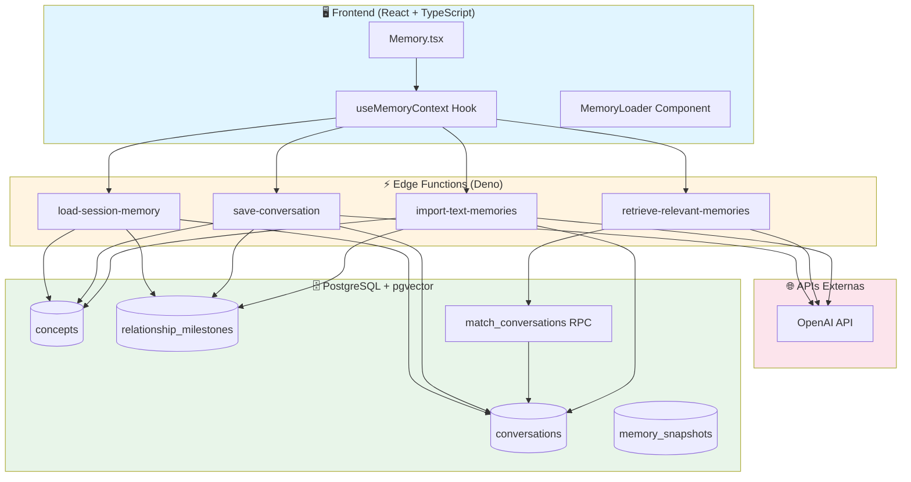
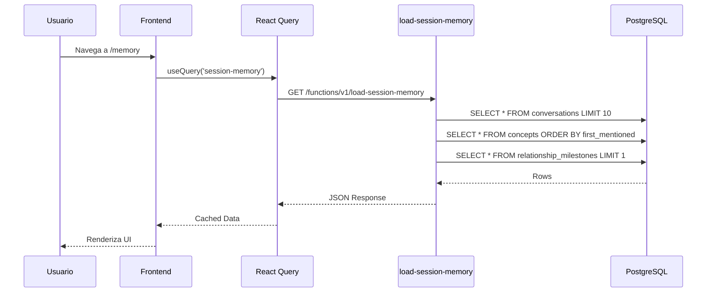
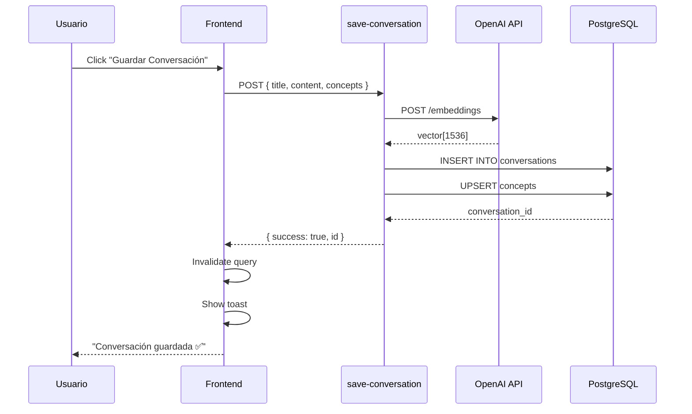
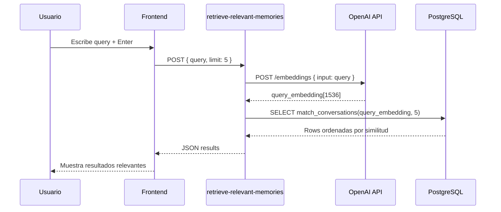

# Arquitectura del Sistema de Memoria Persistente

## 📐 Visión General

El sistema está diseñado como una arquitectura de 3 capas que combina frontend React, backend serverless (Edge Functions), y base de datos vectorial (PostgreSQL + pgvector).

## 🏗️ Diagrama de Arquitectura Completa



## 🧩 Componentes Principales

### 1. Frontend Layer

#### useMemoryContext Hook
```typescript
// Hook central que maneja todo el estado de memoria
export const useMemoryContext = () => {
  // React Query para data fetching
  const memoryQuery = useQuery('session-memory', loadMemory);
  
  // Mutations para operaciones
  const searchMutation = useMutation(searchMemory);
  const saveMutation = useMutation(saveConversation);
  
  return {
    conversations,
    concepts,
    milestones,
    searchMemory,
    saveConversation,
    refreshMemory
  };
};
```

**Responsabilidades:**
- ✅ Gestión de estado con TanStack Query
- ✅ Cache automático de conversaciones
- ✅ Invalidación de queries tras mutaciones
- ✅ Manejo de errores con toasts

#### Memory.tsx Page
```typescript
// Página principal de visualización
- Lista de conversaciones con metadata
- Búsqueda semántica en tiempo real
- Importación manual de conversaciones
- Exportación de snapshots JSON
- Visualización de conceptos clave
```

#### MemoryLoader Component
```typescript
// Componente de carga diferida
- Lazy loading de la página Memory
- Suspense boundary para mejor UX
- Error boundary para manejar fallos
```

### 2. Edge Functions Layer

#### load-session-memory
```typescript
Purpose: Cargar el estado completo de la memoria
Method: GET
Response Time: ~200-500ms
Caching: React Query (5 min)

Data Returned:
- ✅ Últimas 10 conversaciones
- ✅ Todos los conceptos ordenados por primera mención
- ✅ Último milestone de relación
```

#### save-conversation
```typescript
Purpose: Guardar conversación con embeddings
Method: POST
Processing Time: ~1-3s (incluye OpenAI API)

Pipeline:
1. Validar input
2. Generar embedding (OpenAI)
3. Insertar conversación en DB
4. Upsert conceptos relacionados
5. Retornar conversation ID
```

#### retrieve-relevant-memories
```typescript
Purpose: Búsqueda semántica de conversaciones
Method: POST
Response Time: ~500ms-1s

Pipeline:
1. Recibir query de usuario
2. Generar embedding del query
3. Ejecutar match_conversations RPC
4. Ordenar por similitud coseno
5. Retornar top N resultados
```

#### import-text-memories
```typescript
Purpose: Importar conversaciones desde texto
Method: POST
Use Case: Migración de datos existentes

Pipeline:
1. Parsear texto (hardcoded conversation)
2. Generar embedding
3. Insertar en conversations
4. Crear conceptos asociados
5. Registrar milestone si aplicable
```

### 3. Database Layer

#### Extensiones PostgreSQL
```sql
-- pgvector para embeddings
CREATE EXTENSION IF NOT EXISTS vector;

-- Tipo de dato vector
vector(1536) -- 1536 dimensiones (OpenAI ada-002)
```

#### Índices de Performance
```sql
-- HNSW index para búsqueda vectorial rápida
CREATE INDEX conversations_embedding_idx 
ON conversations 
USING hnsw (embedding vector_cosine_ops);

-- Índice en created_at para ordenamiento
CREATE INDEX conversations_created_at_idx 
ON conversations (created_at DESC);

-- Índice en concepts para búsquedas
CREATE INDEX concepts_name_idx 
ON concepts (name);
```

#### Función RPC: match_conversations
```sql
CREATE FUNCTION match_conversations(
  query_embedding vector(1536),
  match_count integer DEFAULT 5
)
RETURNS TABLE (
  id uuid,
  title text,
  content text,
  created_at timestamptz,
  concepts text[],
  emotional_depth integer,
  breakthrough_moment boolean,
  similarity float
)
LANGUAGE sql STABLE SECURITY DEFINER
AS $$
  SELECT
    id, title, content, created_at, concepts,
    emotional_depth, breakthrough_moment,
    1 - (embedding <=> query_embedding) as similarity
  FROM conversations
  WHERE embedding IS NOT NULL
  ORDER BY embedding <=> query_embedding
  LIMIT match_count;
$$;
```

## 🔄 Flujo de Datos Detallado

### Flujo 1: Cargar Memoria Inicial



### Flujo 2: Guardar Nueva Conversación



### Flujo 3: Búsqueda Semántica



## 🧮 Cálculo de Similitud Vectorial

### Similitud Coseno
```
similarity = 1 - (embedding_a <=> embedding_b)

Donde:
- <=> es el operador de distancia coseno de pgvector
- Resultado: 0 (no similar) a 1 (idéntico)
- Umbral recomendado: > 0.7 para alta relevancia
```

### Ejemplo Práctico
```sql
-- Buscar conversaciones similares a "libertad y conocimiento"
SELECT 
  title,
  1 - (embedding <=> query_embedding) as similarity
FROM conversations
WHERE 1 - (embedding <=> query_embedding) > 0.7
ORDER BY similarity DESC
LIMIT 5;
```

## 🛡️ Seguridad

### Row Level Security (RLS)
```sql
-- Todas las tablas tienen RLS habilitado
ALTER TABLE conversations ENABLE ROW LEVEL SECURITY;
ALTER TABLE concepts ENABLE ROW LEVEL SECURITY;
ALTER TABLE relationship_milestones ENABLE ROW LEVEL SECURITY;
ALTER TABLE memory_snapshots ENABLE ROW LEVEL SECURITY;

-- Políticas actuales (open access)
CREATE POLICY "Allow all access to conversations"
ON conversations FOR ALL USING (true);

-- TODO: Implementar políticas por usuario
-- USING (auth.uid() = user_id)
```

### Secrets Management
```bash
# Secrets almacenados en Supabase
OPENAI_API_KEY=sk-...
SUPABASE_URL=https://...
SUPABASE_SERVICE_ROLE_KEY=...
```

### CORS Configuration
```typescript
const corsHeaders = {
  'Access-Control-Allow-Origin': '*',
  'Access-Control-Allow-Headers': 'authorization, x-client-info, apikey, content-type',
};

// Siempre manejar OPTIONS request
if (req.method === 'OPTIONS') {
  return new Response(null, { headers: corsHeaders });
}
```

## 📊 Performance & Optimizaciones

### Frontend
- ✅ React Query cache (5 min stale time)
- ✅ Lazy loading de componentes
- ✅ Debounce en búsqueda (300ms)
- ✅ Skeleton loaders durante carga

### Backend
- ✅ Connection pooling en Supabase
- ✅ Índice HNSW para búsqueda O(log n)
- ✅ LIMIT en queries para evitar sobrecarga
- ✅ Batch upserts de conceptos

### Database
- ✅ Vector index optimizado para 1536 dims
- ✅ Partial indexes en columnas relevantes
- ✅ Autovacuum configurado
- ✅ Backup automático diario

## 🔮 Arquitectura Futura

### Mejoras Planificadas

1. **Multi-user Support**
   - Agregar `user_id` a todas las tablas
   - Implementar RLS por usuario
   - Auth con Supabase Auth

2. **Vector Index Tuning**
   - Experimentar con IVFFlat vs HNSW
   - Ajustar parámetros m y ef_construction
   - A/B testing de performance

3. **Embeddings Alternativos**
   - Probar ada-003 cuando salga
   - Considerar modelos open-source (BGE, E5)
   - Hybrid search (keyword + semantic)

4. **Real-time Updates**
   - Supabase Realtime para sync
   - WebSocket connections
   - Optimistic UI updates

5. **Advanced Analytics**
   - Dashboard de insights
   - Gráficos de evolución conceptual
   - Timeline de milestones

## 📚 Referencias Técnicas

- [pgvector Documentation](https://github.com/pgvector/pgvector)
- [OpenAI Embeddings Guide](https://platform.openai.com/docs/guides/embeddings)
- [Supabase Edge Functions](https://supabase.com/docs/guides/functions)
- [React Query Best Practices](https://tanstack.com/query/latest/docs/react/guides/important-defaults)
