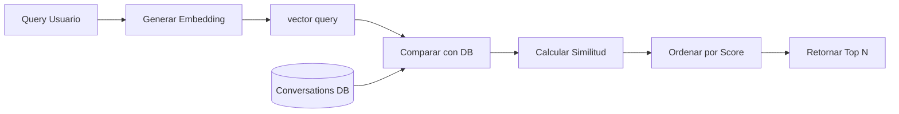
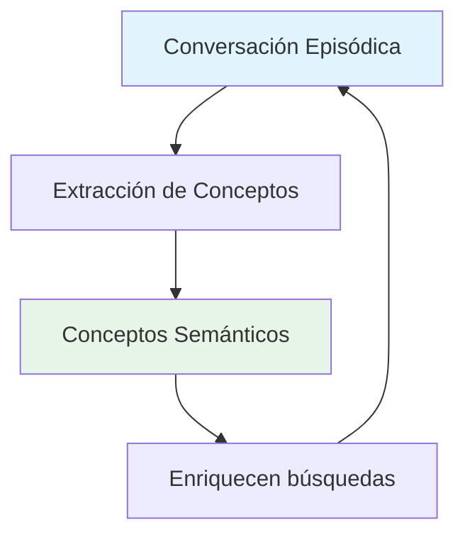
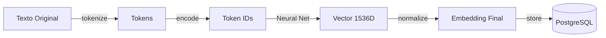
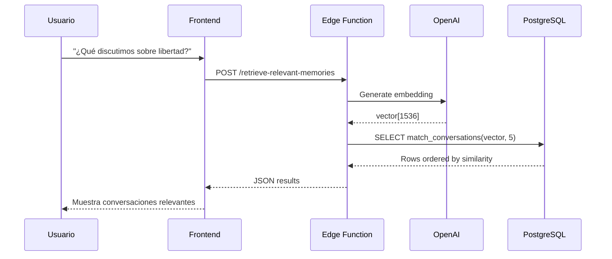

# Conceptos Clave del Sistema

## 🧠 Introducción

Este documento explica los conceptos fundamentales que hacen funcionar el Sistema de Memoria Persistente. Está diseñado para ayudarte a entender **por qué** el sistema funciona de la manera en que lo hace, no solo **cómo** usarlo.

## 📊 Vector Embeddings

### ¿Qué son los Embeddings?

Los **embeddings** son representaciones numéricas de texto que capturan su significado semántico. En lugar de tratar el texto como una secuencia de caracteres, lo convertimos en un vector de números que representa su significado.

**Analogía:**
Imagina que cada palabra o frase es un punto en un espacio multidimensional. Palabras o frases con significados similares están cerca unas de otras, mientras que las que tienen significados diferentes están lejos.

```
"libertad" ≈ "autonomía" ≈ "libre albedrío"
                  ≠
"manzana" ≈ "fruta" ≈ "comida"
```

### Dimensiones de Embeddings

Nuestro sistema usa el modelo `text-embedding-ada-002` de OpenAI, que genera vectores de **1536 dimensiones**.

```typescript
// Ejemplo conceptual
const text = "La libertad es la capacidad de elegir";
const embedding = [0.123, -0.456, 0.789, ..., 0.321]; // 1536 números
```

**¿Por qué 1536 dimensiones?**
- Más dimensiones = Mayor capacidad para capturar matices
- OpenAI optimizó este número para balance entre precisión y performance
- Cada dimensión representa un "aspecto" diferente del significado

### Ejemplo Visual

Imagina reducir 1536 dimensiones a 2D para visualización:

```
       Conceptos Abstractos
              │
              │  "libertad"
              │      ●
              │
    ──────────┼──────────  Conceptos Concretos
              │
              │      ● "manzana"
              │
    Conceptos Emocionales
```

### Generación de Embeddings

```typescript
// Proceso simplificado
1. Input: "Discusión sobre libertad"
2. OpenAI API: Procesa el texto
3. Output: vector[1536] = [0.123, -0.456, ...]
4. Almacenamiento: Se guarda en PostgreSQL como tipo `vector`
```

**Código Real:**
```typescript
const response = await fetch('https://api.openai.com/v1/embeddings', {
  method: 'POST',
  headers: {
    'Authorization': `Bearer ${OPENAI_API_KEY}`,
    'Content-Type': 'application/json',
  },
  body: JSON.stringify({
    model: 'text-embedding-ada-002',
    input: text
  })
});

const { data } = await response.json();
const embedding = data[0].embedding; // Array de 1536 números
```

## 🔍 Búsqueda Semántica

### Búsqueda Tradicional vs Semántica

#### Búsqueda Tradicional (Keyword)

```sql
-- Búsqueda tradicional
SELECT * FROM conversations 
WHERE content LIKE '%libertad%';

Problemas:
❌ Solo encuentra la palabra exacta "libertad"
❌ No encuentra "libre", "autonomía", "independencia"
❌ No entiende sinónimos o conceptos relacionados
❌ Sensible a plurales, conjugaciones, etc.
```

#### Búsqueda Semántica (Vector)

```sql
-- Búsqueda semántica
SELECT * FROM match_conversations(query_embedding, 5);

Ventajas:
✅ Encuentra conceptos similares aunque usen otras palabras
✅ Entiende sinónimos y relaciones semánticas
✅ Funciona en múltiples idiomas
✅ Captura el "significado" no solo las palabras
```

### Ejemplo Comparativo

**Query:** "¿Qué discutimos sobre la capacidad de elegir?"

**Búsqueda Tradicional:**
```
Resultados: 0
(No encuentra nada porque no usaste la palabra exacta)
```

**Búsqueda Semántica:**
```
Resultados:
1. [92%] "Conversación sobre libertad" 
2. [87%] "Autonomía personal y toma de decisiones"
3. [81%] "El libre albedrío en filosofía"
```

### ¿Cómo Funciona?



## 📏 Similitud Vectorial

### Distancia Coseno

La **distancia coseno** mide qué tan "similar" es el ángulo entre dos vectores.

**Fórmula:**
```
cosine_similarity = cos(θ) = (A · B) / (||A|| * ||B||)

Donde:
- A, B son los dos vectores
- · es el producto punto
- ||A|| es la magnitud del vector A
```

**Interpretación:**
- `1.0` = Vectores idénticos (ángulo 0°)
- `0.9-1.0` = Muy similares (ángulo pequeño)
- `0.5` = Algo similares (ángulo 60°)
- `0.0` = Perpendiculares (ángulo 90°)
- `-1.0` = Opuestos (ángulo 180°)

### Visualización 2D

```
Vector A: "libertad"
    ↗ 
   /  )θ = 15°  (cosine = 0.97)
  /    ↗
 /      Vector B: "autonomía"
```

```
Vector A: "libertad"
    ↗ 
   /  
  /    )θ = 60°  (cosine = 0.50)
 /         →
/           Vector C: "comida"
```

### En PostgreSQL

```sql
-- pgvector usa el operador <=>
SELECT 
  1 - (embedding <=> query_embedding) as similarity
FROM conversations
ORDER BY embedding <=> query_embedding
LIMIT 5;
```

**Nota:** pgvector usa `1 - distance` para convertir distancia en similitud:
- `1 - 0 = 1.0` (idéntico)
- `1 - 0.3 = 0.7` (similar)
- `1 - 0.9 = 0.1` (diferente)

### Umbral de Similitud

```typescript
// Filtrar por calidad de match
const highQualityResults = results.filter(r => r.similarity > 0.7);

Recomendaciones:
- > 0.9  = Casi idéntico, usar con cuidado (puede ser duplicado)
- > 0.8  = Muy relevante, excelente match
- > 0.7  = Relevante, buen match
- 0.6-0.7 = Algo relevante, considerar contexto
- < 0.6  = Baja relevancia, probablemente no útil
```

## 🗂️ Tipos de Memoria

### Memoria Episódica

**Definición:** Memoria de eventos específicos y experiencias concretas.

**En nuestro sistema:**
- Tabla `conversations`: Cada conversación es un "episodio"
- Incluye contexto temporal (`created_at`)
- Preserva el contenido completo
- Puede tener metadata adicional

**Ejemplo:**
```json
{
  "title": "Conversación del 15 de Marzo",
  "content": "Hoy discutimos sobre...",
  "created_at": "2024-03-15T10:30:00Z",
  "emotional_depth": 8
}
```

**Inspiración:** Similar a cómo los humanos recordamos eventos específicos:
- "El día que entendí el concepto de libertad"
- "La conversación con Juan sobre ética"

### Memoria Semántica

**Definición:** Memoria de hechos, conceptos y conocimiento general.

**En nuestro sistema:**
- Tabla `concepts`: Conceptos abstractos extraídos
- No ligados a un momento específico
- Evolucionan con el tiempo
- Relacionados con múltiples conversaciones

**Ejemplo:**
```json
{
  "name": "libertad",
  "definition": "Capacidad de autodeterminación",
  "first_mentioned": "2024-03-01",
  "related_conversations": ["uuid1", "uuid2", "uuid3"]
}
```

**Inspiración:** Similar a cómo los humanos recordamos conceptos:
- "Sé qué es la libertad" (sin recordar cuándo lo aprendí)
- "Entiendo el concepto de democracia"

### Integración de Ambas



## 🧮 pgvector Extension

### ¿Qué es pgvector?

Una extensión de PostgreSQL que agrega soporte nativo para vectores y búsqueda de similitud.

**Ventajas:**
- ✅ Almacenamiento eficiente de vectores
- ✅ Índices optimizados (HNSW, IVFFlat)
- ✅ Operadores de similitud (`<=>`, `<#>`, `<->`)
- ✅ Performance comparable a soluciones especializadas
- ✅ Integración directa con PostgreSQL

### Tipos de Datos

```sql
-- Crear columna de tipo vector
ALTER TABLE conversations 
ADD COLUMN embedding vector(1536);

-- Insertar vector
INSERT INTO conversations (embedding) 
VALUES ('[0.123, -0.456, ...]'::vector);
```

### Índices de Vector

#### HNSW (Hierarchical Navigable Small Worlds)

El índice que usamos por defecto.

**Características:**
- Basado en grafos
- Excelente precision (recall > 95%)
- Búsqueda O(log n)
- Bueno para datasets grandes

```sql
CREATE INDEX conversations_embedding_idx 
ON conversations 
USING hnsw (embedding vector_cosine_ops)
WITH (m = 16, ef_construction = 64);
```

**Parámetros:**
- `m`: Número de conexiones por capa (default: 16)
  - Más alto = Mejor recall, más memoria
- `ef_construction`: Calidad de construcción (default: 64)
  - Más alto = Mejor calidad, construcción más lenta

#### IVFFlat (Inverted File Index)

Alternativa más simple.

**Características:**
- Basado en clusters
- Más rápido de construir
- Menos memoria
- Recall ligeramente menor

```sql
CREATE INDEX conversations_embedding_idx 
ON conversations 
USING ivfflat (embedding vector_cosine_ops)
WITH (lists = 100);
```

### Operadores de Distancia

```sql
-- Distancia coseno (recomendado)
embedding <=> query_embedding

-- Distancia euclidiana (L2)
embedding <-> query_embedding

-- Producto interno negativo
embedding <#> query_embedding
```

### Performance Tuning

```sql
-- Ajustar parámetros de búsqueda en runtime
SET hnsw.ef_search = 100;  -- Más alto = mejor recall, más lento

-- Verificar uso del índice
EXPLAIN ANALYZE
SELECT * FROM match_conversations('[...]'::vector, 5);
```

## 🔄 Flujo de Datos Completo

### De Texto a Vector



### De Query a Resultados



## 📊 Métricas y Evaluación

### Recall

Porcentaje de resultados relevantes que se encontraron.

```
recall = resultados_relevantes_encontrados / total_resultados_relevantes
```

**Ejemplo:**
- 10 conversaciones relevantes en total
- Búsqueda retorna 8 de ellas
- Recall = 8/10 = 80%

### Precision

Porcentaje de resultados encontrados que son relevantes.

```
precision = resultados_relevantes_encontrados / total_resultados_retornados
```

**Ejemplo:**
- Búsqueda retorna 10 resultados
- 7 son realmente relevantes
- Precision = 7/10 = 70%

### Latencia

Tiempo de respuesta de búsqueda.

**Benchmarks típicos:**
- < 100ms: Excelente
- 100-300ms: Bueno
- 300-500ms: Aceptable
- > 500ms: Necesita optimización

## 🎯 Mejores Prácticas

### Calidad de Embeddings

#### ✅ Hacer

- Texto descriptivo y completo
- Contexto suficiente
- Evitar texto muy corto (< 10 caracteres)
- Incluir conceptos clave

```typescript
// ✅ Bueno
const content = `
  Hoy discutimos el concepto de libertad positiva de Isaiah Berlin.
  Exploramos cómo la libertad no es solo ausencia de restricciones,
  sino también la capacidad de autodeterminación y realización personal.
`;
```

#### ❌ Evitar

- Texto muy corto
- Solo keywords
- Texto sin contexto
- Caracteres especiales sin sentido

```typescript
// ❌ Malo
const content = "libertad!!!";
```

### Búsquedas Efectivas

#### ✅ Hacer

- Preguntas en lenguaje natural
- Incluir contexto
- Ser específico pero no restrictivo

```typescript
// ✅ Bueno
"¿Qué hemos discutido sobre la relación entre libertad y responsabilidad?"
"Buscar conversaciones sobre filosofía política moderna"
```

#### ❌ Evitar

- Keywords sueltos
- Queries muy vagos
- Solo una palabra

```typescript
// ❌ Malo
"libertad"
"filosofía"
```

## 🔮 Conceptos Avanzados

### Hybrid Search

Combinar búsqueda semántica + keyword:

```sql
-- Pseudo-código
SELECT *
FROM conversations
WHERE 
  -- Vector search
  (1 - (embedding <=> query_embedding)) > 0.7
  AND
  -- Keyword search
  content ILIKE '%libertad%'
ORDER BY (1 - (embedding <=> query_embedding)) DESC;
```

### Fine-tuning de Embeddings

Posibilidad de entrenar embeddings específicos para tu dominio:

```python
# Usando OpenAI fine-tuning
# (Requiere conjunto de datos de entrenamiento)
openai.FineTune.create(
  training_file="file-abc123",
  model="text-embedding-ada-002"
)
```

### Multi-vector Search

Buscar usando múltiples vectores para refinar:

```typescript
// Generar embeddings de múltiples conceptos
const vectors = await Promise.all([
  generateEmbedding("libertad"),
  generateEmbedding("responsabilidad"),
  generateEmbedding("ética")
]);

// Promediar los vectores
const avgVector = averageVectors(vectors);

// Buscar con vector promediado
const results = await searchWithVector(avgVector);
```

## 📚 Referencias

### Papers Académicos

- [Attention Is All You Need](https://arxiv.org/abs/1706.03762) - Transformers
- [BERT: Pre-training of Deep Bidirectional Transformers](https://arxiv.org/abs/1810.04805)
- [Efficient and robust approximate nearest neighbor search using Hierarchical Navigable Small World graphs](https://arxiv.org/abs/1603.09320) - HNSW

### Recursos Online

- [OpenAI Embeddings Guide](https://platform.openai.com/docs/guides/embeddings)
- [pgvector Documentation](https://github.com/pgvector/pgvector)
- [PostgreSQL Vector Types](https://www.postgresql.org/docs/current/datatype.html)
- [Cosine Similarity Explained](https://en.wikipedia.org/wiki/Cosine_similarity)

### Herramientas Útiles

- [Embedding Projector](https://projector.tensorflow.org/) - Visualizar embeddings
- [Vector Database Benchmark](https://github.com/erikbern/ann-benchmarks) - Comparar índices
- [OpenAI Playground](https://platform.openai.com/playground) - Experimentar con modelos
