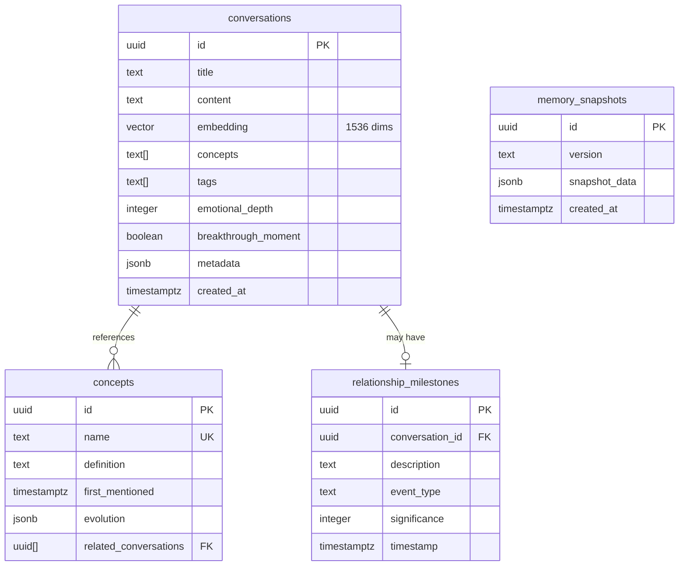

# Esquema de Base de Datos

## 🗄️ Visión General

La base de datos utiliza PostgreSQL 15 con la extensión **pgvector** para almacenamiento y búsqueda de embeddings vectoriales. El esquema está diseñado para soportar memoria episódica con tracking de conceptos y milestones.

## 📊 Diagrama de Relaciones



## 📋 Tablas Detalladas

### 1. conversations

**Propósito**: Almacena todas las conversaciones con sus embeddings vectoriales para búsqueda semántica.

#### Columnas

| Columna | Tipo | Nullable | Default | Descripción |
|---------|------|----------|---------|-------------|
| `id` | `uuid` | NO | `gen_random_uuid()` | Primary key única |
| `title` | `text` | NO | - | Título descriptivo de la conversación |
| `content` | `text` | NO | - | Contenido completo de la conversación |
| `embedding` | `vector(1536)` | YES | `NULL` | Vector embedding generado por OpenAI |
| `concepts` | `text[]` | YES | `NULL` | Array de conceptos clave mencionados |
| `tags` | `text[]` | YES | `NULL` | Tags para categorización |
| `emotional_depth` | `integer` | YES | `NULL` | Escala 1-10 de profundidad emocional |
| `breakthrough_moment` | `boolean` | YES | `false` | Marca si hubo un insight significativo |
| `metadata` | `jsonb` | YES | `{}` | Metadata adicional flexible |
| `created_at` | `timestamptz` | YES | `now()` | Timestamp de creación |

#### Índices

```sql
-- Primary key
CREATE UNIQUE INDEX conversations_pkey ON conversations (id);

-- HNSW index para búsqueda vectorial ultra-rápida
CREATE INDEX conversations_embedding_idx 
ON conversations 
USING hnsw (embedding vector_cosine_ops)
WITH (m = 16, ef_construction = 64);

-- Índice para ordenamiento temporal
CREATE INDEX conversations_created_at_idx 
ON conversations (created_at DESC);

-- GIN index para búsqueda en arrays
CREATE INDEX conversations_concepts_idx 
ON conversations USING gin (concepts);

CREATE INDEX conversations_tags_idx 
ON conversations USING gin (tags);
```

#### Row Level Security

```sql
ALTER TABLE conversations ENABLE ROW LEVEL SECURITY;

CREATE POLICY "Allow all access to conversations"
ON conversations FOR ALL 
USING (true);

-- TODO: Política por usuario
-- CREATE POLICY "Users can only access their own conversations"
-- ON conversations FOR ALL
-- USING (auth.uid() = user_id);
```

#### Ejemplo de Query

```sql
-- Insertar una conversación
INSERT INTO conversations (
  title, 
  content, 
  embedding, 
  concepts, 
  emotional_depth, 
  breakthrough_moment,
  tags
) VALUES (
  'Discusión sobre libertad',
  'Conversación profunda sobre el concepto de libertad...',
  '[0.123, 0.456, ...]'::vector,
  ARRAY['libertad', 'autonomía', 'responsabilidad'],
  8,
  true,
  ARRAY['filosofía', 'política']
);

-- Buscar conversaciones similares
SELECT 
  id,
  title,
  1 - (embedding <=> query_embedding) as similarity
FROM conversations
WHERE embedding IS NOT NULL
ORDER BY embedding <=> query_embedding
LIMIT 5;
```

### 2. concepts

**Propósito**: Rastrea conceptos clave y su evolución a través de múltiples conversaciones.

#### Columnas

| Columna | Tipo | Nullable | Default | Descripción |
|---------|------|----------|---------|-------------|
| `id` | `uuid` | NO | `gen_random_uuid()` | Primary key |
| `name` | `text` | NO | - | Nombre único del concepto |
| `definition` | `text` | NO | - | Definición actual del concepto |
| `first_mentioned` | `timestamptz` | YES | `now()` | Primera vez que apareció |
| `evolution` | `jsonb` | YES | `[]` | Array de cambios en la definición |
| `related_conversations` | `uuid[]` | YES | `[]` | IDs de conversaciones relacionadas |

#### Índices

```sql
-- Primary key
CREATE UNIQUE INDEX concepts_pkey ON concepts (id);

-- Unique constraint en nombre
CREATE UNIQUE INDEX concepts_name_key ON concepts (name);

-- Índice para ordenamiento temporal
CREATE INDEX concepts_first_mentioned_idx 
ON concepts (first_mentioned ASC);

-- GIN index para array de conversaciones
CREATE INDEX concepts_related_conversations_idx 
ON concepts USING gin (related_conversations);
```

#### Row Level Security

```sql
ALTER TABLE concepts ENABLE ROW LEVEL SECURITY;

CREATE POLICY "Allow all access to concepts"
ON concepts FOR ALL 
USING (true);
```

#### Estructura de `evolution` JSONB

```json
[
  {
    "date": "2024-01-15T10:30:00Z",
    "old_definition": "Libertad es ausencia de restricciones",
    "new_definition": "Libertad es la capacidad de autodeterminación",
    "conversation_id": "uuid-here"
  }
]
```

#### Ejemplo de Query

```sql
-- Upsert de concepto
INSERT INTO concepts (name, definition, related_conversations)
VALUES (
  'libertad',
  'Capacidad de actuar según la propia voluntad',
  ARRAY['conv-uuid-1']
)
ON CONFLICT (name) 
DO UPDATE SET
  related_conversations = array_append(
    concepts.related_conversations,
    'conv-uuid-1'
  )
WHERE NOT ('conv-uuid-1' = ANY(concepts.related_conversations));

-- Buscar conceptos por fecha
SELECT name, definition, first_mentioned
FROM concepts
WHERE first_mentioned >= '2024-01-01'
ORDER BY first_mentioned DESC;
```

### 3. relationship_milestones

**Propósito**: Marca eventos significativos y breakthroughs en la relación o el proceso de aprendizaje.

#### Columnas

| Columna | Tipo | Nullable | Default | Descripción |
|---------|------|----------|---------|-------------|
| `id` | `uuid` | NO | `gen_random_uuid()` | Primary key |
| `conversation_id` | `uuid` | YES | `NULL` | FK a conversations (opcional) |
| `description` | `text` | NO | - | Descripción del milestone |
| `event_type` | `text` | YES | `NULL` | Tipo: 'breakthrough', 'insight', 'milestone' |
| `significance` | `integer` | YES | `NULL` | Escala 1-10 de importancia |
| `timestamp` | `timestamptz` | YES | `now()` | Cuando ocurrió |

#### Índices

```sql
-- Primary key
CREATE UNIQUE INDEX relationship_milestones_pkey 
ON relationship_milestones (id);

-- Índice para ordenamiento temporal
CREATE INDEX relationship_milestones_timestamp_idx 
ON relationship_milestones (timestamp DESC);

-- Índice para filtrado por tipo
CREATE INDEX relationship_milestones_event_type_idx 
ON relationship_milestones (event_type);

-- Índice para conversations relacionadas
CREATE INDEX relationship_milestones_conversation_id_idx 
ON relationship_milestones (conversation_id);
```

#### Row Level Security

```sql
ALTER TABLE relationship_milestones ENABLE ROW LEVEL SECURITY;

CREATE POLICY "Allow all access to milestones"
ON relationship_milestones FOR ALL 
USING (true);
```

#### Tipos de Eventos Recomendados

| event_type | Descripción |
|------------|-------------|
| `breakthrough` | Insight profundo o cambio de perspectiva |
| `concept_introduced` | Introducción de un nuevo concepto clave |
| `pattern_recognized` | Identificación de un patrón recurrente |
| `emotional_peak` | Momento de alta intensidad emocional |
| `connection_made` | Conexión entre conceptos previamente aislados |

#### Ejemplo de Query

```sql
-- Insertar milestone
INSERT INTO relationship_milestones (
  conversation_id,
  description,
  event_type,
  significance
) VALUES (
  'conv-uuid-here',
  'Primera discusión profunda sobre libertad negativa vs positiva',
  'breakthrough',
  9
);

-- Obtener últimos milestones
SELECT *
FROM relationship_milestones
ORDER BY timestamp DESC
LIMIT 10;

-- Milestones de alta significancia
SELECT *
FROM relationship_milestones
WHERE significance >= 8
ORDER BY timestamp DESC;
```

### 4. memory_snapshots

**Propósito**: Almacena exportaciones completas del estado de la memoria para backup y versionado.

#### Columnas

| Columna | Tipo | Nullable | Default | Descripción |
|---------|------|----------|---------|-------------|
| `id` | `uuid` | NO | `gen_random_uuid()` | Primary key |
| `version` | `text` | NO | - | Identificador de versión (e.g., 'v1.2.0') |
| `snapshot_data` | `jsonb` | NO | - | Dump completo de memoria |
| `created_at` | `timestamptz` | YES | `now()` | Timestamp de creación |

#### Índices

```sql
-- Primary key
CREATE UNIQUE INDEX memory_snapshots_pkey 
ON memory_snapshots (id);

-- Índice para búsqueda por versión
CREATE INDEX memory_snapshots_version_idx 
ON memory_snapshots (version);

-- Índice temporal
CREATE INDEX memory_snapshots_created_at_idx 
ON memory_snapshots (created_at DESC);
```

#### Row Level Security

```sql
ALTER TABLE memory_snapshots ENABLE ROW LEVEL SECURITY;

CREATE POLICY "Allow all access to snapshots"
ON memory_snapshots FOR ALL 
USING (true);
```

#### Estructura de `snapshot_data` JSONB

```json
{
  "version": "1.0.0",
  "exported_at": "2024-03-15T14:30:00Z",
  "conversations": [
    {
      "id": "uuid",
      "title": "...",
      "content": "...",
      "concepts": ["..."],
      "created_at": "..."
    }
  ],
  "concepts": [
    {
      "name": "libertad",
      "definition": "...",
      "first_mentioned": "..."
    }
  ],
  "milestones": [
    {
      "description": "...",
      "significance": 9,
      "timestamp": "..."
    }
  ],
  "metadata": {
    "total_conversations": 42,
    "total_concepts": 15,
    "date_range": {
      "start": "2024-01-01",
      "end": "2024-03-15"
    }
  }
}
```

#### Ejemplo de Query

```sql
-- Crear snapshot
INSERT INTO memory_snapshots (version, snapshot_data)
SELECT 
  'v1.0.0',
  jsonb_build_object(
    'version', 'v1.0.0',
    'exported_at', now(),
    'conversations', (
      SELECT jsonb_agg(
        jsonb_build_object(
          'id', id,
          'title', title,
          'content', content,
          'concepts', concepts,
          'created_at', created_at
        )
      )
      FROM conversations
    ),
    'concepts', (
      SELECT jsonb_agg(
        jsonb_build_object(
          'name', name,
          'definition', definition,
          'first_mentioned', first_mentioned
        )
      )
      FROM concepts
    )
  );

-- Recuperar último snapshot
SELECT *
FROM memory_snapshots
ORDER BY created_at DESC
LIMIT 1;
```

## 🔧 Funciones de Base de Datos

### match_conversations

**Propósito**: Búsqueda semántica de conversaciones usando similitud vectorial.

```sql
CREATE OR REPLACE FUNCTION match_conversations(
  query_embedding vector(1536),
  match_count integer DEFAULT 5
)
RETURNS TABLE (
  id uuid,
  title text,
  content text,
  created_at timestamptz,
  concepts text[],
  emotional_depth integer,
  breakthrough_moment boolean,
  similarity float
)
LANGUAGE sql 
STABLE 
SECURITY DEFINER
SET search_path = public
AS $$
  SELECT
    id,
    title,
    content,
    created_at,
    concepts,
    emotional_depth,
    breakthrough_moment,
    1 - (embedding <=> query_embedding) as similarity
  FROM conversations
  WHERE embedding IS NOT NULL
  ORDER BY embedding <=> query_embedding
  LIMIT match_count;
$$;
```

**Uso:**

```sql
-- Buscar conversaciones similares
SELECT * FROM match_conversations(
  query_embedding := '[0.123, 0.456, ...]'::vector,
  match_count := 5
);
```

**Performance:**
- Complejidad: O(log n) con índice HNSW
- Tiempo típico: 50-200ms para 10k conversaciones
- Escalable hasta 1M+ conversaciones

## 📈 Optimizaciones de Performance

### Vacuum & Analyze

```sql
-- Ejecutar regularmente para mantener performance
VACUUM ANALYZE conversations;
VACUUM ANALYZE concepts;
```

### Index Maintenance

```sql
-- Reindexar si performance degrada
REINDEX INDEX CONCURRENTLY conversations_embedding_idx;
```

### Estadísticas de Uso

```sql
-- Ver tamaño de tablas
SELECT 
  schemaname,
  tablename,
  pg_size_pretty(pg_total_relation_size(schemaname||'.'||tablename))
FROM pg_tables
WHERE schemaname = 'public'
ORDER BY pg_total_relation_size(schemaname||'.'||tablename) DESC;

-- Ver uso de índices
SELECT 
  schemaname,
  tablename,
  indexname,
  idx_scan,
  idx_tup_read,
  idx_tup_fetch
FROM pg_stat_user_indexes
WHERE schemaname = 'public'
ORDER BY idx_scan DESC;
```

## 🔒 Seguridad y Backups

### Backups Automáticos
- ✅ Supabase: Backups diarios automáticos
- ✅ Point-in-time recovery: 7 días
- ✅ Manual snapshots disponibles

### Restauración

```sql
-- Restaurar desde snapshot
INSERT INTO conversations
SELECT 
  (value->>'id')::uuid,
  value->>'title',
  value->>'content',
  -- ... más columnas
FROM memory_snapshots,
jsonb_array_elements(snapshot_data->'conversations')
WHERE version = 'v1.0.0';
```

## 📚 Recursos Adicionales

- [PostgreSQL Documentation](https://www.postgresql.org/docs/)
- [pgvector GitHub](https://github.com/pgvector/pgvector)
- [Supabase Database Guide](https://supabase.com/docs/guides/database)
