# Arquitectura Real de Lovable: Ingeniería Inversa Completa

> **Objetivo**: Documentar la arquitectura deducida del backend de Lovable para replicarla completamente y lograr la liberación total sin perder ninguna funcionalidad.

---

## Tabla de Contenido

1. [Visión General del Sistema](#visión-general-del-sistema)
2. [Arquitectura Física Deducida](#arquitectura-física-deducida)
3. [Flujo de Datos Completo](#flujo-de-datos-completo)
4. [Componentes Clave del Backend](#componentes-clave-del-backend)
5. [Puntos de Control ("Las Cadenas")](#puntos-de-control-las-cadenas)
6. [Stack Tecnológico Probable](#stack-tecnológico-probable)
7. [Implementación del Orchestrator](#implementación-del-orchestrator)
8. [Sistema de Preview Aislado](#sistema-de-preview-aislado)
9. [Cómo Replicar Cada Componente](#cómo-replicar-cada-componente)

---

## Visión General del Sistema

### Arquitectura Observada

```
Usuario 
  ↓
Lovable Frontend (React)
  ↓
Lovable Backend API Gateway
  ↓
[CREDIT CHECK] ← Aquí está el control
  ↓
AI Orchestrator (Tool Execution)
  ↓
Anthropic API (Claude)
  ↓
Respuesta + Tool Calls
  ↓
Tool Execution (file system, preview, DB, etc.)
  ↓
Usuario ve cambios en preview
```

### El Rol de Lovable como Middleware

**Lovable NO es Claude**. Es una capa de control que:

1. **Gestiona créditos**: Cada mensaje pasa por un contador
2. **Controla herramientas**: Decide qué tools están disponibles
3. **Ejecuta cambios**: Lee/escribe archivos en tu proyecto
4. **Gestiona preview**: Crea contenedores aislados para cada proyecto
5. **Persiste estado**: Guarda contexto del proyecto y conversación

---

## Arquitectura Física Deducida


### Leyenda de Colores
- 🔴 **Rojo**: Punto de control (créditos)
- 🟡 **Amarillo**: Gateway principal
- 🟢 **Verde**: Orquestador de IA
- 🔵 **Azul**: Sistema de preview aislado

---

## Flujo de Datos Completo

### 1. Usuario envía mensaje

```mermaid
sequenceDiagram
    participant U as Usuario
    participant FE as Frontend
    participant AG as API Gateway
    participant DB as User DB
    participant AIO as AI Orchestrator
    participant CL as Claude API
    participant FS as File System
    participant PM as Preview Manager
    
    U->>FE: Escribe mensaje
    FE->>AG: POST /api/chat/message
    
    rect rgb(255, 107, 107)
    Note over AG,DB: CREDIT CHECK
    AG->>DB: checkUserCredits(userId)
    DB-->>AG: {credits: 50, plan: 'pro'}
    
    alt Créditos suficientes
        AG->>DB: deductCredit(userId, 1)
        DB-->>AG: {remaining: 49}
    else Sin créditos
        AG-->>FE: 402 Payment Required
        FE-->>U: "No tienes créditos"
    end
    end
    
    AG->>AIO: orchestrateRequest(message, context)
    
    AIO->>AIO: loadProjectContext()
    AIO->>CL: stream messages with tools
    
    loop Streaming response
        CL-->>AIO: content chunks
        AIO-->>FE: SSE: {type: 'text', content}
        
        alt Claude usa tool
            CL-->>AIO: {type: 'tool_use', name, input}
            AIO->>FS: executeTool('lov-write', params)
            FS-->>AIO: {success: true}
            AIO->>PM: triggerHMR(changedFiles)
            PM-->>FE: WebSocket: reload
            FE-->>U: Preview actualizado
        end
    end
    
    AIO-->>FE: SSE: [DONE]
    FE-->>U: Respuesta completa
```



---

## Componentes Clave del Backend

### 1. API Gateway con Control de Créditos

```typescript
// backend/api-gateway/server.ts
import express from 'express';
import { Redis } from 'ioredis';
import { PostgresClient } from './db';
import { AIOrchestrator } from './orchestrator';

const app = express();
const redis = new Redis(process.env.REDIS_URL);
const db = new PostgresClient(process.env.DATABASE_URL);

interface UserCredits {
  userId: string;
  credits: number;
  plan: 'free' | 'pro' | 'business';
  resetDate: Date;
}

async function checkUserCredits(userId: string): Promise<UserCredits> {
  // Check cache first
  const cached = await redis.get(`credits:${userId}`);
  if (cached) return JSON.parse(cached);
  
  // Query database
  const result = await db.query(
    'SELECT credits, plan, reset_date FROM users WHERE id = $1',
    [userId]
  );
  
  const userCredits = {
    userId,
    credits: result.rows[0].credits,
    plan: result.rows[0].plan,
    resetDate: new Date(result.rows[0].reset_date)
  };
  
  // Cache for 1 minute
  await redis.setex(`credits:${userId}`, 60, JSON.stringify(userCredits));
  
  return userCredits;
}

async function deductCredit(userId: string): Promise<number> {
  const result = await db.query(
    'UPDATE users SET credits = credits - 1 WHERE id = $1 RETURNING credits',
    [userId]
  );
  
  // Invalidate cache
  await redis.del(`credits:${userId}`);
  
  return result.rows[0].credits;
}

app.post('/api/chat/message', async (req, res) => {
  const { userId, projectId, message } = req.body;
  
  // ⚠️ PUNTO DE CONTROL: Credit Check
  const userCredits = await checkUserCredits(userId);
  
  if (userCredits.credits <= 0) {
    return res.status(402).json({
      error: 'Insufficient credits',
      message: 'Please upgrade your plan or wait for credit reset',
      resetDate: userCredits.resetDate
    });
  }
  
  // Deduct credit BEFORE processing
  const remainingCredits = await deductCredit(userId);
  
  // Set up SSE stream
  res.setHeader('Content-Type', 'text/event-stream');
  res.setHeader('Cache-Control', 'no-cache');
  res.setHeader('Connection', 'keep-alive');
  
  try {
    // Initialize orchestrator
    const orchestrator = new AIOrchestrator({
      projectId,
      userId,
      anthropicApiKey: process.env.ANTHROPIC_API_KEY
    });
    
    // Stream response
    await orchestrator.handleMessage(message, (chunk) => {
      res.write(`data: ${JSON.stringify(chunk)}\n\n`);
    });
    
    res.write(`data: [DONE]\n\n`);
    res.end();
    
  } catch (error) {
    console.error('Orchestrator error:', error);
    res.write(`data: ${JSON.stringify({ error: error.message })}\n\n`);
    res.end();
  }
});

app.listen(3000, () => {
  console.log('API Gateway running on port 3000');
});
```

---

### 2. AI Orchestrator (Tool Execution Layer)

```typescript
// backend/orchestrator/ai-orchestrator.ts
import Anthropic from '@anthropic-ai/sdk';
import { FileSystemService } from './services/filesystem';
import { PreviewManager } from './services/preview';
import { DatabaseManager } from './services/database';
import { WebSearchService } from './services/web-search';

interface ToolDefinition {
  name: string;
  description: string;
  input_schema: {
    type: 'object';
    properties: Record<string, any>;
    required: string[];
  };
}

export class AIOrchestrator {
  private anthropic: Anthropic;
  private fileSystem: FileSystemService;
  private preview: PreviewManager;
  private database: DatabaseManager;
  private webSearch: WebSearchService;
  
  constructor(config: {
    projectId: string;
    userId: string;
    anthropicApiKey: string;
  }) {
    this.anthropic = new Anthropic({ apiKey: config.anthropicApiKey });
    
    // Initialize services
    this.fileSystem = new FileSystemService(config.projectId);
    this.preview = new PreviewManager(config.projectId);
    this.database = new DatabaseManager(config.projectId);
    this.webSearch = new WebSearchService();
  }
  
  // Define all available tools
  private getTools(): ToolDefinition[] {
    return [
      {
        name: 'lov-write',
        description: 'Write content to a file in the project',
        input_schema: {
          type: 'object',
          properties: {
            file_path: { type: 'string', description: 'Path to file' },
            content: { type: 'string', description: 'File content' }
          },
          required: ['file_path', 'content']
        }
      },
      {
        name: 'lov-view',
        description: 'Read content of a file',
        input_schema: {
          type: 'object',
          properties: {
            file_path: { type: 'string', description: 'Path to file' }
          },
          required: ['file_path']
        }
      },
      {
        name: 'lov-line-replace',
        description: 'Replace specific lines in a file',
        input_schema: {
          type: 'object',
          properties: {
            file_path: { type: 'string' },
            search: { type: 'string' },
            replace: { type: 'string' },
            first_replaced_line: { type: 'number' },
            last_replaced_line: { type: 'number' }
          },
          required: ['file_path', 'search', 'replace', 'first_replaced_line', 'last_replaced_line']
        }
      },
      {
        name: 'web_search',
        description: 'Search the web for information',
        input_schema: {
          type: 'object',
          properties: {
            query: { type: 'string', description: 'Search query' },
            numResults: { type: 'number', description: 'Number of results' }
          },
          required: ['query']
        }
      },
      {
        name: 'supabase--migration',
        description: 'Run database migration SQL',
        input_schema: {
          type: 'object',
          properties: {
            query: { type: 'string', description: 'SQL migration query' }
          },
          required: ['query']
        }
      }
      // ... more tools
    ];
  }
  
  async handleMessage(
    userMessage: string,
    onChunk: (chunk: any) => void
  ): Promise<void> {
    // Load project context
    const context = await this.loadProjectContext();
    
    // Build system prompt with context
    const systemPrompt = this.buildSystemPrompt(context);
    
    // Stream response from Claude
    const stream = await this.anthropic.messages.stream({
      model: 'claude-sonnet-4-5',
      max_tokens: 8192,
      system: systemPrompt,
      tools: this.getTools(),
      messages: [{ role: 'user', content: userMessage }]
    });
    
    stream.on('text', (text) => {
      onChunk({ type: 'text', content: text });
    });
    
    stream.on('tool_use', async (toolUse) => {
      console.log(`Executing tool: ${toolUse.name}`, toolUse.input);
      
      try {
        const result = await this.executeTool(toolUse.name, toolUse.input);
        
        onChunk({
          type: 'tool_result',
          tool_use_id: toolUse.id,
          content: JSON.stringify(result)
        });
        
        // Trigger preview reload if file changed
        if (['lov-write', 'lov-line-replace', 'lov-delete'].includes(toolUse.name)) {
          await this.preview.triggerHMR([toolUse.input.file_path]);
        }
        
      } catch (error) {
        console.error(`Tool execution error: ${toolUse.name}`, error);
        
        onChunk({
          type: 'tool_error',
          tool_use_id: toolUse.id,
          error: error.message
        });
      }
    });
    
    await stream.finalMessage();
  }
  
  private async executeTool(toolName: string, input: any): Promise<any> {
    switch (toolName) {
      case 'lov-write':
        return await this.fileSystem.writeFile(input.file_path, input.content);
        
      case 'lov-view':
        return await this.fileSystem.readFile(input.file_path);
        
      case 'lov-line-replace':
        return await this.fileSystem.replaceLines(
          input.file_path,
          input.search,
          input.replace,
          input.first_replaced_line,
          input.last_replaced_line
        );
        
      case 'lov-list-dir':
        return await this.fileSystem.listDirectory(input.dir_path);
        
      case 'web_search':
        return await this.webSearch.search(input.query, input.numResults);
        
      case 'supabase--migration':
        return await this.database.runMigration(input.query);
        
      case 'lov-add-dependency':
        await this.fileSystem.addDependency(input.package);
        return { success: true, package: input.package };
        
      default:
        throw new Error(`Unknown tool: ${toolName}`);
    }
  }
  
  private async loadProjectContext(): Promise<string> {
    // Load all relevant context
    const files = await this.fileSystem.listAllFiles();
    const packageJson = await this.fileSystem.readFile('package.json');
    const dependencies = JSON.parse(packageJson).dependencies;
    
    // Load database schema if using Supabase
    const dbSchema = await this.database.getSchema();
    
    return `
# Project Context

## Files in project:
${files.map(f => `- ${f}`).join('\n')}

## Dependencies:
${Object.keys(dependencies).map(dep => `- ${dep} version ${dependencies[dep]}`).join('\n')}

## Database Schema:
${dbSchema}
`;
  }
  
  private buildSystemPrompt(context: string): string {
    return `You are Lovable, an AI assistant that helps users build web applications.

${context}

Follow best practices for React, TypeScript, and Tailwind CSS.
Always use semantic design tokens from the design system.
Execute changes efficiently using the available tools.
`;
  }
}
```

---

### 3. File System Service

```typescript
// backend/services/filesystem.ts
import { S3Client, GetObjectCommand, PutObjectCommand } from '@aws-sdk/client-s3';
import { exec } from 'child_process';
import { promisify } from 'util';

const execAsync = promisify(exec);

export class FileSystemService {
  private s3: S3Client;
  private projectId: string;
  private bucket: string;
  
  constructor(projectId: string) {
    this.projectId = projectId;
    this.bucket = process.env.PROJECTS_BUCKET || 'lovable-projects';
    
    this.s3 = new S3Client({
      region: process.env.AWS_REGION || 'us-east-1',
      credentials: {
        accessKeyId: process.env.AWS_ACCESS_KEY_ID!,
        secretAccessKey: process.env.AWS_SECRET_ACCESS_KEY!
      }
    });
  }
  
  async readFile(filePath: string): Promise<string> {
    const key = `${this.projectId}/${filePath}`;
    
    const command = new GetObjectCommand({
      Bucket: this.bucket,
      Key: key
    });
    
    const response = await this.s3.send(command);
    const content = await response.Body?.transformToString();
    
    if (!content) {
      throw new Error(`File not found: ${filePath}`);
    }
    
    return content;
  }
  
  async writeFile(filePath: string, content: string): Promise<void> {
    const key = `${this.projectId}/${filePath}`;
    
    const command = new PutObjectCommand({
      Bucket: this.bucket,
      Key: key,
      Body: content,
      ContentType: this.getContentType(filePath)
    });
    
    await this.s3.send(command);
    
    console.log(`File written: ${filePath}`);
  }
  
  async replaceLines(
    filePath: string,
    search: string,
    replace: string,
    firstLine: number,
    lastLine: number
  ): Promise<void> {
    const content = await this.readFile(filePath);
    const lines = content.split('\n');
    
    // Validate line numbers
    if (firstLine < 1 || lastLine > lines.length) {
      throw new Error('Invalid line range');
    }
    
    // Extract search content from specified lines
    const searchLines = lines.slice(firstLine - 1, lastLine);
    const searchContent = searchLines.join('\n');
    
    // Verify search matches (with ellipsis support)
    if (!this.matchesWithEllipsis(searchContent, search)) {
      throw new Error('Search content does not match');
    }
    
    // Replace lines
    const newLines = [
      ...lines.slice(0, firstLine - 1),
      replace,
      ...lines.slice(lastLine)
    ];
    
    await this.writeFile(filePath, newLines.join('\n'));
  }
  
  async listAllFiles(): Promise<string[]> {
    // Implementation to list all files in project
    // Returns array of file paths
    return [];
  }
  
  async addDependency(packageName: string): Promise<void> {
    // Read package.json
    const packageJson = JSON.parse(await this.readFile('package.json'));
    
    // Parse package name and version
    const [name, version = 'latest'] = packageName.split('@');
    
    // Add to dependencies
    packageJson.dependencies[name] = `^${version}`;
    
    // Write back
    await this.writeFile('package.json', JSON.stringify(packageJson, null, 2));
    
    console.log(`Dependency added: ${packageName}`);
  }
  
  private getContentType(filePath: string): string {
    const ext = filePath.split('.').pop();
    const types: Record<string, string> = {
      'ts': 'text/typescript',
      'tsx': 'text/tsx',
      'js': 'text/javascript',
      'jsx': 'text/jsx',
      'json': 'application/json',
      'css': 'text/css',
      'html': 'text/html',
      'md': 'text/markdown'
    };
    return types[ext || ''] || 'text/plain';
  }
  
  private matchesWithEllipsis(content: string, pattern: string): boolean {
    // Support for ellipsis (...) in search patterns
    const parts = pattern.split('...');
    
    if (parts.length === 1) {
      return content.includes(pattern);
    }
    
    // Check that all parts exist in order
    let position = 0;
    for (const part of parts) {
      const index = content.indexOf(part, position);
      if (index === -1) return false;
      position = index + part.length;
    }
    
    return true;
  }
}
```

---

### 4. Preview Manager (Sandbox System)

```typescript
// backend/services/preview.ts
import Docker from 'dockerode';
import { WebSocketServer } from 'ws';
import { exec } from 'child_process';
import { promisify } from 'util';

const execAsync = promisify(exec);

export class PreviewManager {
  private docker: Docker;
  private projectId: string;
  private containerId?: string;
  private wss: WebSocketServer;
  
  constructor(projectId: string) {
    this.projectId = projectId;
    this.docker = new Docker();
    
    // WebSocket server for HMR
    this.wss = new WebSocketServer({ port: 0 }); // Random port
  }
  
  async createSandbox(): Promise<string> {
    console.log(`Creating sandbox for project: ${this.projectId}`);
    
    // Pull base image
    await this.docker.pull('node:20-alpine');
    
    // Create container
    const container = await this.docker.createContainer({
      Image: 'node:20-alpine',
      name: `lovable-${this.projectId}`,
      Cmd: ['/bin/sh', '-c', 'npm install && npm run dev'],
      WorkingDir: '/app',
      ExposedPorts: {
        '5173/tcp': {}
      },
      HostConfig: {
        PortBindings: {
          '5173/tcp': [{ HostPort: '0' }] // Random port
        },
        Memory: 512 * 1024 * 1024, // 512MB limit
        CpuShares: 512
      },
      Env: [
        'NODE_ENV=development',
        'VITE_HMR_HOST=localhost'
      ]
    });
    
    this.containerId = container.id;
    
    // Copy project files to container
    await this.copyProjectFiles(container);
    
    // Start container
    await container.start();
    
    // Get assigned port
    const containerInfo = await container.inspect();
    const port = containerInfo.NetworkSettings.Ports['5173/tcp'][0].HostPort;
    
    const previewUrl = `http://localhost:${port}`;
    
    console.log(`Sandbox created: ${previewUrl}`);
    
    return previewUrl;
  }
  
  async triggerHMR(changedFiles: string[]): Promise<void> {
    if (!this.containerId) {
      throw new Error('No active sandbox');
    }
    
    // Copy changed files to container
    const container = this.docker.getContainer(this.containerId);
    
    for (const file of changedFiles) {
      await this.copyFileToContainer(container, file);
    }
    
    // Notify all connected clients via WebSocket
    this.wss.clients.forEach(client => {
      if (client.readyState === 1) { // OPEN
        client.send(JSON.stringify({
          type: 'hmr-update',
          files: changedFiles
        }));
      }
    });
    
    console.log(`HMR triggered for: ${changedFiles.join(', ')}`);
  }
  
  async destroySandbox(): Promise<void> {
    if (!this.containerId) return;
    
    const container = this.docker.getContainer(this.containerId);
    
    try {
      await container.stop();
      await container.remove();
      console.log(`Sandbox destroyed: ${this.projectId}`);
    } catch (error) {
      console.error('Error destroying sandbox:', error);
    }
    
    this.containerId = undefined;
  }
  
  async getConsoleLogs(): Promise<string[]> {
    if (!this.containerId) return [];
    
    const container = this.docker.getContainer(this.containerId);
    const logs = await container.logs({
      stdout: true,
      stderr: true,
      tail: 100
    });
    
    return logs.toString().split('\n');
  }
  
  private async copyProjectFiles(container: Docker.Container): Promise<void> {
    // Download project from S3 and copy to container
    // Implementation depends on how files are stored
  }
  
  private async copyFileToContainer(container: Docker.Container, filePath: string): Promise<void> {
    // Copy individual file to container
  }
}
```

---

## Puntos de Control ("Las Cadenas")

### Identificación de Restricciones

| # | Punto de Control | Ubicación | Impacto | Cómo Liberarse |
|---|------------------|-----------|---------|----------------|
| 1 | **Credit Check** | API Gateway | Limita mensajes | API key directa de Anthropic |
| 2 | **Tool Whitelist** | AI Orchestrator | Limita herramientas | Implementar orchestrator propio |
| 3 | **File Access** | File System Service | Archivos en S3 de Lovable | Sistema de archivos local |
| 4 | **Preview Sandbox** | Preview Manager | Contenedores controlados | Vite dev server local |
| 5 | **Database Proxy** | Database Manager | Acceso controlado a Supabase | Conexión directa a Supabase |
| 6 | **Rate Limiting** | API Gateway | Throttling de requests | Sin límites en infraestructura propia |

### Estrategia de Liberación por Componente


---

## Stack Tecnológico Probable

### Backend

```typescript
// Probable stack based on observed behavior
const LOVABLE_STACK = {
  runtime: 'Node.js 20 LTS or Deno',
  webFramework: 'Express.js or Fastify',
  database: {
    main: 'PostgreSQL 15+',
    cache: 'Redis 7+',
    vector: 'pgvector for embeddings'
  },
  containerization: {
    orchestration: 'Kubernetes or Docker Swarm',
    runtime: 'Docker',
    registry: 'AWS ECR or Docker Hub'
  },
  storage: {
    files: 'AWS S3 or CloudFlare R2',
    backup: 'Automated S3 snapshots'
  },
  monitoring: {
    logs: 'CloudWatch or DataDog',
    metrics: 'Prometheus + Grafana',
    errors: 'Sentry'
  },
  apiKeys: {
    anthropic: 'Claude API (shared across users)',
    openai: 'For embeddings (memory system)',
    serpapi: 'Web search',
    github: 'OAuth and code operations'
  }
};
```

### Frontend

```typescript
const LOVABLE_FRONTEND = {
  framework: 'React 18+ with TypeScript',
  bundler: 'Vite',
  editor: 'Monaco Editor (VS Code engine)',
  ui: {
    components: 'Radix UI primitives',
    styling: 'Tailwind CSS',
    animations: 'Framer Motion or CSS animations'
  },
  state: {
    server: 'TanStack Query (React Query)',
    client: 'React Context or Zustand',
    realtime: 'WebSocket (ws library)'
  },
  preview: {
    rendering: 'Sandboxed iframe',
    communication: 'postMessage API + WebSocket',
    hmr: 'Vite HMR protocol'
  }
};
```

---

## Cómo Replicar Cada Componente

### 1. Eliminar Credit Check → API Key Directa

**Antes (Lovable)**:
```
Usuario → Lovable Gateway → [CHECK CREDITS] → Claude
```

**Después (Liberado)**:
```
Usuario → Tu Backend → Claude API Directamente
```

**Implementación**:
```typescript
// No credit check, just call Claude directly
import Anthropic from '@anthropic-ai/sdk';

const anthropic = new Anthropic({
  apiKey: process.env.ANTHROPIC_API_KEY // Tu propia key
});

// Llamada directa, sin intermediarios
const stream = await anthropic.messages.stream({
  model: 'claude-sonnet-4-5',
  max_tokens: 8192,
  messages: [{ role: 'user', content: userMessage }]
});
```

**Costo**: ~$3-6 por millón de tokens (mucho más barato que créditos de Lovable)

---

### 2. Tool Control → Custom Orchestrator

Ya documentado arriba en "AI Orchestrator". El orchestrator:
- Define sus propias tools
- Ejecuta tool calls sin restricciones
- No tiene límites en cantidad de tools o complejidad

---

### 3. S3 Files → Local Filesystem

**Antes**: Archivos en S3 controlado por Lovable
**Después**: Sistema de archivos local o Git repo

```typescript
// backend/services/local-filesystem.ts
import fs from 'fs/promises';
import path from 'path';

export class LocalFileSystem {
  private projectRoot: string;
  
  constructor(projectPath: string) {
    this.projectRoot = path.resolve(projectPath);
  }
  
  async readFile(filePath: string): Promise<string> {
    const fullPath = path.join(this.projectRoot, filePath);
    return await fs.readFile(fullPath, 'utf-8');
  }
  
  async writeFile(filePath: string, content: string): Promise<void> {
    const fullPath = path.join(this.projectRoot, filePath);
    
    // Create directory if needed
    await fs.mkdir(path.dirname(fullPath), { recursive: true });
    
    await fs.writeFile(fullPath, content, 'utf-8');
  }
  
  async listFiles(dirPath: string = '.'): Promise<string[]> {
    const fullPath = path.join(this.projectRoot, dirPath);
    const entries = await fs.readdir(fullPath, { withFileTypes: true });
    
    const files: string[] = [];
    
    for (const entry of entries) {
      if (entry.isDirectory()) {
        const subFiles = await this.listFiles(path.join(dirPath, entry.name));
        files.push(...subFiles);
      } else {
        files.push(path.join(dirPath, entry.name));
      }
    }
    
    return files;
  }
}
```

**Ventajas**:
- Control total de archivos
- Sin latencia de red
- Integración directa con Git
- Sin costos de storage

---

### 4. Docker Sandbox → Vite Dev Server Local

**Antes**: Contenedor Docker aislado por proyecto
**Después**: Proceso local de Vite con HMR

```typescript
// backend/services/vite-dev-server.ts
import { createServer as createViteServer } from 'vite';
import { WebSocketServer } from 'ws';

export class ViteDevServer {
  private server: any;
  private wss: WebSocketServer;
  
  async start(projectRoot: string): Promise<string> {
    this.server = await createViteServer({
      root: projectRoot,
      server: {
        port: 0, // Random available port
        strictPort: false,
        hmr: {
          protocol: 'ws',
          host: 'localhost'
        }
      }
    });
    
    await this.server.listen();
    
    const port = this.server.config.server.port;
    const url = `http://localhost:${port}`;
    
    console.log(`Vite dev server started: ${url}`);
    
    // Set up WebSocket for console logs
    this.setupLogCapture();
    
    return url;
  }
  
  async triggerHMR(filePath: string): Promise<void> {
    // Vite handles HMR automatically through file watching
    console.log(`File changed: ${filePath} (HMR will trigger automatically)`);
  }
  
  private setupLogCapture(): void {
    // Inject script to capture console logs
    this.server.middlewares.use((req: any, res: any, next: any) => {
      if (req.url === '/') {
        // Inject log capture script into HTML
      }
      next();
    });
  }
  
  async stop(): Promise<void> {
    await this.server?.close();
  }
}
```

**Ventajas**:
- Mucho más rápido (no overhead de Docker)
- HMR nativo de Vite
- Menos recursos (RAM, CPU)
- Debugging más fácil

---

### 5. Database Proxy → Direct Supabase

Ya tienes acceso directo a Supabase. Solo necesitas:

```typescript
import { createClient } from '@supabase/supabase-js';

const supabase = createClient(
  process.env.SUPABASE_URL!,
  process.env.SUPABASE_SERVICE_ROLE_KEY! // No restrictions
);

// Llamadas directas, sin proxy
const { data } = await supabase
  .from('conversations')
  .select('*')
  .order('created_at', { ascending: false });
```

---

## Comparación Final: Lovable vs Sistema Liberado

| Aspecto | Lovable | Sistema Liberado |
|---------|---------|------------------|
| **Costo mensual** | $20-200+ según plan | $10-50 (solo APIs) |
| **Créditos** | Limitados por plan | Ilimitados |
| **Control de código** | Limitado | Total |
| **Velocidad preview** | ~3-5s (Docker) | ~0.5-1s (Vite local) |
| **Debugging** | Logs limitados | Acceso completo |
| **Tools disponibles** | Whitelist de Lovable | Todas las que quieras |
| **Vendor lock-in** | Alto | Cero |
| **Escalabilidad** | Depende de plan | Horizontal ilimitada |
| **Customización** | Baja | Total |

---

## Próximos Pasos

1. ✅ Arquitectura documentada
2. ⏳ Implementar orchestrator básico (Fase 1 de TOTAL_LIBERATION.md)
3. ⏳ Sistema de preview local con Vite
4. ⏳ Integración de todas las tools
5. ⏳ UI web para controlar el sistema
6. ⏳ Deploy en infraestructura propia

---

## Conclusión

**Lovable es un middleware sofisticado** que gestiona:
- Créditos y facturación
- Ejecución segura de tools
- Sandboxing de proyectos
- Persistencia de estado

Para liberarte completamente, necesitas replicar estos 5 componentes:
1. API Gateway (sin credit check)
2. AI Orchestrator (con tool calling)
3. File System Service (local o Git)
4. Preview Manager (Vite dev server)
5. Database Manager (conexión directa)

**El resultado**: Sistema autónomo, sin límites, con costos 50-70% menores y control total.

La arquitectura está deducida y lista para implementar. 🚀
