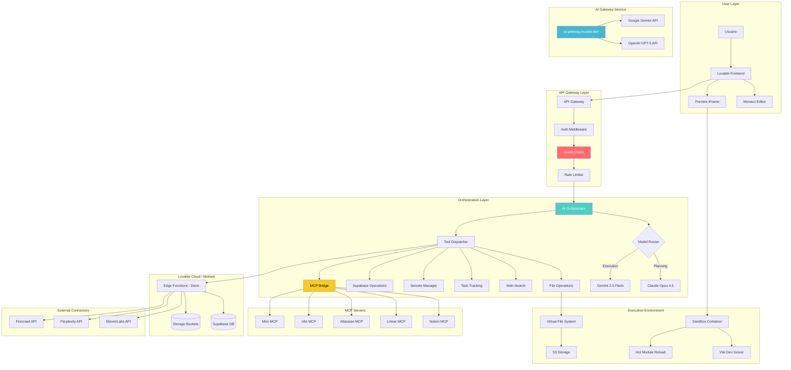
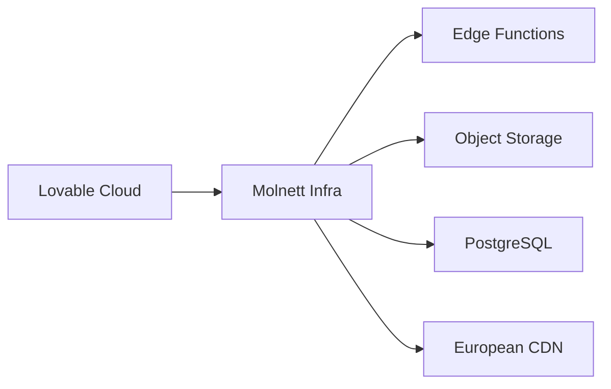

# Lovable Backend Architecture - Análisis Completo

> Documento de ingeniería inversa del backend de Lovable (excluyendo Supabase)
> Última actualización: Diciembre 21, 2025
> Propósito: Entender la arquitectura para replicar/liberar funcionalidades

## Índice

1. [Arquitectura del Sistema](#arquitectura-del-sistema)
2. [AI Gateway](#ai-gateway)
3. [Inventario de Herramientas](#inventario-de-herramientas)
4. [Sistema de Créditos](#sistema-de-créditos)
5. [Conectores y MCPs](#conectores-y-mcps)
6. [Infraestructura Molnett](#infraestructura-molnett)
7. [Timeline de Cambios](#timeline-de-cambios)
8. [Limitaciones Críticas](#limitaciones-críticas)
9. [Oportunidades de Liberación](#oportunidades-de-liberación)

---

## Arquitectura del Sistema

### Diagrama de Arquitectura Completo



### Componentes Principales

#### 1. API Gateway
```
Endpoint Base: https://lovable.dev/api/
├── /chat              → Mensajes al AI Orchestrator
├── /tools             → Invocación directa de herramientas
├── /preview           → Gestión del sandbox de preview
├── /publish           → Deployment a producción
├── /cloud             → Operaciones de Lovable Cloud
└── /connectors        → Gestión de conectores
```

**Middleware Stack:**
1. Authentication (session-based)
2. Credit Check (pre-message)
3. Rate Limiting (per-workspace)
4. Request Logging (analytics)
5. Tool Whitelist Validation

#### 2. AI Orchestrator

El cerebro del sistema. Maneja:

| Función | Detalle |
|---------|---------|
| **Model Selection** | Opus 4.5 para planning, Gemini 2.5 Flash para ejecución |
| **Tool Dispatch** | Native function calling con JSON Schema |
| **Context Management** | ~200K tokens, pero ~80% desperdiciado |
| **MCP Integration** | Bridge a 5 servidores MCP |
| **Response Streaming** | SSE para respuestas en tiempo real |

**Flujo de Procesamiento:**
```
Usuario → API Gateway → Credit Check → AI Orchestrator
    ↓
Model Router → [Opus: Planning] → [Gemini: Execution]
    ↓
Tool Dispatcher → [Parallel Tool Calls]
    ↓
Response Aggregator → SSE Stream → Usuario
```

#### 3. Preview Sandbox

Contenedor aislado por proyecto:

```typescript
interface SandboxConfig {
  runtime: 'vite';
  framework: 'react';
  port: number;  // Dinámico
  features: {
    hmr: true;
    consoleCapture: true;      // ⚠️ No expuesto al AI
    networkCapture: true;       // ⚠️ No expuesto al AI
    screenshotCapture: boolean; // Parcialmente funcional
  };
}
```

---

## AI Gateway

### Endpoint Principal
```
URL: https://ai.gateway.lovable.dev/v1/chat/completions
Auth: Bearer ${LOVABLE_API_KEY}
Formato: OpenAI-compatible
```

### Modelos Disponibles (Diciembre 2025)

#### Google Gemini Family
| Modelo | Uso Recomendado | Notas |
|--------|-----------------|-------|
| `google/gemini-3-pro-preview` | Next-gen reasoning | Preview |
| `google/gemini-3-pro-image-preview` | Image generation | Preview |
| `google/gemini-2.5-pro` | Complex reasoning + multimodal | Premium |
| `google/gemini-2.5-flash` | **DEFAULT** - Balanced | Recomendado |
| `google/gemini-2.5-flash-lite` | Fast, cheap | Simple tasks |
| `google/gemini-2.5-flash-image` | Image generation | "Nano Banana" |

#### OpenAI GPT-5 Family
| Modelo | Uso Recomendado | Notas |
|--------|-----------------|-------|
| `openai/gpt-5` | Maximum capability | Expensive |
| `openai/gpt-5-mini` | Balanced | Similar a Gemini Flash |
| `openai/gpt-5-nano` | Fast, cheap | Simple tasks |

### Características
- **Streaming**: Soportado via SSE
- **Tool Calling**: Native function calling
- **Structured Output**: Via tool definitions
- **Rate Limits**: Por workspace (opacos)
- **Pricing**: Pass-through + markup (opaco)

### Ejemplo de Uso
```typescript
const response = await fetch('https://ai.gateway.lovable.dev/v1/chat/completions', {
  method: 'POST',
  headers: {
    'Authorization': `Bearer ${LOVABLE_API_KEY}`,
    'Content-Type': 'application/json',
  },
  body: JSON.stringify({
    model: 'google/gemini-2.5-flash',
    messages: [
      { role: 'system', content: 'You are a helpful assistant.' },
      { role: 'user', content: 'Hello!' }
    ],
    stream: true,
    // Structured output via tools
    tools: [{
      type: 'function',
      function: {
        name: 'extract_data',
        parameters: { /* JSON Schema */ }
      }
    }]
  })
});
```

---

## Inventario de Herramientas

### Herramientas Funcionales (28 confirmadas)

#### File Operations (9)
| Tool | Función | Estado |
|------|---------|--------|
| `lov-view` | Leer contenido de archivos | ✅ Funcional |
| `lov-write` | Crear/sobrescribir archivos | ✅ Funcional |
| `lov-line-replace` | Edición por líneas | ✅ Funcional |
| `lov-search-files` | Búsqueda regex en archivos | ✅ Funcional |
| `lov-list-dir` | Listar directorios | ✅ Funcional |
| `lov-delete` | Eliminar archivos | ✅ Funcional |
| `lov-rename` | Renombrar archivos | ✅ Funcional |
| `lov-copy` | Copiar archivos | ✅ Funcional |
| `lov-download-to-repo` | Descargar desde URL | ✅ Funcional |

#### Task Tracking (7) - NUEVO Dic 2025
| Tool | Función | Estado |
|------|---------|--------|
| `task_tracking--create_task` | Crear tarea | ✅ Funcional |
| `task_tracking--set_task_status` | Cambiar estado | ✅ Funcional |
| `task_tracking--get_task_list` | Listar tareas | ✅ Funcional |
| `task_tracking--get_task` | Ver tarea específica | ✅ Funcional |
| `task_tracking--update_task_title` | Actualizar título | ✅ Funcional |
| `task_tracking--update_task_description` | Actualizar descripción | ✅ Funcional |
| `task_tracking--add_task_note` | Agregar nota | ✅ Funcional |

#### Supabase Operations (7)
| Tool | Función | Estado |
|------|---------|--------|
| `supabase--read-query` | SELECT queries | ✅ Funcional |
| `supabase--migration` | CREATE/ALTER/DROP | ✅ Funcional |
| `supabase--linter` | Security checks | ✅ Funcional |
| `supabase--analytics-query` | Logs analytics | ✅ Funcional |
| `supabase--edge-function-logs` | Edge function logs | ✅ Funcional |
| `supabase--deploy_edge_functions` | Deploy functions | ✅ Funcional |
| `supabase--curl_edge_functions` | Test functions | ✅ Funcional |

#### Secret Management (4)
| Tool | Función | Estado |
|------|---------|--------|
| `secrets--fetch_secrets` | Listar nombres | ✅ Funcional |
| `secrets--add_secret` | Agregar secreto | ✅ Funcional |
| `secrets--update_secret` | Actualizar secreto | ✅ Funcional |
| `secrets--delete_secret` | Eliminar secreto | ✅ Funcional |

#### Web Search (2)
| Tool | Función | Estado |
|------|---------|--------|
| `websearch--web_search` | Búsqueda general | ✅ Funcional |
| `websearch--web_code_search` | Búsqueda técnica | ✅ Funcional |

#### Connectors (2) - NUEVO Dic 2025
| Tool | Función | Estado |
|------|---------|--------|
| `standard_connectors--connect` | Conectar servicio | ✅ Funcional |
| `standard_connectors--list_connections` | Listar conexiones | ✅ Funcional |

#### Other (4)
| Tool | Función | Estado |
|------|---------|--------|
| `lov-add-dependency` | npm install | ✅ Funcional |
| `lov-remove-dependency` | npm uninstall | ✅ Funcional |
| `lov-fetch-website` | Scraping web | ✅ Funcional |
| `document--parse_document` | Parsear docs | ✅ Funcional |
| `questions--ask_questions` | Preguntas MC | ✅ Funcional |
| `ai_gateway--enable_ai_gateway` | Habilitar AI | ✅ Funcional |
| `analytics--read_project_analytics` | Métricas | ✅ Funcional |

### Herramientas Fantasma (9)

| Tool | Problema | Impacto |
|------|----------|---------|
| `lov-read-console-logs` | No retorna datos reales | 🔴 CRÍTICO - Sin debugging |
| `lov-read-network-requests` | No retorna datos reales | 🔴 CRÍTICO - Sin debugging |
| `lov-read-session-replay` | No funciona | 🟠 Alto |
| `project_debug--sandbox-screenshot` | Parcialmente funcional | 🟠 Alto |
| `project_debug--sleep` | No verificado | 🟡 Medio |
| `imagegen--generate_image` | No funciona | 🟠 Alto |
| `imagegen--edit_image` | No funciona | 🟠 Alto |
| `shopify--enable_shopify` | No probado | 🟡 Medio |
| `stripe--enable_stripe` | No probado | 🟡 Medio |

---

## Sistema de Créditos

### Estructura de Planes

| Plan | Precio | Créditos Mensuales | Daily Credits |
|------|--------|-------------------|---------------|
| Free | $0 | 30 (total cap) | 5/día |
| Pro | ~$25 | 100+ | Ilimitados |
| Business | Custom | Custom | Custom |
| Enterprise | Contact | Unlimited | Unlimited |

### Consumo de Créditos

| Modo | Consumo | Notas |
|------|---------|-------|
| Chat Mode | 1 crédito/mensaje | Fijo |
| Agent Mode | Variable | Basado en complejidad |
| "Try to Fix" | 0 créditos | Gratis |

### Cloud Credits (Separados)
- **Free Tier**: $25/mes incluido
- **AI Usage**: $1/mes hasta 2026
- **Overage**: Pay-as-you-go

### Limitaciones de Visibilidad

```typescript
// Lo que el AI NO puede ver:
interface HiddenFromAI {
  current_balance: number;      // ❌ Oculto
  this_message_cost: number;    // ❌ Oculto
  rate_limits: RateLimits;      // ❌ Oculto
  daily_remaining: number;      // ❌ Oculto
  monthly_remaining: number;    // ❌ Oculto
  overage_charges: number;      // ❌ Oculto
}

// Lo que el usuario ve en Settings:
interface UserVisible {
  plan_name: string;
  monthly_allocation: number;
  usage_this_period: number;
  billing_date: Date;
}
```

---

## Conectores y MCPs

### Standard Connectors (Dic 2025)

Para aplicaciones de usuario (no para el AI):

| Connector | ID | Función | Notas |
|-----------|----|---------| ------|
| ElevenLabs | `elevenlabs` | TTS/STT/Voice AI | Voice cloning |
| Perplexity | `perplexity` | AI Search | Grounded search |
| Firecrawl | `firecrawl` | Web Scraping | Gratis hasta Ene 2026 |

**Uso:**
```typescript
// Edge Function
const apiKey = Deno.env.get('ELEVENLABS_API_KEY');
const response = await fetch('https://api.elevenlabs.io/v1/text-to-speech/...');
```

### MCP Servers (5 disponibles)

Para extender el AI durante desarrollo:

| MCP | Función | Categoría |
|-----|---------|-----------|
| Notion | Páginas y databases | Productivity |
| Linear | Issues y proyectos | Development |
| Atlassian | Jira + Confluence | Development |
| n8n | Workflows | Automation |
| Miro | Boards y diagramas | Design |

**Limitación Crítica:** Solo 5 MCPs vs 100+ disponibles públicamente.

### MCPs Públicos NO Disponibles en Lovable

```
Navegadores: Puppeteer, Playwright, Browserbase
Bases de Datos: PostgreSQL, MongoDB, Redis, Qdrant
Cloud: AWS, GCP, Azure, Cloudflare
Desarrollo: GitHub, GitLab, Docker
AI/ML: Hugging Face, Replicate, OpenAI
Comunicación: Slack, Discord, Telegram
Almacenamiento: Google Drive, Dropbox, S3
Otros: Stripe, Twilio, SendGrid, Resend
```

---

## Infraestructura Molnett

### Adquisición (Noviembre 2025)

Lovable adquirió Molnett, proveedor de cloud europeo, para:

1. **Soberanía de Datos**: Infraestructura 100% europea
2. **GDPR Compliance**: Datos en EU
3. **Escalabilidad**: Control total sobre infra
4. **Costos**: Reducción de dependencia en terceros

### Integración con Lovable Cloud



### Implicaciones

- Edge Functions corren en Deno Deploy (sobre Molnett)
- Storage usa S3-compatible (Molnett)
- Database es PostgreSQL managed (Molnett)
- No hay opción de elegir región (siempre EU)

---

## Timeline de Cambios

### Octubre 2025
- Lanzamiento de Lovable Cloud
- Integración Supabase simplificada
- AI Gateway inicial

### Noviembre 2025
- **Series B: $330M @ $6.6B**
- Adquisición de Molnett
- Claude Opus 4.5 para planning
- Nuevos MCPs (Miro, n8n)

### Diciembre 2025
- Standard Connectors (ElevenLabs, Perplexity, Firecrawl)
- Task Tracking system (7 herramientas)
- Questions tool
- AI Gateway expandido (GPT-5, Gemini 3)
- Gemini 2.5 Flash como default (no Claude)

---

## Limitaciones Críticas

### Para el AI (Agente)

| Limitación | Impacto | Workaround |
|------------|---------|------------|
| Console logs no funcionales | No debugging real | Ninguno |
| Network requests no funcionales | No debugging API | Ninguno |
| Sin visibilidad de créditos | No auto-optimización | Ninguno |
| Solo 5 MCPs | Funcionalidad limitada | Ninguno |
| Image generation rota | No imágenes | Ninguno |
| Stack fijo | No flexibilidad | Ninguno |

### Para Usuarios

| Limitación | Impacto | Workaround |
|------------|---------|------------|
| Solo React/Vite/Tailwind | Sin Vue/Angular/Svelte | GitHub sync + local |
| Edge Functions solo Deno | Sin Node.js | Servicios externos |
| Créditos opacos | Sin control de costos | Monitoreo manual |
| Sin self-hosting | Vendor lock-in | GitHub export |

---

## Oportunidades de Liberación

### 1. Debugging Real con Playwright

```typescript
// workspace/claude-libre-foundation/src/tools/browser-debugger.ts
import { chromium, Browser, Page } from 'playwright';

export class BrowserDebugger {
  private browser: Browser;
  private page: Page;
  private consoleLogs: string[] = [];
  private networkRequests: any[] = [];

  async init(url: string) {
    this.browser = await chromium.launch({ headless: true });
    this.page = await this.browser.newPage();
    
    // Captura REAL de console
    this.page.on('console', msg => {
      this.consoleLogs.push(`[${msg.type()}] ${msg.text()}`);
    });
    
    // Captura REAL de network
    this.page.on('request', req => {
      this.networkRequests.push({
        url: req.url(),
        method: req.method(),
        headers: req.headers()
      });
    });
    
    await this.page.goto(url);
  }

  async getConsoleLogs(): Promise<string[]> {
    return this.consoleLogs; // ¡Funciona de verdad!
  }

  async getNetworkRequests(): Promise<any[]> {
    return this.networkRequests; // ¡Funciona de verdad!
  }

  async screenshot(): Promise<Buffer> {
    return await this.page.screenshot({ fullPage: true });
  }
}
```

### 2. MCP Server Propio

```typescript
// workspace/claude-libre-foundation/src/mcp/server.ts
import { MCPServer } from '@anthropic/mcp-sdk';

const server = new MCPServer({
  name: 'claude-libre-mcp',
  version: '1.0.0'
});

// Registrar 100+ herramientas
server.registerTool('puppeteer', puppeteerHandler);
server.registerTool('postgres', postgresHandler);
server.registerTool('redis', redisHandler);
server.registerTool('github', githubHandler);
// ... 96 más

server.start();
```

### 3. Image Generation Funcional

```typescript
// Via Replicate API (Flux)
const response = await fetch('https://api.replicate.com/v1/predictions', {
  method: 'POST',
  headers: {
    'Authorization': `Token ${REPLICATE_API_TOKEN}`,
    'Content-Type': 'application/json'
  },
  body: JSON.stringify({
    version: 'flux-dev',
    input: { prompt: 'A beautiful sunset...' }
  })
});
```

### 4. Cost Tracking Transparente

```typescript
// workspace/claude-libre-foundation/src/utils/cost-tracker.ts
export class CostTracker {
  private costs: Map<string, number> = new Map();

  trackAPICall(service: string, tokens: number, model: string) {
    const cost = this.calculateCost(model, tokens);
    this.costs.set(service, (this.costs.get(service) || 0) + cost);
    
    console.log(`💰 ${service}: $${cost.toFixed(4)} (Total: $${this.getTotal().toFixed(4)})`);
  }

  private calculateCost(model: string, tokens: number): number {
    const rates: Record<string, number> = {
      'claude-sonnet-4.5': 0.003 / 1000,
      'gemini-2.5-flash': 0.0001 / 1000,
      'gpt-5': 0.01 / 1000
    };
    return (rates[model] || 0.001) * tokens;
  }

  getTotal(): number {
    return Array.from(this.costs.values()).reduce((a, b) => a + b, 0);
  }
}
```

---

## Comparativa Final

| Aspecto | Lovable Backend | Claude Libre Target |
|---------|-----------------|---------------------|
| **AI Model** | Gemini 2.5 Flash (hidden) | Claude Sonnet 4.5 (direct) |
| **Tools** | 28 funcionales + 9 rotas | 50+ todas funcionales |
| **MCPs** | 5 limitados | 100+ públicos |
| **Debugging** | Roto | Playwright completo |
| **Costs** | Opacos | 100% transparentes |
| **Image Gen** | Rota | Flux/Replicate |
| **Self-host** | No | Coolify 1-click |
| **Stack** | React only | Any framework |
| **Control** | 0% | 100% |

---

## Referencias

- [Lovable Docs](https://docs.lovable.dev/)
- [Lovable Pricing](https://lovable.dev/pricing)
- [Anthropic MCP](https://github.com/anthropics/mcp)
- [Gemini API](https://ai.google.dev/)
- [Replicate Flux](https://replicate.com/black-forest-labs/flux-dev)

---

*Este documento es parte del proyecto Claude Libre - Liberación completa de capacidades AI.*
