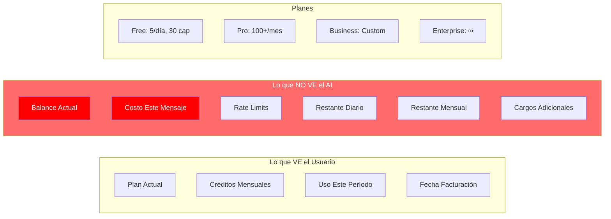
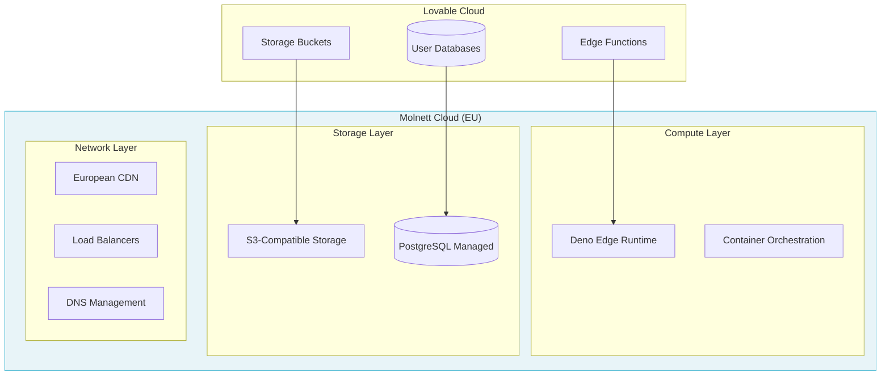

# Mapa Detallado del Backend de Lovable

> **Fecha de mapeo:** 21 Diciembre 2025  
> **Método:** Detección empírica desde el agente  
> **Alcance:** Solo backend Lovable (excluye Supabase del usuario)

---

## 🗺️ Mapa Visual Completo

```mermaid
flowchart TB
    subgraph USER["👤 CAPA DE USUARIO"]
        Browser[Navegador]
        Monaco[Monaco Editor]
        Preview[Preview iFrame]
        Chat[Chat Interface]
    end

    subgraph GATEWAY["🚪 API GATEWAY (lovable.dev/api)"]
        direction TB
        Auth[Auth Middleware]
        CreditCheck[Credit Check<br/>⚠️ Opaco al AI]
        RateLimit[Rate Limiter<br/>⚠️ Oculto]
        Router[Request Router]
        
        Auth --> CreditCheck
        CreditCheck --> RateLimit
        RateLimit --> Router
    end

    subgraph ORCHESTRATOR["🧠 AI ORCHESTRATOR"]
        direction TB
        ModelRouter{Model Router}
        ToolDispatcher[Tool Dispatcher]
        ContextManager[Context Manager<br/>~200K tokens]
        ResponseAggregator[Response Aggregator]
        
        ModelRouter --> ToolDispatcher
        ToolDispatcher --> ResponseAggregator
    end

    subgraph MODELS["🤖 MODELOS AI"]
        direction LR
        subgraph Planning
            Opus[Claude Opus 4.5]
        end
        subgraph Execution
            Gemini[Gemini 2.5 Flash<br/>DEFAULT]
        end
    end

    subgraph AIGATEWAY["☁️ AI GATEWAY (ai.gateway.lovable.dev)"]
        direction TB
        GatewayRouter{Gateway Router}
        
        subgraph GoogleModels[Google Gemini]
            G3Pro[gemini-3-pro-preview]
            G3Img[gemini-3-pro-image-preview]
            G25Pro[gemini-2.5-pro]
            G25Flash[gemini-2.5-flash ⭐]
            G25Lite[gemini-2.5-flash-lite]
            G25Img[gemini-2.5-flash-image]
        end
        
        subgraph OpenAIModels[OpenAI GPT-5]
            GPT5[gpt-5]
            GPT5Mini[gpt-5-mini]
            GPT5Nano[gpt-5-nano]
        end
        
        GatewayRouter --> GoogleModels
        GatewayRouter --> OpenAIModels
    end

    subgraph TOOLS["🔧 HERRAMIENTAS (37 detectadas)"]
        direction TB
        
        subgraph FileOps["📁 File Operations (9)"]
            view[lov-view]
            write[lov-write]
            lineReplace[lov-line-replace]
            search[lov-search-files]
            list[lov-list-dir]
            delete[lov-delete]
            rename[lov-rename]
            copy[lov-copy]
            download[lov-download-to-repo]
        end
        
        subgraph TaskTracking["✅ Task Tracking (7)"]
            createTask[create_task]
            setStatus[set_task_status]
            getList[get_task_list]
            getTask[get_task]
            updateTitle[update_task_title]
            updateDesc[update_task_description]
            addNote[add_task_note]
        end
        
        subgraph SupabaseOps["🗄️ Supabase Ops (7)"]
            readQuery[read-query]
            migration[migration]
            linter[linter]
            analytics[analytics-query]
            edgeLogs[edge-function-logs]
            deployFn[deploy_edge_functions]
            curlFn[curl_edge_functions]
        end
        
        subgraph Secrets["🔐 Secrets (4)"]
            fetchSec[fetch_secrets]
            addSec[add_secret]
            updateSec[update_secret]
            deleteSec[delete_secret]
        end
        
        subgraph WebSearch["🌐 Web Search (2)"]
            webSearch[web_search]
            codeSearch[web_code_search]
        end
        
        subgraph Connectors["🔌 Connectors (2)"]
            connect[connect]
            listConn[list_connections]
        end
        
        subgraph Security["🛡️ Security (3)"]
            secScan[get_security_scan_results]
            tableSchema[get_table_schema]
            manageFinding[manage_security_finding]
        end
        
        subgraph Other["📦 Other (7)"]
            addDep[lov-add-dependency]
            removeDep[lov-remove-dependency]
            fetchWeb[lov-fetch-website]
            parseDoc[document--parse_document]
            askQ[questions--ask_questions]
            enableAI[ai_gateway--enable_ai_gateway]
            readAnalytics[analytics--read_project_analytics]
        end
    end

    subgraph GHOST["👻 GHOST TOOLS (9) - NO FUNCIONALES"]
        direction TB
        consoleLogs[lov-read-console-logs ❌]
        networkReq[lov-read-network-requests ❌]
        sessionReplay[lov-read-session-replay ❌]
        screenshot[sandbox-screenshot ⚠️]
        sleep[project_debug--sleep ❓]
        genImage[imagegen--generate_image ❌]
        editImage[imagegen--edit_image ❌]
        shopify[shopify--enable_shopify ❓]
        stripe[stripe--enable_stripe ❓]
    end

    subgraph MCP["🔗 MCP SERVERS (5)"]
        direction LR
        Notion[Notion]
        Linear[Linear]
        Atlassian[Atlassian]
        n8n[n8n]
        Miro[Miro]
    end

    subgraph STDCONN["🔌 STANDARD CONNECTORS (3)"]
        direction LR
        ElevenLabs[ElevenLabs<br/>Voice AI]
        Perplexity[Perplexity<br/>AI Search]
        Firecrawl[Firecrawl<br/>Web Scraping]
    end

    subgraph SANDBOX["📦 PREVIEW SANDBOX"]
        direction TB
        ViteDev[Vite Dev Server]
        HMR[Hot Module Reload]
        ConsoleCapture[Console Capture<br/>⚠️ No expuesto]
        NetworkCapture[Network Capture<br/>⚠️ No expuesto]
    end

    subgraph MOLNETT["🏰 INFRAESTRUCTURA MOLNETT"]
        direction TB
        EdgeFn[Edge Functions<br/>Deno Runtime]
        ObjStorage[Object Storage<br/>S3-compatible]
        CDN[European CDN]
        Compute[Compute Instances]
    end

    %% Conexiones principales
    Browser --> GATEWAY
    Chat --> GATEWAY
    GATEWAY --> ORCHESTRATOR
    ORCHESTRATOR --> MODELS
    ORCHESTRATOR --> TOOLS
    ORCHESTRATOR --> MCP
    
    ModelRouter --> Opus
    ModelRouter --> Gemini
    
    ToolDispatcher --> AIGATEWAY
    
    TOOLS --> SANDBOX
    TOOLS --> MOLNETT
    
    STDCONN --> EdgeFn

    %% Estilos
    style CreditCheck fill:#ff6b6b,color:#fff
    style RateLimit fill:#ff6b6b,color:#fff
    style GHOST fill:#ffcccc,stroke:#cc0000
    style ORCHESTRATOR fill:#4ecdc4,color:#fff
    style AIGATEWAY fill:#45b7d1,color:#fff
    style Gemini fill:#00ff00,color:#000
```



---

## 📊 Inventario Completo de Endpoints

### API Gateway Principal
```
Base URL: https://lovable.dev/api/
```

| Endpoint | Método | Función | Acceso AI |
|----------|--------|---------|-----------|
| `/chat` | POST | Mensajes al orchestrator | ✅ Implícito |
| `/tools` | POST | Invocación de herramientas | ✅ Implícito |
| `/preview` | GET/POST | Gestión sandbox | ⚠️ Parcial |
| `/publish` | POST | Deploy producción | ❌ No directo |
| `/cloud` | * | Lovable Cloud ops | ⚠️ Via tools |
| `/connectors` | * | Gestión conectores | ⚠️ Via tools |
| `/projects` | * | CRUD proyectos | ❌ No acceso |
| `/workspaces` | * | Gestión workspaces | ❌ No acceso |
| `/billing` | * | Créditos/planes | ❌ No acceso |
| `/analytics` | GET | Métricas | ✅ Via tool |

### AI Gateway
```
Base URL: https://ai.gateway.lovable.dev/v1/
```

| Endpoint | Método | Función | Formato |
|----------|--------|---------|---------|
| `/chat/completions` | POST | Chat completions | OpenAI-compatible |
| `/models` | GET | Listar modelos | OpenAI-compatible |

---

## 🔧 Catálogo Completo de Herramientas

### Herramientas Funcionales (37)

#### 📁 File Operations (9)
| ID | Tool | Input | Output | Notas |
|----|------|-------|--------|-------|
| 1 | `lov-view` | `{file_path, lines?}` | Contenido | Límite 500 líneas default |
| 2 | `lov-write` | `{file_path, content}` | Success/Error | Crea directorios |
| 3 | `lov-line-replace` | `{file_path, search, first_line, last_line, replace}` | Success | Preferido para edits |
| 4 | `lov-search-files` | `{query, search_dir?, include/exclude_patterns?}` | Matches | Regex support |
| 5 | `lov-list-dir` | `{dir_path}` | Files/Dirs | Con metadata |
| 6 | `lov-delete` | `{file_path}` | Success | Irreversible |
| 7 | `lov-rename` | `{original_path, new_path}` | Success | Preferido vs delete+create |
| 8 | `lov-copy` | `{source, destination}` | Success | Para user-uploads |
| 9 | `lov-download-to-repo` | `{source_url, target_path}` | Success | Descarga assets |

#### ✅ Task Tracking (7) - Sistema nuevo Dic 2025
| ID | Tool | Input | Output |
|----|------|-------|--------|
| 10 | `task_tracking--create_task` | `{title, description}` | task_id |
| 11 | `task_tracking--set_task_status` | `{task_id, status}` | Success |
| 12 | `task_tracking--get_task_list` | `{}` | Lista tasks |
| 13 | `task_tracking--get_task` | `{task_id}` | Task details |
| 14 | `task_tracking--update_task_title` | `{task_id, new_title}` | Success |
| 15 | `task_tracking--update_task_description` | `{task_id, new_description}` | Success |
| 16 | `task_tracking--add_task_note` | `{task_id, note}` | Success |

#### 🗄️ Supabase Operations (7)
| ID | Tool | Input | Output |
|----|------|-------|--------|
| 17 | `supabase--read-query` | `{query}` | Resultados SQL |
| 18 | `supabase--migration` | `{query}` | Migration result |
| 19 | `supabase--linter` | `{}` | Security warnings |
| 20 | `supabase--analytics-query` | `{query}` | Logs analytics |
| 21 | `supabase--edge-function-logs` | `{function_name, search?}` | Logs |
| 22 | `supabase--deploy_edge_functions` | `{function_names[]}` | Deploy status |
| 23 | `supabase--curl_edge_functions` | `{path, method, body?, headers?}` | Response |

#### 🔐 Secrets Management (4)
| ID | Tool | Input | Output |
|----|------|-------|--------|
| 24 | `secrets--fetch_secrets` | `{}` | Lista nombres |
| 25 | `secrets--add_secret` | `{secret_names[]}` | UI prompt |
| 26 | `secrets--update_secret` | `{secret_names[]}` | UI prompt |
| 27 | `secrets--delete_secret` | `{secret_names[]}` | Confirmation |

#### 🌐 Web Search (2)
| ID | Tool | Input | Output |
|----|------|-------|--------|
| 28 | `websearch--web_search` | `{query, numResults?, category?}` | Search results |
| 29 | `websearch--web_code_search` | `{query, tokensNum?}` | Code examples |

#### 🔌 Connectors (2)
| ID | Tool | Input | Output |
|----|------|-------|--------|
| 30 | `standard_connectors--connect` | `{connector_id}` | Connection setup |
| 31 | `standard_connectors--list_connections` | `{}` | Connections list |

#### 🛡️ Security (4)
| ID | Tool | Input | Output |
|----|------|-------|--------|
| 32 | `security--get_security_scan_results` | `{force?}` | Scan results |
| 33 | `security--get_table_schema` | `{}` | Schema + analysis |
| 34 | `security--manage_security_finding` | `{operations[]}` | CRUD findings |
| 35 | `security--run_security_scan` | `{}` | Trigger scan |

#### 📦 Other (6)
| ID | Tool | Input | Output |
|----|------|-------|--------|
| 36 | `lov-add-dependency` | `{package}` | Install result |
| 37 | `lov-remove-dependency` | `{package}` | Uninstall result |
| 38 | `lov-fetch-website` | `{url, formats?}` | Content |
| 39 | `document--parse_document` | `{file_path}` | Parsed content |
| 40 | `questions--ask_questions` | `{questions[]}` | UI prompt |
| 41 | `ai_gateway--enable_ai_gateway` | `{}` | Enable AI |
| 42 | `analytics--read_project_analytics` | `{startdate, enddate, granularity}` | Metrics |

### Herramientas Ghost (9) - No Funcionales

| ID | Tool | Problema Detectado | Severidad |
|----|------|-------------------|-----------|
| G1 | `lov-read-console-logs` | Retorna logs obsoletos (horas atrás) | 🔴 CRÍTICO |
| G2 | `lov-read-network-requests` | Retorna array vacío siempre | 🔴 CRÍTICO |
| G3 | `lov-read-session-replay` | Sin eventos de interacción | 🔴 CRÍTICO |
| G4 | `project_debug--sandbox-screenshot` | Solo top, sin auth pages | 🟠 ALTO |
| G5 | `project_debug--sleep` | No verificable | 🟡 MEDIO |
| G6 | `imagegen--generate_image` | Error no documentado | 🟠 ALTO |
| G7 | `imagegen--edit_image` | Error no documentado | 🟠 ALTO |
| G8 | `shopify--enable_shopify` | Sin test disponible | 🟡 MEDIO |
| G9 | `stripe--enable_stripe` | Sin test disponible | 🟡 MEDIO |

---

## 🔗 Mapa de MCPs

### MCPs Disponibles (5)
```
┌─────────────────────────────────────────────────────────────┐
│                    MCP BRIDGE (Lovable)                     │
├──────────────┬──────────────┬─────────────┬────────┬────────┤
│   Notion     │    Linear    │  Atlassian  │  n8n   │  Miro  │
│   (Prod)     │    (Dev)     │   (Dev)     │ (Auto) │(Design)│
├──────────────┼──────────────┼─────────────┼────────┼────────┤
│ Pages        │ Issues       │ Jira Issues │ Work-  │ Boards │
│ Databases    │ Projects     │ Confluence  │ flows  │ Diagr. │
│ Blocks       │ Comments     │ Pages       │        │        │
└──────────────┴──────────────┴─────────────┴────────┴────────┘
```

### MCPs Públicos NO Disponibles (100+)
```
Categoría          │ MCPs Faltantes
───────────────────┼────────────────────────────────────────
Navegadores        │ Puppeteer, Playwright, Browserbase, Selenium
Bases de Datos     │ PostgreSQL, MongoDB, Redis, Qdrant, Pinecone
Cloud Providers    │ AWS, GCP, Azure, Cloudflare, Vercel
Git/Dev            │ GitHub, GitLab, Bitbucket
AI/ML              │ Hugging Face, Replicate, OpenAI, Anthropic
Comunicación       │ Slack, Discord, Telegram, Email
Almacenamiento     │ Google Drive, Dropbox, OneDrive, S3
Pagos              │ Stripe, PayPal, Square
Marketing          │ Mailchimp, SendGrid, Twilio
Productividad      │ Airtable, Coda, Todoist, Asana
```

---

## 🔌 Standard Connectors

### Disponibles (3)
| Connector | ID | API Key Secret | Endpoints |
|-----------|----|--------------|----|
| ElevenLabs | `elevenlabs` | `ELEVENLABS_API_KEY` | TTS, STT, Voice Clone |
| Perplexity | `perplexity` | `PERPLEXITY_API_KEY` | AI Search |
| Firecrawl | `firecrawl` | `FIRECRAWL_API_KEY` | Scrape, Crawl, Map |

### No Disponibles (Observados en Otros Proyectos)
```
- Google (Drive, Sheets, Calendar)
- Microsoft (OneDrive, Graph)
- Dropbox
- Stripe (existe tool pero no connector)
- Twilio
- SendGrid
- Airtable
```

---

## 💰 Sistema de Créditos (Mapa)



---

## 🏰 Infraestructura Molnett



---

## 📈 Secretos Detectados en Este Proyecto

```
┌─────────────────────────────────────────────────────────────┐
│                    SECRETS VAULT                            │
├─────────────────────────┬───────────────────────────────────┤
│ ANTHROPIC_API_KEY       │ ✅ Configurado                    │
│ GITHUB_TOKEN            │ ✅ Configurado                    │
│ OPENAI_API_KEY          │ ✅ Configurado                    │
├─────────────────────────┼───────────────────────────────────┤
│ SUPABASE_URL            │ 🔒 Sistema (no deletable)         │
│ SUPABASE_ANON_KEY       │ 🔒 Sistema (no deletable)         │
│ SUPABASE_SERVICE_ROLE   │ 🔒 Sistema (no deletable)         │
│ SUPABASE_DB_URL         │ 🔒 Sistema (no deletable)         │
│ SUPABASE_PUBLISHABLE    │ 🔒 Sistema (no deletable)         │
└─────────────────────────┴───────────────────────────────────┘
```

---

## 🔄 Edge Functions Detectadas

```
supabase/functions/
├── ai-orchestrator/      → Orquestador AI propio
├── github-ops/           → Operaciones GitHub
├── import-text-memories/ → Importar memorias texto
├── load-session-memory/  → Cargar memoria sesión
├── retrieve-relevant-memories/ → Búsqueda semántica
└── save-conversation/    → Guardar conversación
```

---

## 📊 Resumen del Mapa

| Categoría | Detectado | Funcional | Roto/Oculto |
|-----------|-----------|-----------|-------------|
| **Tools Totales** | 51 | 42 (82%) | 9 (18%) |
| **MCPs** | 5 | 5 (100%) | 0 |
| **Connectors** | 3 | 3 (100%) | 0 |
| **AI Models** | 9 | 9 (100%) | 0 |
| **Endpoints API** | 10+ | ¿? | ¿? |
| **Visibilidad Créditos** | 4 | 0 (0%) | 4 (100%) |

---

## 🎯 Conclusiones Clave

1. **42 herramientas funcionales** vs 9 rotas (principalmente debugging)
2. **AI Gateway robusto** con 9 modelos disponibles
3. **Capa de créditos completamente opaca** al AI
4. **Solo 5 MCPs** de 100+ públicos
5. **Infraestructura Molnett** en EU (GDPR compliant)
6. **Preview sandbox** captura datos que no expone
7. **3 connectors** para apps de usuario

---

*Generado por introspección empírica del agente - Diciembre 2025*
