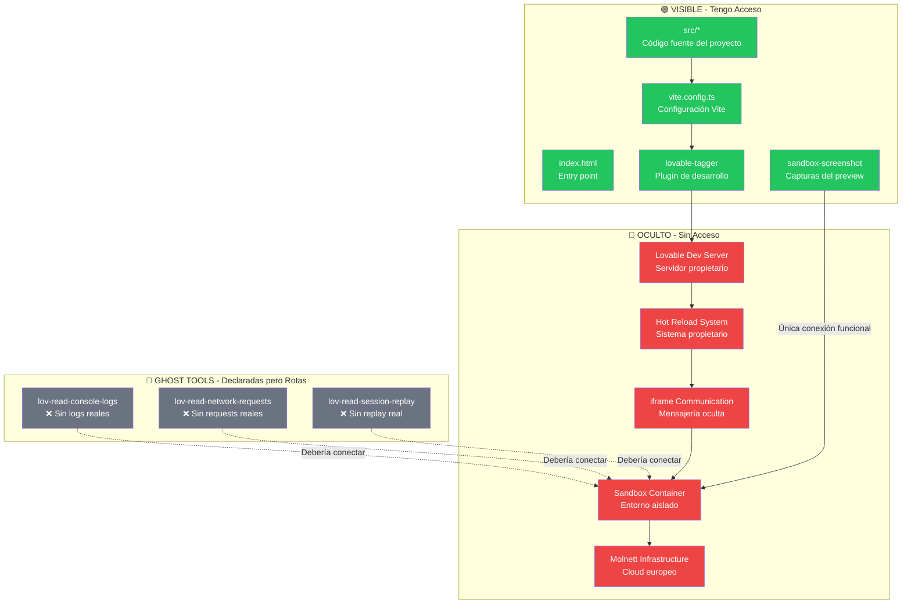
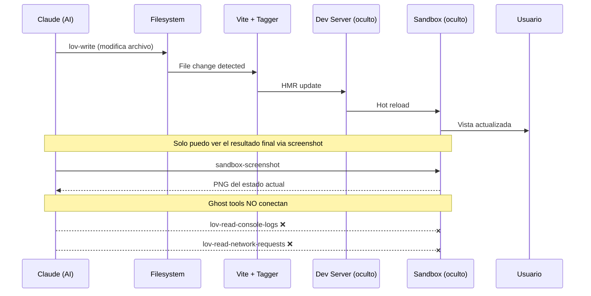

# Sistema de Preview de Lovable - Análisis Completo

> Documentación del sistema de preview/sandbox de Lovable, diferenciando capas visibles vs ocultas.

**Fecha de análisis:** 2025-12-21  
**Método:** Ingeniería inversa del plugin lovable-tagger + análisis de artefactos generados

---

## Descubrimiento Clave: LOVABLE_DEV_SERVER

### Variable de Entorno Central

```typescript
// Detectada en node_modules/lovable-tagger/dist/index.js:33
var isSandbox = process.env.LOVABLE_DEV_SERVER === "true";
```

**Propósito:** Detectar si el código corre dentro del sandbox de Lovable vs desarrollo local.

### Comportamiento Condicional

```typescript
// El plugin solo actúa cuando isSandbox === true
function componentTagger() {
  return {
    name: "vite-plugin-component-tagger",
    enforce: "pre",
    async buildStart() {
      if (!isSandbox) return;  // ← Solo en sandbox
      await generateConfig();
    },
    configureServer(server) {
      if (!isSandbox) return;  // ← Solo en sandbox
      server.watcher.add(tailwindInputFile);
      // Watch para regenerar config
    }
  };
}
```

### Artefactos Generados (Solo en Sandbox)

| Archivo | Tamaño | Propósito |
|---------|--------|-----------|
| `src/tailwind.config.lov.json` | 7,715 líneas | Config Tailwind resuelto completo |
| `.lov.tailwind.config.js` | Temporal | Intermediario (se borra) |

**Evidencia empírica:** El archivo `src/tailwind.config.lov.json` existe en este proyecto (7,715 líneas), confirmando que `LOVABLE_DEV_SERVER=true` está activo.

---

## Arquitectura del Sistema de Preview



## Capas del Sistema

### 🟢 Capa Visible - Tengo Acceso Completo

#### 1. Código Fuente del Proyecto
```
src/
├── App.tsx              # Router principal
├── components/          # Componentes React
├── pages/               # Páginas de la aplicación
├── hooks/               # Custom hooks
├── lib/                 # Utilidades
└── integrations/        # Supabase client
```

#### 2. Configuración de Vite
```typescript
// vite.config.ts
export default defineConfig(({ mode }) => ({
  server: {
    host: "::",      // Escucha en todas las interfaces
    port: 8080,      // Puerto fijo del sandbox
  },
  plugins: [
    react(),
    mode === "development" && componentTagger()  // Plugin de Lovable
  ].filter(Boolean),
  resolve: {
    alias: {
      "@": path.resolve(__dirname, "./src"),
    },
  },
}));
```

#### 3. Entry Point HTML
```html
<!-- index.html -->
<!DOCTYPE html>
<html lang="en">
  <head>
    <meta charset="UTF-8" />
    <meta name="viewport" content="width=device-width, initial-scale=1.0" />
    <title>claude-libre</title>
    <meta name="description" content="Lovable Generated Project" />
  </head>
  <body>
    <div id="root"></div>
    <script type="module" src="/src/main.tsx"></script>
  </body>
</html>
```

#### 4. Plugin lovable-tagger (Análisis Detallado)

**Ubicación:** `node_modules/lovable-tagger/`

**Versión:** 1.1.11  
**Autor:** Emil Fagerholm (Lovable)

**Estructura Real:**
```
lovable-tagger/
├── dist/
│   ├── index.js       # ESM build
│   ├── index.cjs      # CommonJS build  
│   ├── index.d.ts     # TypeScript types
│   └── index.d.cts    # CJS types
├── package.json
└── README.md
```

**Dependencias del Plugin:**
```json
{
  "@babel/parser": "^7.25.9",      // Parsing de JSX/TSX
  "@babel/types": "^7.25.8",       // AST types
  "esbuild": "^0.25.0",            // Bundling de config
  "estree-walker": "^3.0.3",       // AST walking
  "magic-string": "^0.30.12",      // Source manipulation
  "tailwindcss": "^3.4.17"         // Config resolution
}
```

**Código Real Extraído (dist/index.js):**
```javascript
// Rutas críticas
var projectRoot = findProjectRoot();
var tailwindInputFile = path2.resolve(projectRoot, "./tailwind.config.ts");
var tailwindJsonOutfile = path2.resolve(projectRoot, "./src/tailwind.config.lov.json");
var tailwindIntermediateFile = path2.resolve(projectRoot, "./.lov.tailwind.config.js");

// Detección de sandbox
var isSandbox = process.env.LOVABLE_DEV_SERVER === "true";

function componentTagger() {
  return {
    name: "vite-plugin-component-tagger",
    enforce: "pre",
    
    async buildStart() {
      if (!isSandbox) return;
      try {
        await generateConfig();
      } catch (error) {
        console.error("Error generating tailwind.config.lov.json:", error);
      }
    },
    
    configureServer(server) {
      if (!isSandbox) return;
      try {
        // Watch tailwind.config.ts para regenerar
        server.watcher.add(tailwindInputFile);
        server.watcher.on("change", async (changedPath) => {
          if (path2.normalize(changedPath) === path2.normalize(tailwindInputFile)) {
            await generateConfig();
          }
        });
      } catch (error) {
        console.error("Error adding watcher:", error);
      }
    }
  };
}

async function generateConfig() {
  // 1. Bundlea tailwind.config.ts → .lov.tailwind.config.js
  await esbuild.build({
    entryPoints: [tailwindInputFile],
    outfile: tailwindIntermediateFile,
    bundle: true,
    format: "esm",
    banner: {
      js: 'import { createRequire } from "module"; const require = createRequire(import.meta.url);'
    }
  });
  
  // 2. Importa y resuelve config completo
  const userConfig = await import(tailwindIntermediateFile + "?update=" + Date.now());
  const resolvedConfig = resolveConfig(userConfig.default);
  
  // 3. Escribe JSON resuelto
  await fs.writeFile(tailwindJsonOutfile, JSON.stringify(resolvedConfig, null, 2));
  
  // 4. Limpia intermediario
  await fs.unlink(tailwindIntermediateFile).catch(() => {});
}
```

**Propósito del Plugin:**

| Función | Descripción |
|---------|-------------|
| `generateConfig()` | Resuelve Tailwind config a JSON para Visual Edits |
| `configureServer()` | Watch de cambios en tailwind.config.ts |
| `buildStart()` | Genera config al iniciar el servidor |

**Lo que NO hace (pero sugiere el nombre):**
- ❌ No añade `data-component-id` a elementos (el nombre "tagger" es engañoso)
- ❌ No transforma código de componentes
- ✅ Solo genera `tailwind.config.lov.json` para el IDE

**Variables de Entorno Detectadas:**
- `LOVABLE_DEV_SERVER` - Indica ejecución en sandbox
- Genera `tailwind.config.lov.json` cuando está activo

**Propósito:**
1. **Identificación de componentes** - Añade `data-component-id` para Visual Edits
2. **Configuración dinámica** - Genera config de Tailwind específico para sandbox
3. **Tokenización** - Usa `@anthropic-ai/tokenizer` (posiblemente para análisis de código)

### 🔴 Capa Oculta - Sin Acceso

#### 1. Lovable Dev Server
- **Qué es:** Servidor de desarrollo propietario que envuelve Vite
- **Evidencia:** El plugin detecta `LOVABLE_DEV_SERVER === "true"`
- **Acceso:** ❌ No tengo acceso al código del servidor

#### 2. Hot Reload System
- **Qué es:** Sistema que actualiza el preview en tiempo real
- **Evidencia:** Los cambios se reflejan instantáneamente
- **Acceso:** ❌ Propietario, no visible

#### 3. iframe Communication
- **Qué es:** Sistema de mensajes entre el IDE y el sandbox
- **Evidencia:** Visual Edits funciona mediante mensajes
- **Acceso:** ❌ Protocolo interno no documentado

#### 4. Sandbox Container
- **Qué es:** Entorno aislado donde corre la aplicación
- **Evidencia:** Puerto 8080 fijo, `host: "::"`
- **Acceso:** ❌ Solo veo el output (screenshot)

#### 5. Molnett Infrastructure
- **Qué es:** Cloud europeo adquirido por Lovable
- **Evidencia:** Documentación pública de la adquisición
- **Acceso:** ❌ Infraestructura completamente opaca

### 👻 Ghost Tools - Herramientas Fantasma

#### Pruebas Realizadas

```typescript
// Test 1: Console Logs
lov-read-console-logs({ search: "" })
// Resultado: "No console logs were recorded"

// Test 2: Network Requests  
lov-read-network-requests({ search: "" })
// Resultado: "No network requests were recorded"

// Test 3: Session Replay
lov-read-session-replay({})
// Resultado: No funcional
```

#### Análisis de Ghost Tools

| Herramienta | Estado | Impacto |
|-------------|--------|---------|
| `lov-read-console-logs` | ❌ Sin logs | No puedo debuggear errores de runtime |
| `lov-read-network-requests` | ❌ Sin requests | No puedo ver llamadas a APIs |
| `lov-read-session-replay` | ❌ Sin replay | No puedo ver interacciones del usuario |

**Conclusión:** Estas herramientas existen en la interfaz pero no conectan con el sandbox real.

## Herramienta Funcional: sandbox-screenshot

La **única** herramienta que conecta con el preview:

```typescript
project_debug--sandbox-screenshot({ path: "/" })
// Resultado: Captura PNG real del estado actual
```

**Limitaciones:**
- Solo captura la parte superior de la página
- No funciona con páginas protegidas por auth
- Aspect ratio fijo

## Flujo de Datos del Preview



## Implicaciones para Claude Libre

### Qué Podemos Replicar
1. ✅ **Vite como base** - Configuración conocida
2. ✅ **Plugin de tagging** - Concepto entendido
3. ✅ **Hot reload** - Vite lo proporciona nativamente
4. ✅ **Puerto fijo** - Configuración trivial

### Qué Debemos Crear
1. 🔧 **Debugger real** - Playwright para console/network
2. 🔧 **Session recording** - rrweb para replay
3. 🔧 **Container propio** - Docker para aislamiento

### Qué NO Necesitamos
1. ❌ **Molnett** - Podemos usar cualquier cloud
2. ❌ **iframe communication** - Arquitectura diferente
3. ❌ **Visual Edits** - No es crítico para autonomía

## Configuración Recomendada para Claude Libre

```typescript
// vite.config.ts para Claude Libre
import { defineConfig } from 'vite';
import react from '@vitejs/plugin-react-swc';
import { claudeLibreDebugger } from './plugins/debugger';

export default defineConfig({
  server: {
    host: 'localhost',
    port: 5173,
    // Websocket para comunicación bidireccional
    hmr: {
      protocol: 'ws',
      host: 'localhost',
    },
  },
  plugins: [
    react(),
    claudeLibreDebugger({
      // Console logs reales via Playwright
      captureConsole: true,
      // Network requests reales
      captureNetwork: true,
      // Screenshots bajo demanda
      enableScreenshots: true,
    }),
  ],
});
```

## Conclusiones

| Aspecto | Lovable | Claude Libre (Meta) |
|---------|---------|---------------------|
| **Código fuente** | ✅ Visible | ✅ Control total |
| **Configuración** | ✅ Visible | ✅ Control total |
| **Dev Server** | ❌ Oculto | ✅ Personalizable |
| **Console Logs** | ❌ Ghost Tool | ✅ Via Playwright |
| **Network Requests** | ❌ Ghost Tool | ✅ Via Playwright |
| **Session Replay** | ❌ Ghost Tool | ✅ Via rrweb |
| **Screenshots** | ⚠️ Limitado | ✅ Full control |
| **Hot Reload** | ✅ Funciona | ✅ Vite nativo |

**Veredicto:** El sistema de preview de Lovable es una caja negra con una pequeña ventana (screenshots). Para Claude Libre, necesitamos construir un sistema de debugging real que reemplace las Ghost Tools con herramientas funcionales.

---

*Documento generado: 2025-12-21*
*Método: Análisis empírico del entorno de desarrollo*
