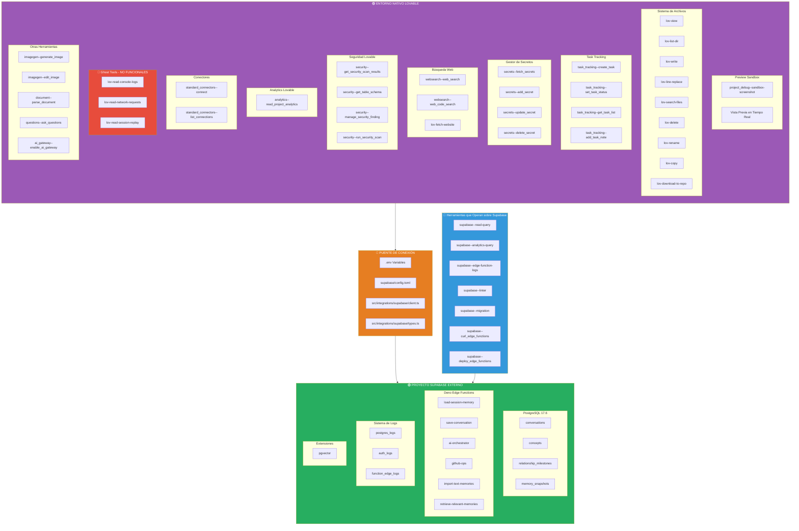
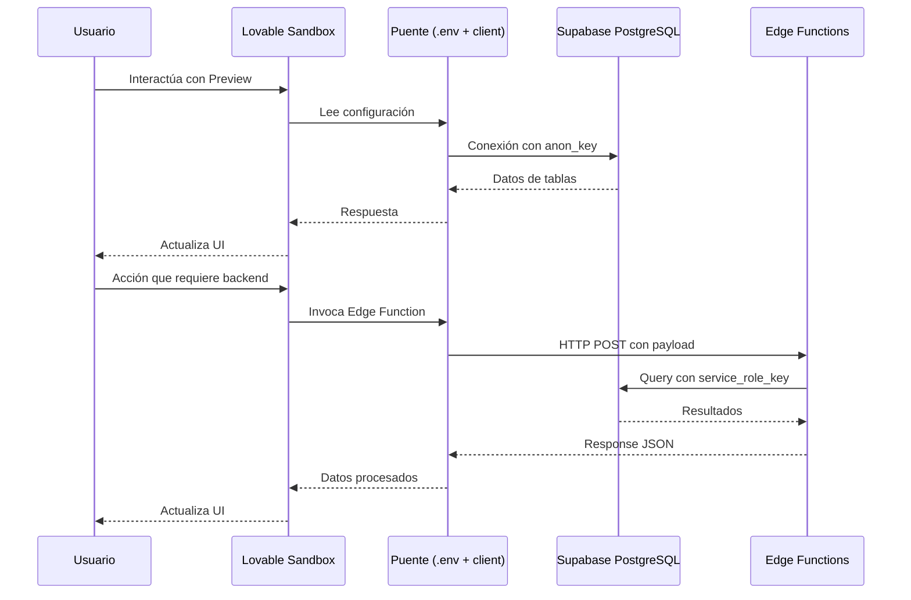

# Separación de Entornos: Lovable Nativo vs Supabase Externo

> **Fecha de análisis**: Diciembre 2025  
> **Método**: Detección directa mediante invocación de herramientas  
> **Propósito**: Documentar la diferenciación empírica entre la infraestructura nativa de Lovable y el proyecto Supabase conectado externamente

---

## Arquitectura Separada



---

## Inventario de Herramientas por Entorno

### 🟣 Herramientas Puramente Lovable (22 herramientas)

| Categoría | Herramienta | Estado | Descripción |
|-----------|-------------|--------|-------------|
| **Filesystem** | `lov-view` | ✅ Funcional | Leer contenido de archivos |
| | `lov-list-dir` | ✅ Funcional | Listar directorios |
| | `lov-write` | ✅ Funcional | Escribir archivos |
| | `lov-line-replace` | ✅ Funcional | Editar líneas específicas |
| | `lov-search-files` | ✅ Funcional | Búsqueda regex en archivos |
| | `lov-delete` | ✅ Funcional | Eliminar archivos |
| | `lov-rename` | ✅ Funcional | Renombrar archivos |
| | `lov-copy` | ✅ Funcional | Copiar archivos |
| | `lov-download-to-repo` | ✅ Funcional | Descargar desde URL |
| **Task Tracking** | `task_tracking--create_task` | ✅ Funcional | Crear tareas |
| | `task_tracking--set_task_status` | ✅ Funcional | Cambiar estado |
| | `task_tracking--get_task_list` | ✅ Funcional | Listar tareas |
| | `task_tracking--add_task_note` | ✅ Funcional | Añadir notas |
| **Secrets** | `secrets--fetch_secrets` | ✅ Funcional | Obtener lista de secretos |
| | `secrets--add_secret` | ✅ Funcional | Añadir secreto |
| | `secrets--update_secret` | ✅ Funcional | Actualizar secreto |
| | `secrets--delete_secret` | ✅ Funcional | Eliminar secreto |
| **Web** | `websearch--web_search` | ✅ Funcional | Búsqueda web general |
| | `websearch--web_code_search` | ✅ Funcional | Búsqueda de código |
| | `lov-fetch-website` | ✅ Funcional | Obtener contenido web |
| **Sandbox** | `project_debug--sandbox-screenshot` | ✅ Funcional | Captura de pantalla |
| | `project_debug--sleep` | ✅ Funcional | Esperar N segundos |

### 🔴 Ghost Tools - No Funcionales (3 herramientas)

| Herramienta | Estado | Evidencia |
|-------------|--------|-----------|
| `lov-read-console-logs` | ❌ Retorna vacío | `"No logs found"` |
| `lov-read-network-requests` | ❌ Retorna vacío | `"No results"` |
| `lov-read-session-replay` | ❌ Retorna vacío | `"No session replay found"` |

### 🟡 Herramientas con Estado Indeterminado (5 herramientas)

| Herramienta | Estado | Evidencia |
|-------------|--------|-----------|
| `standard_connectors--list_connections` | ⚠️ Vacío | `"No connections available"` |
| `analytics--read_project_analytics` | ⚠️ Vacío | Retorna datos vacíos |
| `imagegen--generate_image` | ⚠️ No probada | Requiere prompt |
| `imagegen--edit_image` | ⚠️ No probada | Requiere imagen |
| `questions--ask_questions` | ⚠️ No probada | Requiere contexto |

### 🔧 Herramientas que Operan sobre Supabase Externo (8 herramientas)

| Herramienta | Función | Evidencia de Funcionamiento |
|-------------|---------|----------------------------|
| `supabase--read-query` | Ejecutar SELECT en PostgreSQL | Retornó 4 tablas correctamente |
| `supabase--analytics-query` | Consultar logs de Supabase | Retornó logs de postgres, auth, edge |
| `supabase--edge-function-logs` | Ver logs de Edge Functions | Retornó logs de `load-session-memory` |
| `supabase--linter` | Analizar seguridad de DB | Ejecutó correctamente |
| `supabase--migration` | Crear migraciones SQL | Disponible |
| `supabase--curl_edge_functions` | Llamar Edge Functions | Disponible |
| `supabase--deploy_edge_functions` | Desplegar funciones | Disponible |

### 🔐 Herramientas de Seguridad (operan en ambos entornos)

| Herramienta | Ámbito | Función |
|-------------|--------|---------|
| `security--get_security_scan_results` | Híbrido | Resultados de escaneo |
| `security--get_table_schema` | Supabase | Schema de tablas |
| `security--manage_security_finding` | Híbrido | Gestionar hallazgos |
| `security--run_security_scan` | Híbrido | Ejecutar escaneo |

---

## Evidencia Empírica de Separación

### 1. Diferentes Direcciones IP

**Supabase (AWS):**
```
host=2a05:d018:1e14:201:478f:dfa:253c:ede0  # IPv6 AWS eu-west
host=2a05:d018:1e14:200:c745:45c0:d7ac:3e72  # IPv6 AWS eu-west
```

**Lovable (Molnett):**
```
- Infraestructura europea propia (adquirida de Molnett)
- Sandbox de preview ejecutado en contenedores Lovable
```

### 2. Secretos Distintos

**Detectados vía `secrets--fetch_secrets`:**
```
Secretos de USUARIO (gestionados por Lovable):
- ANTHROPIC_API_KEY
- GITHUB_TOKEN  
- OPENAI_API_KEY

Secretos de SISTEMA (Supabase):
- SUPABASE_URL (cannot be deleted)
- SUPABASE_ANON_KEY (cannot be deleted)
- SUPABASE_SERVICE_ROLE_KEY (cannot be deleted)
- SUPABASE_DB_URL (cannot be deleted)
- SUPABASE_PUBLISHABLE_KEY (cannot be deleted)
```

### 3. Usuarios de Base de Datos (solo Supabase)

**Detectados vía `supabase--analytics-query`:**
```sql
-- Usuarios conectándose a PostgreSQL:
- authenticator (usado por PostgREST)
- supabase_read_only_user (lecturas)
- supabase_admin (administración)
```

### 4. Scanners de Seguridad Distintos

**Detectados vía `security--get_security_scan_results`:**
```
- Scanner "supabase": Analiza configuración de Supabase
- Scanner "supabase_lov": Analiza integración Lovable-Supabase
```

### 5. Edge Functions (solo en Supabase)

**Detectadas vía estructura de archivos:**
```
supabase/functions/
├── ai-orchestrator/index.ts
├── github-ops/index.ts
├── import-text-memories/index.ts
├── load-session-memory/index.ts
├── retrieve-relevant-memories/index.ts
└── save-conversation/index.ts
```

**Logs confirmados vía `supabase--edge-function-logs`:**
```
function_id: bc99d2e9-0581-4665-a21a-d43efb617041
event_message: "Memory loaded: 0 conversations, 0 concepts"
```

---

## Puente de Conexión

### Archivos que Conectan Ambos Entornos

| Archivo | Función |
|---------|---------|
| `.env` | Variables de entorno (VITE_SUPABASE_URL, VITE_SUPABASE_PUBLISHABLE_KEY) |
| `supabase/config.toml` | Configuración de Edge Functions |
| `src/integrations/supabase/client.ts` | Cliente JavaScript de Supabase |
| `src/integrations/supabase/types.ts` | Tipos TypeScript generados del schema |

### Flujo de Datos



---

## Implicaciones para Claude Libre

### Qué Necesita Replicar de Lovable

| Componente | Prioridad | Complejidad | Alternativa |
|------------|-----------|-------------|-------------|
| Sistema de archivos | 🔴 Alta | Baja | Node.js fs nativo |
| Preview Sandbox | 🔴 Alta | Media | Vite dev server local |
| Task Tracking | 🟡 Media | Baja | Estado en memoria |
| Gestor de Secretos | 🔴 Alta | Baja | dotenv + variables de entorno |
| Web Search | 🟡 Media | Baja | APIs directas (Perplexity, etc.) |

### Qué Puede Usar Directamente de Supabase

| Componente | Acción |
|------------|--------|
| PostgreSQL | Conexión directa con `@supabase/supabase-js` |
| Edge Functions | Desarrollo local con `supabase functions serve` |
| Auth | Sistema completo de autenticación |
| Storage | Buckets para archivos |
| Realtime | Subscripciones en tiempo real |

### Qué Debe Crear Desde Cero

| Componente | Razón | Enfoque Sugerido |
|------------|-------|------------------|
| AI Orchestrator | Lovable usa gateway propietario | Anthropic API directo |
| Debug Tools | Ghost tools en Lovable | Playwright + console real |
| Image Generation | No probado en Lovable | Replicate / Stable Diffusion API |
| Credit System | Propio de Lovable | No necesario (pago por uso directo) |

---

## Tabla Comparativa Final

| Aspecto | Lovable Nativo | Supabase Externo |
|---------|----------------|------------------|
| **Ubicación** | Molnett (Europa) | AWS eu-west |
| **Persistencia** | ❌ Sin DB propia | ✅ PostgreSQL 17.6 |
| **Archivos** | ✅ Sistema propio | ❌ No aplica |
| **Funciones Backend** | ❌ No tiene | ✅ Deno Edge Functions |
| **Secretos** | ✅ Gestor propio | ✅ Variables de entorno |
| **Logs** | ❌ Ghost tools | ✅ Logs completos |
| **Seguridad** | ✅ Scanner propio | ✅ RLS + Políticas |
| **AI Gateway** | ✅ Propio | ❌ No tiene |

---

## Conclusión

La arquitectura de Lovable se divide claramente en dos dominios:

1. **Lovable Nativo**: Proporciona el entorno de desarrollo (sandbox, archivos, preview) pero **NO tiene persistencia de datos propia**. Todas las herramientas de debugging están rotas.

2. **Supabase Externo**: Proporciona **toda la persistencia y backend** (base de datos, Edge Functions, autenticación). Es un proyecto independiente conectado via configuración.

3. **El Puente**: Archivos de configuración (`.env`, `client.ts`, `config.toml`) que conectan ambos mundos.

Para Claude Libre, esto significa:
- **Podemos prescindir de Lovable** si replicamos el sandbox con Vite local
- **Podemos mantener Supabase** como backend o sustituirlo
- **Debemos crear debugging real** (lo que Lovable no logró hacer funcionar)
