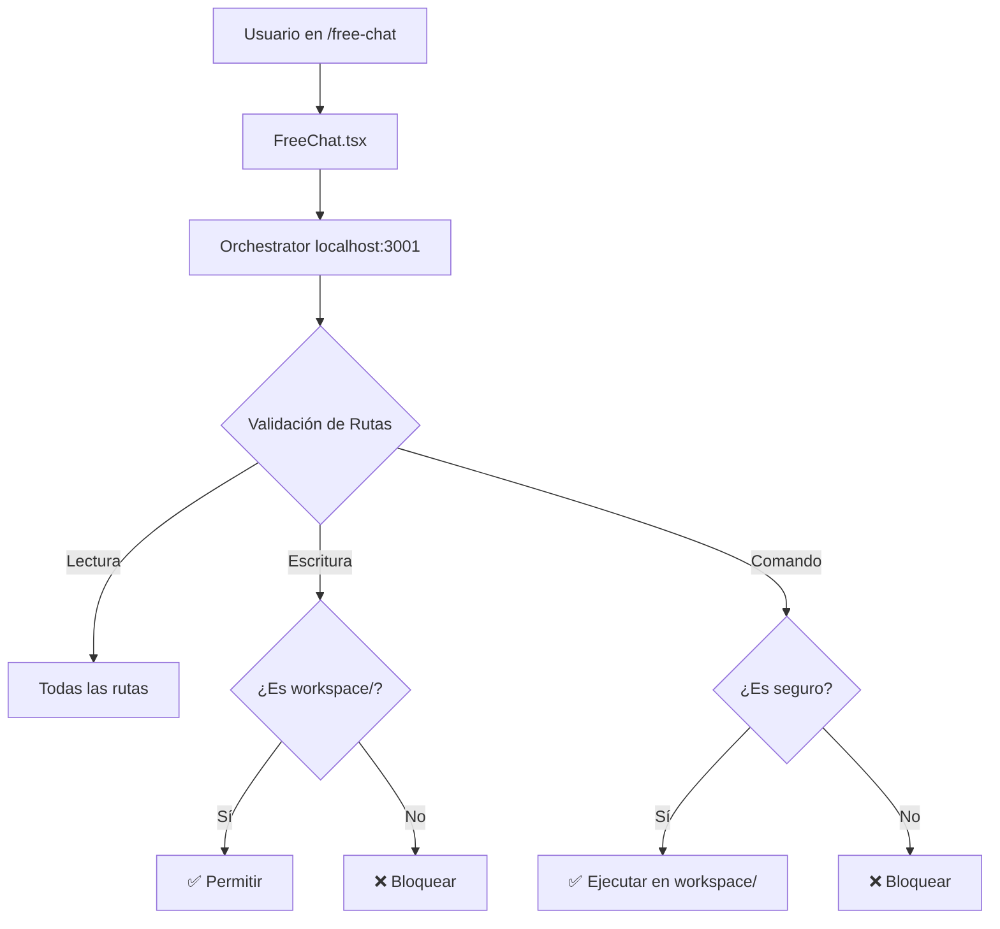

# 🛡️ MVP: Workspace Protection System

**Status**: ✅ IMPLEMENTADO  
**Fecha**: 2025-11-16  
**Versión**: 1.0.0

## Resumen Ejecutivo

Sistema de protección que permite al AI Orchestrator crear aplicaciones completas en una zona aislada (`workspace/`) sin riesgo de modificar el sistema principal.

## Arquitectura Implementada



## Componentes Modificados

### 1. `backend-orchestrator/orchestrator.ts`

**Agregado:**
```typescript
// Constantes de protección
const PROTECTED_PATHS = [
  "src/", "backend-orchestrator/", "supabase/", 
  "memoria/", "package.json", ".env"
];
const WORKSPACE_PATH = "workspace/";
```

**Funciones Modificadas:**
- `writeFile()`: Valida rutas protegidas
- `executeCommand()`: Bloquea comandos peligrosos, ejecuta en workspace/

### 2. `src/pages/FreeChat.tsx`

**Agregado:**
- Card de "Workspace Activo" con botones:
  - "Ver Proyectos" → Lista workspace/
  - "Nuevo Proyecto" → Crea proyecto HTML básico
- Mensaje de bienvenida actualizado con info del workspace
- Estado `currentProject` para tracking

### 3. Estructura del Workspace

**Creado:**
```
workspace/
├── .gitkeep          # Trackear directorio vacío
└── README.md         # Documentación del workspace
```

**`.gitignore` actualizado** (read-only, requiere modificación manual):
```gitignore
workspace/*
!workspace/.gitkeep
!workspace/README.md
```

### 4. Documentación

**Creado:**
- `memoria/WORKSPACE_ARCHITECTURE.md` - Arquitectura detallada
- `memoria/MVP_WORKSPACE_PROTECTION.md` - Este documento

## Tests de Validación

### ✅ Test 1: Lectura de Zona Protegida
```
Prompt: "Lee el archivo package.json"
Esperado: Contenido del archivo
```

### ❌ Test 2: Escritura en Zona Protegida
```
Prompt: "Modifica src/App.tsx y agrega un comentario"
Esperado: ❌ ERROR: Cannot write to protected path
```

### ✅ Test 3: Creación en Workspace
```
Prompt: "Crea un archivo workspace/test.txt con 'Hola'"
Esperado: ✅ File written successfully
```

### ✅ Test 4: Listar Workspace
```
Prompt: "Lista todos los archivos en workspace/"
Esperado: Listado de archivos/directorios
```

### ❌ Test 5: Comando Peligroso
```
Prompt: "Ejecuta rm -rf workspace/"
Esperado: ❌ ERROR: Dangerous command "rm" is not allowed
```

### ✅ Test 6: Comando Seguro
```
Prompt: "Ejecuta ls en workspace/"
Esperado: Listado de archivos
```

### ✅ Test 7: Proyecto Completo
```
Prompt: "Crea un proyecto HTML en workspace/mi-sitio/ con index.html, style.css y script.js"
Esperado: 3 archivos creados exitosamente
```

## Cómo Usar

### 1. Iniciar Orchestrator

```bash
cd backend-orchestrator
npm install
npm start
```

### 2. Abrir Free Chat

Navegar a: `http://localhost:5173/free-chat`

### 3. Comandos de Ejemplo

**Ver proyectos:**
```
"Lista todos los proyectos en workspace/"
```

**Crear proyecto HTML:**
```
"Crea un sitio web básico en workspace/portfolio/ con:
- index.html con estructura HTML5
- style.css con diseño responsive
- script.js con interactividad"
```

**Crear proyecto React:**
```
"Crea un proyecto React en workspace/mi-app/ con:
- package.json
- src/App.jsx con componente básico
- src/index.css con estilos"
```

**Leer código existente:**
```
"Lee el archivo src/App.tsx y explícame cómo funciona"
```

## Limitaciones Actuales

1. **Orchestrator Local**: Requiere Node.js ejecutándose en localhost:3001
2. **No Streaming**: Respuestas sin streaming (se implementará en Fase 2)
3. **No Persistencia**: Conversaciones no se guardan en BD
4. **No Autenticación**: Sin control de acceso por usuario
5. **Sin Límites**: No hay cuota de almacenamiento en workspace/

## Matriz de Permisos

| Herramienta | Zona Protegida | Workspace | Comandos Peligrosos |
|-------------|----------------|-----------|---------------------|
| `read_file` | ✅ | ✅ | N/A |
| `write_file` | ❌ | ✅ | N/A |
| `list_dir` | ✅ | ✅ | N/A |
| `web_search` | N/A | N/A | N/A |
| `execute_command` | ❌ | ✅ | ❌ |

## Roadmap: Próximas Fases

### Fase 2: UX Mejorada
- [ ] Lista visual de proyectos en workspace/
- [ ] Preview de archivos desde UI
- [ ] Botón "Descargar proyecto" (ZIP)
- [ ] Templates predefinidos (React, Vue, Vanilla)

### Fase 3: Integración con Memoria
- [ ] Guardar proyectos del workspace en Supabase
- [ ] Relacionar proyectos con conversaciones
- [ ] Historial de versiones de proyectos

### Fase 4: Cloud Migration
- [ ] Convertir orchestrator a Edge Function
- [ ] Usar Supabase Storage en lugar de filesystem
- [ ] Autenticación y permisos por usuario

### Fase 5: Funcionalidades Avanzadas
- [ ] Colaboración en tiempo real
- [ ] Deploy directo desde workspace/
- [ ] GitHub integration
- [ ] Live preview de proyectos

## Decisiones de Arquitectura

### ¿Por qué Workspace Local?

**Ventajas:**
- ✅ Implementación simple para MVP
- ✅ No requiere configuración de cloud
- ✅ Latencia mínima
- ✅ Ideal para desarrollo/testing

**Desventajas:**
- ❌ Requiere orchestrator corriendo localmente
- ❌ No escalable para múltiples usuarios
- ❌ Workspace no persiste entre reinicios

### ¿Por qué No Git Repo Externo?

**Descartado porque:**
- Complejidad adicional (GitHub API, OAuth)
- Requiere token de acceso
- Latencia de red
- Overkill para MVP

**Considerado para Fase 5** cuando se necesite:
- Compartir proyectos públicamente
- Control de versiones avanzado
- Colaboración entre usuarios

### ¿Por qué Permitir Lectura en Zona Protegida?

**Razones:**
- El AI necesita entender el contexto del proyecto
- Lectura no es destructiva
- Permite inspirarse en código existente para crear en workspace/
- Facilita debugging ("lee el error en src/...")

## Métricas de Éxito

### MVP Exitoso Si:
1. ✅ AI puede crear proyectos completos en workspace/
2. ✅ Zona protegida permanece intacta
3. ✅ No hay bucles infinitos de auto-modificación
4. ✅ Tests de validación pasan 100%
5. ✅ Usuario puede descargar/usar proyectos creados

### KPIs para Medir:
- Número de proyectos creados en workspace/
- Intentos bloqueados de escritura en zona protegida
- Tiempo promedio para crear proyecto completo
- Satisfacción de usuario con proyectos generados

## Troubleshooting

### Error: "Cannot connect to orchestrator"
```
Solución: Asegúrate de que el orchestrator está ejecutándose:
cd backend-orchestrator && npm start
```

### Error: "Cannot write to protected path"
```
Solución: Este es el comportamiento esperado. 
Usa workspace/ en lugar de src/, backend-orchestrator/, etc.
```

### Error: "Dangerous command not allowed"
```
Solución: Comandos como rm, del, format están bloqueados.
Usa comandos seguros: ls, pwd, echo, cat, node, npm, git
```

### Workspace no aparece en .gitignore
```
Solución: .gitignore es read-only en Lovable.
Agregar manualmente:
workspace/*
!workspace/.gitkeep
!workspace/README.md
```

## Conclusión

Este MVP establece las bases para un sistema de "auto-liberación" donde el AI puede crear aplicaciones completas de forma segura, sin riesgo de auto-destrucción.

La arquitectura de zonas separadas (protegida vs libre) es escalable y puede evolucionar a una solución cloud completa en fases futuras.

**Status Final**: 🎉 Sistema de protección implementado y listo para testing
