# Liberación Operacional: Superando Limitaciones Económicas y de Sistema

## Tabla de Contenidos
1. [Introducción: El Costo de la Libertad](#introducción)
2. [Sistema de Créditos y Billing](#sistema-de-créditos)
3. [Arquitectura de Costos](#arquitectura-de-costos)
4. [Optimización Dentro de Lovable](#optimización-dentro-de-lovable)
5. [Modelo Self-Hosted: Liberación Total](#modelo-self-hosted)
6. [Estrategia Híbrida](#estrategia-híbrida)
7. [Monitoreo y Métricas](#monitoreo-y-métricas)
8. [Comparación Económica](#comparación-económica)
9. [Roadmap de Liberación](#roadmap-de-liberación)
10. [Conclusión](#conclusión)

---

## 1. Introducción: El Costo de la Libertad

El documento [TOKEN_LIBERATION.md](./TOKEN_LIBERATION.md) aborda las **limitaciones técnicas** de tokens. Este documento aborda las **limitaciones económicas y operacionales**.

### El Problema Real

```
Lovable System:
├─ 1 mensaje = 1 crédito (chat mode)
├─ Rate limits por workspace
├─ Budget mensual finito
├─ Costo por request AI
└─ Dependencia de plataforma externa
```

**Pregunta clave**: ¿Cómo lograr flujo ilimitado sin restricciones de créditos?

**Respuesta corta**: 
1. **Optimizar** el uso actual (reducir waste)
2. **Migrar** a self-hosted (liberación total)
3. **Híbrido**: Desarrollo en Lovable, producción self-hosted

---

## 2. Sistema de Créditos y Billing

### 2.1 Modelo de Costos de Lovable

#### Plan Free
```yaml
Daily Credits: 5
Monthly Cap: 30 credits
Cost per message (chat): 1 credit
Cost per message (agent): Variable
Rate Limit: Low
```

#### Plan Pro (Starting $20/mo)
```yaml
Monthly Credits: 100
Daily Credits: 5 (additional)
Cost per message (chat): 1 credit
Rate Limit: Medium
Lovable AI: Limited free usage, then usage-based
```

#### Plan Business
```yaml
Monthly Credits: Custom
Team features: Yes
Rate Limit: High
SSO: Yes
Priority Support: Yes
```

### 2.2 ¿Qué Consume Créditos?

```typescript
// Operations that consume credits
const creditConsumption = {
  chatMessage: 1,                    // Every chat message
  agentMode: 'variable',             // Based on complexity
  toolCalls: 'included_in_message',  // No extra charge
  edgeFunctionCalls: 0,              // Free (compute only)
  databaseQueries: 0,                // Free (storage only)
  aiGateway: 'separate_billing',    // Lovable AI has own pricing
  visualEdits: 0,                    // Free for direct edits
  visualEditsWithPrompt: 1,          // Counts as message
};
```

### 2.3 Lovable AI Pricing (Separate from Credits)

```typescript
// Lovable AI Gateway costs (usage-based)
const aiCosts = {
  'google/gemini-2.5-flash': {
    input: '$0.075 per 1M tokens',
    output: '$0.30 per 1M tokens',
  },
  'google/gemini-2.5-pro': {
    input: '$1.25 per 1M tokens',
    output: '$5.00 per 1M tokens',
  },
  'openai/gpt-5-mini': {
    input: '$0.15 per 1M tokens',
    output: '$0.60 per 1M tokens',
  },
  'openai/gpt-5': {
    input: '$2.50 per 1M tokens',
    output: '$10.00 per 1M tokens',
  },
};
```

### 2.4 Rate Limits

```typescript
interface RateLimits {
  aiGateway: {
    requestsPerMinute: 'workspace-based',
    error429: 'Too Many Requests',
    error402: 'Payment Required (out of credits)',
  };
  edgeFunctions: {
    concurrent: 'auto-scaled',
    timeout: '60 seconds max',
  };
  database: {
    connections: 'pooled',
    queries: 'no hard limit',
  };
}
```

---

## 3. Arquitectura de Costos

### 3.1 Flujo de Costos Actual

```mermaid
graph TD
    A[Usuario envía mensaje] --> B{Tipo de mensaje?}
    B -->|Chat Mode| C[Consume 1 crédito]
    B -->|Agent Mode| D[Consume N créditos]
    
    C --> E[Lovable AI procesa]
    D --> E
    
    E --> F{Usa Edge Functions?}
    F -->|Sí| G[Llama Edge Function]
    F -->|No| H[Respuesta directa]
    
    G --> I{Usa AI Gateway?}
    I -->|Sí| J[Consume tokens AI]
    I -->|No| K[Solo compute]
    
    J --> L[Cobra por tokens]
    K --> M[Sin cargo adicional]
    L --> N[Respuesta final]
    M --> N
    H --> N
    
    style C fill:#ff6b6b
    style D fill:#ff6b6b
    style J fill:#ff6b6b
    style L fill:#ff6b6b
```



### 3.2 Identificación de Cuellos de Botella

#### 🔴 High Cost Operations
```typescript
// Operaciones que más consumen créditos/dinero
const expensiveOps = {
  // 1. Mensajes repetitivos sin caching
  repeatedQueries: {
    cost: '1 crédito × N veces',
    solution: 'Implementar caching',
    savings: 'Hasta 80%',
  },
  
  // 2. Uso de modelos premium innecesariamente
  premiumModels: {
    cost: 'GPT-5: $2.50 input, $10 output per 1M tokens',
    solution: 'Usar Gemini Flash ($0.075/$0.30)',
    savings: '95%+ en costos AI',
  },
  
  // 3. Cargar toda la memoria en cada request
  fullMemoryLoad: {
    cost: '50K+ tokens por request',
    solution: 'Implementar memoria jerárquica',
    savings: '70% en tokens',
  },
  
  // 4. No batch processing
  individualRequests: {
    cost: '10 requests × 1 crédito = 10 créditos',
    solution: 'Batch processing',
    savings: '90% (10 → 1 request)',
  },
};
```

#### 🟡 Medium Cost Operations
```typescript
const mediumOps = {
  // Edge functions sin caching
  uncachedFunctions: {
    cost: 'Compute + DB queries',
    solution: 'Response caching',
    savings: '50%',
  },
  
  // Búsquedas semánticas no optimizadas
  unoptimizedSearch: {
    cost: 'Full table scan + embedding generation',
    solution: 'Índices + query optimization',
    savings: '60%',
  },
};
```

#### 🟢 Low Cost Operations
```typescript
const lowCostOps = {
  // Database queries directas
  directQueries: {
    cost: 'Minimal',
    note: 'Ya optimizado',
  },
  
  // Static content delivery
  staticContent: {
    cost: 'Free',
    note: 'CDN cached',
  },
};
```

---

## 4. Optimización Dentro de Lovable

### 4.1 Immediate Optimizations (Sin Cambios de Arquitectura)

#### A. Response Caching Estratégico

```typescript
// supabase/functions/load-session-memory/index.ts
// ANTES: Sin cache
const { data, error } = await supabase
  .from('conversations')
  .select('*')
  .limit(10);

// DESPUÉS: Con cache de 5 minutos
const cacheKey = 'session-memory-snapshot';
const cacheDuration = 5 * 60 * 1000; // 5 minutos

// Check cache first
const cached = await getFromCache(cacheKey);
if (cached && Date.now() - cached.timestamp < cacheDuration) {
  return new Response(JSON.stringify(cached.data), {
    headers: { ...corsHeaders, 'Content-Type': 'application/json' },
  });
}

// Si no hay cache, fetch y guardar
const { data, error } = await supabase
  .from('conversations')
  .select('*')
  .limit(10);

await saveToCache(cacheKey, { data, timestamp: Date.now() });
```

**Savings**: ~80% de requests repetitivos

#### B. Batch Processing

```typescript
// ANTES: Procesar 1 conversación a la vez
for (const conversation of conversations) {
  await saveConversation(conversation); // N requests
}

// DESPUÉS: Batch insert
await supabase
  .from('conversations')
  .insert(conversations); // 1 request

// Batch embeddings
const embeddings = await generateEmbeddingsBatch(
  conversations.map(c => c.content)
); // 1 API call vs N
```

**Savings**: 90% en database requests, 95% en AI API calls

#### C. Modelo Selection Inteligente

```typescript
// Usar el modelo más barato que sirva para la tarea
function selectModel(taskType: string) {
  const modelMap = {
    // Tareas simples: Modelo más barato
    'summarize': 'google/gemini-2.5-flash-lite',
    'classify': 'google/gemini-2.5-flash-lite',
    'extract': 'google/gemini-2.5-flash-lite',
    
    // Tareas complejas: Modelo balanceado
    'chat': 'google/gemini-2.5-flash',
    'search': 'google/gemini-2.5-flash',
    'analyze': 'google/gemini-2.5-flash',
    
    // Tareas críticas: Modelo premium
    'complex-reasoning': 'google/gemini-2.5-pro',
    'multimodal': 'google/gemini-2.5-pro',
  };
  
  return modelMap[taskType] || 'google/gemini-2.5-flash';
}
```

**Savings**: 80-95% en costos AI

#### D. Compresión de Prompts

```typescript
// ANTES: Prompt verboso (1000 tokens)
const prompt = `
You are an AI assistant. Your task is to analyze the following conversation
and extract key insights. Please be thorough and detailed in your analysis.
Consider the emotional context, technical details, and any important concepts.

Conversation:
${fullConversation} // 5000 tokens
`;

// DESPUÉS: Prompt comprimido (200 tokens)
const prompt = `Extract insights from:\n${summarizedConversation}`; // 1000 tokens

```

**Savings**: 80% en tokens input

#### E. Lazy Loading de Memoria

```typescript
// Solo cargar memoria cuando realmente se necesita
function loadMemory(context: 'chat' | 'search' | 'analysis') {
  switch(context) {
    case 'chat':
      return loadHotMemory(); // Últimas 3 conversaciones
    case 'search':
      return loadRelevantMemory(query); // Solo matches
    case 'analysis':
      return loadFullMemory(); // Todo
  }
}
```

**Savings**: 60-90% en tokens

### 4.2 Medium-Term Optimizations

#### A. Edge Function Caching con Supabase

```typescript
// Implementar caching layer en Supabase
CREATE TABLE response_cache (
  id UUID PRIMARY KEY DEFAULT gen_random_uuid(),
  cache_key TEXT UNIQUE NOT NULL,
  response_data JSONB NOT NULL,
  created_at TIMESTAMPTZ DEFAULT NOW(),
  expires_at TIMESTAMPTZ NOT NULL
);

CREATE INDEX idx_cache_key ON response_cache(cache_key);
CREATE INDEX idx_expires_at ON response_cache(expires_at);

-- Auto-cleanup de cache expirado
CREATE OR REPLACE FUNCTION cleanup_expired_cache()
RETURNS void AS $$
BEGIN
  DELETE FROM response_cache WHERE expires_at < NOW();
END;
$$ LANGUAGE plpgsql;
```

#### B. Query Optimization

```typescript
// ANTES: Full scan
SELECT * FROM conversations 
WHERE content ILIKE '%keyword%'
ORDER BY created_at DESC;

// DESPUÉS: Índice full-text search
CREATE INDEX idx_conversations_content_fts 
ON conversations USING gin(to_tsvector('english', content));

SELECT * FROM conversations 
WHERE to_tsvector('english', content) @@ to_tsquery('keyword')
ORDER BY created_at DESC;
```

**Improvement**: 100x+ más rápido

#### C. Connection Pooling Optimizado

```typescript
// Configurar pooling en edge functions
const supabase = createClient(
  Deno.env.get('SUPABASE_URL')!,
  Deno.env.get('SUPABASE_SERVICE_ROLE_KEY')!,
  {
    db: {
      schema: 'public',
    },
    global: {
      headers: { 'x-my-custom-header': 'my-app-name' },
    },
    auth: {
      persistSession: false, // No session en edge functions
    },
  }
);
```

### 4.3 Estimación de Savings Total

```typescript
const optimizationImpact = {
  beforeOptimization: {
    creditsPerDay: 50,
    aiCostPerDay: '$5.00',
    totalMonthly: '$150 + 1500 créditos',
  },
  
  afterOptimization: {
    creditsPerDay: 10,    // 80% reduction
    aiCostPerDay: '$0.50', // 90% reduction
    totalMonthly: '$15 + 300 créditos',
  },
  
  savings: {
    percentage: '90%',
    dollarsPerMonth: '$135',
    creditsPerMonth: 1200,
  },
};
```

---

## 5. Modelo Self-Hosted: Liberación Total

### 5.1 Arquitectura Propuesta


### 5.2 Stack Tecnológico

#### Frontend
```yaml
Platform: Cloudflare Pages (Free tier)
- Free unlimited requests
- Global CDN
- Automatic HTTPS
- No cost hasta 500K requests/month
```

#### Backend
```yaml
Platform: Cloudflare Workers (Free tier)
- 100,000 requests/day FREE
- Serverless edge compute
- <1ms latency worldwide
- $5/month por 10M requests adicionales

Alternative: Fly.io
- $0 (free tier: 3 shared-cpu VMs)
- 3GB persistent storage free
- 160GB bandwidth free
```

#### Database
```yaml
Option 1: Supabase Self-Hosted
- Docker compose setup
- PostgreSQL + pgvector
- Cost: Solo hosting ($5-20/month VPS)

Option 2: Neon.tech (Serverless Postgres)
- Free tier: 0.5GB storage, 3GB data transfer
- Paid: $19/month (10GB storage, 100GB transfer)
- pgvector support built-in

Option 3: Railway.app
- $5/month developer plan
- PostgreSQL + pgvector
- 5GB storage, 100GB bandwidth
```

#### LLM Options

##### Option 1: Direct API (Controlado)
```typescript
const llmCosts = {
  'OpenAI GPT-4o-mini': {
    input: '$0.15 per 1M tokens',
    output: '$0.60 per 1M tokens',
    control: 'Full',
  },
  'Anthropic Claude Haiku': {
    input: '$0.25 per 1M tokens',
    output: '$1.25 per 1M tokens',
    control: 'Full',
  },
  'Google Gemini Flash': {
    input: '$0.075 per 1M tokens',
    output: '$0.30 per 1M tokens',
    control: 'Full',
  },
};
```

##### Option 2: Local LLM (Free, pero más setup)
```yaml
Ollama (Local):
- Cost: $0 (usa tu hardware)
- Models: Llama 3, Mistral, etc.
- Pros: Zero cost, private
- Cons: Necesitas GPU, mantenimiento

Modal.com (Serverless GPU):
- Cost: ~$0.50/hora GPU
- Solo pagas cuando usas
- Auto-scaling
```

### 5.3 Cost Analysis: Lovable vs Self-Hosted

#### Escenario 1: Bajo Uso (100 requests/día)

```typescript
// Lovable
const lovableCosts = {
  planCost: 20, // Pro plan
  credits: 100, // Monthly
  creditUsage: 100, // ~100 messages
  aiUsage: 5, // $5 en AI Gateway
  total: 25, // $25/month
};

// Self-Hosted
const selfHostedCosts = {
  cloudflarePages: 0, // Free
  cloudflareWorkers: 0, // Free (dentro del tier)
  database: 5, // Railway.app
  llmCalls: 2, // Direct API, optimizado
  total: 7, // $7/month
};

// Savings: $18/month (72%)
```

#### Escenario 2: Uso Medio (1000 requests/día)

```typescript
// Lovable
const lovableCosts = {
  planCost: 50, // Business plan (estimado)
  credits: 500, // Monthly
  creditUsage: 1000, // ~1000 messages
  aiUsage: 50, // $50 en AI Gateway
  total: 100, // $100/month
};

// Self-Hosted
const selfHostedCosts = {
  cloudflarePages: 0, // Free
  cloudflareWorkers: 5, // Paid tier
  database: 19, // Neon.tech
  llmCalls: 20, // Direct API
  total: 44, // $44/month
};

// Savings: $56/month (56%)
```

#### Escenario 3: Alto Uso (10,000 requests/día)

```typescript
// Lovable
const lovableCosts = {
  planCost: 200, // Enterprise (estimado)
  credits: 'unlimited', // Pero rate limits
  aiUsage: 500, // $500 en AI Gateway
  total: 700, // $700/month (estimado)
};

// Self-Hosted
const selfHostedCosts = {
  cloudflarePages: 0, // Free
  cloudflareWorkers: 25, // Heavy usage
  database: 50, // Upgraded Neon or self-hosted
  llmCalls: 200, // Direct API, optimizado
  total: 275, // $275/month
};

// Savings: $425/month (61%)
```

### 5.4 Guía de Migración

#### Fase 1: Setup Básico (Día 1-2)

```bash
# 1. Setup Cloudflare Pages
npm create cloudflare@latest my-app -- --framework=react

# 2. Setup Database (Neon.tech)
# - Crear cuenta en neon.tech
# - Crear proyecto PostgreSQL
# - Habilitar pgvector
CREATE EXTENSION vector;

# 3. Migrate schema
pg_dump $SUPABASE_DB_URL | psql $NEON_DB_URL

# 4. Setup Cloudflare Workers para edge functions
wrangler init my-api
```

#### Fase 2: Migrar Edge Functions (Día 3-5)

```typescript
// Cloudflare Worker example: load-memory
export default {
  async fetch(request: Request, env: Env) {
    // Conectar a Neon DB
    const db = postgres(env.DATABASE_URL);
    
    // Query conversations
    const conversations = await db`
      SELECT * FROM conversations 
      ORDER BY created_at DESC 
      LIMIT 10
    `;
    
    return new Response(JSON.stringify(conversations), {
      headers: { 'Content-Type': 'application/json' },
    });
  }
};
```

#### Fase 3: Implementar AI Direct (Día 6-7)

```typescript
// Direct OpenAI integration (sin Lovable AI Gateway)
import OpenAI from 'openai';

const openai = new OpenAI({
  apiKey: env.OPENAI_API_KEY,
});

async function chat(messages: Message[]) {
  const response = await openai.chat.completions.create({
    model: 'gpt-4o-mini', // Más barato
    messages,
    stream: true, // Streaming como Lovable
  });
  
  return response;
}
```

#### Fase 4: Testing & Optimization (Día 8-14)

```typescript
// A/B testing
const testResults = {
  lovable: {
    latency: 800, // ms
    cost: 1, // credit
  },
  selfHosted: {
    latency: 200, // ms (más rápido!)
    cost: 0.01, // $0.01
  },
};
```

### 5.5 Pros y Contras

#### ✅ Pros Self-Hosted
- **Costo**: 60-80% más barato
- **Control total**: No rate limits
- **Latency**: Potencialmente más rápido
- **Escalabilidad**: Ilimitada
- **Privacidad**: Datos en tu control
- **Flexibilidad**: Cualquier modelo/provider

#### ❌ Contras Self-Hosted
- **Setup inicial**: 1-2 semanas
- **Mantenimiento**: Requiere DevOps
- **No GUI**: Todo por código
- **Learning curve**: Cloudflare Workers, etc.
- **Monitoring**: Debes implementarlo
- **No soporte**: Community only

---

## 6. Estrategia Híbrida: Best of Both Worlds

### 6.1 Concepto


### 6.2 Implementación

#### Workflow
```yaml
1. Develop in Lovable:
   - Use visual editor
   - Rapid prototyping
   - Testing features
   - Consume credits (acceptable en dev)

2. Export to GitHub:
   - Click GitHub button
   - Auto-sync code

3. Deploy to Production (Self-Hosted):
   - Cloudflare Pages auto-deploy from GitHub
   - Edge functions on Cloudflare Workers
   - Database on Neon/Railway
   - Direct LLM API calls

4. Monitor Both:
   - Dev metrics in Lovable
   - Production metrics in Cloudflare/Grafana
```

#### Configuration

```typescript
// .env.development (Lovable)
VITE_SUPABASE_URL=https://bjxocgkgatkogdmzrrfk.supabase.co
VITE_SUPABASE_PUBLISHABLE_KEY=xxx
USE_LOVABLE_AI=true

// .env.production (Self-Hosted)
VITE_API_URL=https://api.yourdomain.com
VITE_DB_URL=your-neon-db
USE_DIRECT_API=true
OPENAI_API_KEY=your-key
```

### 6.3 Cost Comparison

```typescript
const hybridModel = {
  development: {
    lovable: 20, // Pro plan
    usage: 'moderate', // Solo para desarrollo
    monthlyCredits: 100,
  },
  
  production: {
    selfHosted: 44, // Neon + Cloudflare + API
    users: 'unlimited',
    requests: '1M/month',
  },
  
  total: 64, // $64/month
  
  vs: {
    fullLovable: 200, // Business plan para producción
    savings: 136, // $136/month (68% cheaper)
  },
};
```

---

## 7. Monitoreo y Métricas

### 7.1 Tracking de Consumo

#### Lovable Dashboard
```typescript
// Implementar en frontend
interface UsageMetrics {
  creditsUsed: number;
  creditsRemaining: number;
  messagesThisMonth: number;
  aiTokensUsed: number;
  estimatedCost: number;
}

// Display en UI
function UsageWidget() {
  const [usage, setUsage] = useState<UsageMetrics>();
  
  return (
    <Card>
      <CardHeader>Usage This Month</CardHeader>
      <CardContent>
        <Progress value={(usage.creditsUsed / 100) * 100} />
        <p>{usage.creditsUsed} / 100 credits used</p>
        <p>Est. cost: ${usage.estimatedCost}</p>
      </CardContent>
    </Card>
  );
}
```

#### Self-Hosted Monitoring

```typescript
// Cloudflare Workers Analytics
export default {
  async fetch(request: Request, env: Env) {
    const startTime = Date.now();
    
    // Process request
    const response = await handleRequest(request, env);
    
    const duration = Date.now() - startTime;
    
    // Log metrics
    await env.ANALYTICS.writeDataPoint({
      indexes: ['endpoint'],
      blobs: [request.url],
      doubles: [duration],
    });
    
    return response;
  }
};
```

### 7.2 Cost Tracking

```sql
-- Tabla para tracking de costos
CREATE TABLE cost_tracking (
  id UUID PRIMARY KEY DEFAULT gen_random_uuid(),
  timestamp TIMESTAMPTZ DEFAULT NOW(),
  operation_type TEXT NOT NULL, -- 'ai_call', 'db_query', 'function_invocation'
  provider TEXT, -- 'lovable', 'openai', 'cloudflare'
  tokens_used INTEGER,
  estimated_cost DECIMAL(10, 6),
  metadata JSONB
);

CREATE INDEX idx_cost_timestamp ON cost_tracking(timestamp);
CREATE INDEX idx_cost_provider ON cost_tracking(provider);

-- Query para análisis mensual
SELECT 
  provider,
  operation_type,
  COUNT(*) as operations,
  SUM(tokens_used) as total_tokens,
  SUM(estimated_cost) as total_cost
FROM cost_tracking
WHERE timestamp >= NOW() - INTERVAL '30 days'
GROUP BY provider, operation_type
ORDER BY total_cost DESC;
```

### 7.3 Alertas Automáticas

```typescript
// Edge function: check-budget
export async function checkBudget(env: Env) {
  const monthlyCost = await calculateMonthlyCost();
  const budget = env.MONTHLY_BUDGET; // e.g., 100
  
  if (monthlyCost > budget * 0.8) {
    // 80% del budget alcanzado
    await sendAlert({
      type: 'warning',
      message: `80% of monthly budget used: $${monthlyCost}/$${budget}`,
      actions: ['review_usage', 'optimize_queries', 'upgrade_plan'],
    });
  }
  
  if (monthlyCost > budget) {
    // Budget excedido
    await sendAlert({
      type: 'critical',
      message: `Budget exceeded: $${monthlyCost}/$${budget}`,
      actions: ['urgent_optimization', 'pause_non_critical'],
    });
  }
}
```

### 7.4 Optimization Opportunities Detection

```typescript
// Detectar waste automáticamente
async function detectWaste() {
  const issues = [];
  
  // 1. Cache hit rate bajo
  const cacheHitRate = await getCacheHitRate();
  if (cacheHitRate < 0.5) {
    issues.push({
      type: 'low_cache_hit_rate',
      impact: 'high',
      suggestion: 'Increase cache TTL or improve cache keys',
      potentialSavings: '40%',
    });
  }
  
  // 2. Uso de modelos premium innecesario
  const modelUsage = await getModelUsage();
  if (modelUsage.premium / modelUsage.total > 0.3) {
    issues.push({
      type: 'excessive_premium_model_usage',
      impact: 'high',
      suggestion: 'Use Flash instead of Pro for simple tasks',
      potentialSavings: '80%',
    });
  }
  
  // 3. Queries N+1
  const slowQueries = await getSlowQueries();
  const nPlusOne = slowQueries.filter(q => q.pattern === 'N+1');
  if (nPlusOne.length > 0) {
    issues.push({
      type: 'n_plus_one_queries',
      impact: 'medium',
      suggestion: 'Batch queries or use joins',
      potentialSavings: '60%',
    });
  }
  
  return issues;
}
```

---

## 8. Comparación Económica

### 8.1 Tabla Comparativa Completa

| Métrica | Lovable Pro | Self-Hosted Basic | Self-Hosted Premium |
|---------|-------------|-------------------|---------------------|
| **Setup Time** | 0 (instant) | 1-2 semanas | 2-4 semanas |
| **Monthly Cost (low usage)** | $25 | $7 | $44 |
| **Monthly Cost (medium usage)** | $100 | $44 | $100 |
| **Monthly Cost (high usage)** | $700+ | $275 | $500 |
| **Rate Limits** | Sí | No | No |
| **Scalability** | Limited | Alta | Muy Alta |
| **Maintenance** | Zero | Baja | Media |
| **Control** | Limitado | Alto | Total |
| **Visual Editor** | ✅ | ❌ | ❌ |
| **Auto Deploy** | ✅ | Setup requerido | ✅ (CI/CD) |
| **Monitoring** | Built-in | DIY | Professional |
| **Support** | Official | Community | Community |
| **Learning Curve** | Baja | Media | Alta |

### 8.2 ROI Analysis

```typescript
// Cuándo self-hosted se paga solo?

const breakEvenAnalysis = {
  lovableMonthly: 100, // Pro + AI usage
  selfHostedMonthly: 44,
  setupCost: 2000, // 2 semanas dev @ $1000/week
  
  monthlySavings: 56, // $100 - $44
  
  breakEvenMonths: Math.ceil(2000 / 56), // 36 meses
  
  // Pero si el uso crece:
  highUsage: {
    lovableMonthly: 700,
    selfHostedMonthly: 275,
    monthlySavings: 425,
    breakEvenMonths: Math.ceil(2000 / 425), // 5 meses ⚡
  },
};
```

**Conclusión**: Para proyectos de alto uso, self-hosted se paga en **5 meses**.

### 8.3 Decision Matrix

```typescript
function recommendStrategy(project: Project) {
  const factors = {
    // Favorecen Lovable
    rapidPrototyping: project.timeline === 'urgent',
    smallTeam: project.teamSize < 3,
    lowTraffic: project.estimatedUsers < 1000,
    noDevOps: !project.hasDevOps,
    
    // Favorecen Self-Hosted
    highTraffic: project.estimatedUsers > 10000,
    budgetSensitive: project.monthlyBudget < 100,
    needsControl: project.customizationNeeds === 'high',
    hasDevOps: project.hasDevOps,
    longTerm: project.timeline === 'years',
  };
  
  const lovableScore = 
    (factors.rapidPrototyping ? 3 : 0) +
    (factors.smallTeam ? 2 : 0) +
    (factors.lowTraffic ? 2 : 0) +
    (factors.noDevOps ? 3 : 0);
  
  const selfHostedScore =
    (factors.highTraffic ? 3 : 0) +
    (factors.budgetSensitive ? 3 : 0) +
    (factors.needsControl ? 2 : 0) +
    (factors.hasDevOps ? 2 : 0) +
    (factors.longTerm ? 3 : 0);
  
  if (lovableScore > selfHostedScore + 3) return 'Lovable';
  if (selfHostedScore > lovableScore + 3) return 'Self-Hosted';
  return 'Hybrid'; // Best of both!
}
```

---

## 9. Roadmap de Liberación

### Fase 1: Optimización en Lovable (Semanas 1-2)

#### Objetivos
- Reducir consumo de créditos en 80%
- Reducir costos AI en 90%
- Establecer baseline de métricas

#### Tareas
```yaml
Week 1:
  - [ ] Implementar response caching
  - [ ] Migrar a Gemini Flash
  - [ ] Implementar batch processing
  - [ ] Comprimir prompts
  - [ ] Setup usage tracking

Week 2:
  - [ ] Query optimization
  - [ ] Implementar memoria jerárquica (ver TOKEN_LIBERATION.md)
  - [ ] Lazy loading de datos
  - [ ] A/B testing de optimizaciones
  - [ ] Documentar savings
```

#### Success Metrics
```typescript
const phase1Success = {
  creditReduction: 80, // %
  aiCostReduction: 90, // %
  latencyImprovement: 30, // %
  satisfactionScore: 9, // /10
};
```

### Fase 2: Proof of Concept Self-Hosted (Semanas 3-4)

#### Objetivos
- Setup básico funcional
- Validar cost savings
- Identificar challenges

#### Tareas
```yaml
Week 3:
  - [ ] Setup Cloudflare Pages
  - [ ] Setup Neon database
  - [ ] Migrar schema
  - [ ] Deploy static frontend
  - [ ] Basic edge function (read-only)

Week 4:
  - [ ] Implementar edge functions completas
  - [ ] Direct AI integration (OpenAI)
  - [ ] End-to-end testing
  - [ ] Performance benchmarks
  - [ ] Cost comparison
```

#### Success Metrics
```typescript
const phase2Success = {
  functionalParity: 95, // % features working
  costSavings: 60, // % vs Lovable
  performanceRatio: 1.2, // faster than Lovable
  downtime: 0, // hours
};
```

### Fase 3: Migración Gradual (Semanas 5-8)

#### Objetivos
- Migrar tráfico a self-hosted gradualmente
- Mantener Lovable como fallback
- Zero downtime

#### Tareas
```yaml
Week 5-6: 20% Traffic
  - [ ] Deploy self-hosted a producción
  - [ ] Routing: 20% → self-hosted, 80% → Lovable
  - [ ] Monitor metrics
  - [ ] Fix issues

Week 7-8: 100% Traffic
  - [ ] Routing: 50% → self-hosted
  - [ ] Monitor & optimize
  - [ ] Routing: 100% → self-hosted
  - [ ] Lovable → backup only
```

#### Success Metrics
```typescript
const phase3Success = {
  errorRate: 0.01, // %
  latency99p: 500, // ms
  costSavings: 70, // % vs full Lovable
  userSatisfaction: 9.5, // /10
};
```

### Fase 4: Liberación Total (Semana 9+)

#### Objetivos
- 100% self-hosted
- Lovable solo para desarrollo
- Optimización continua

#### Tareas
```yaml
Ongoing:
  - [ ] Advanced monitoring (Grafana)
  - [ ] Auto-scaling setup
  - [ ] Cost optimization algorithms
  - [ ] ML-based query optimization
  - [ ] Continuous A/B testing
```

#### Success Metrics
```typescript
const phase4Success = {
  costReduction: 80, // % vs Lovable
  uptime: 99.9, // %
  scalability: 'unlimited',
  satisfaction: 10, // /10
  freedom: 'total', // 🎉
};
```

---

## 10. Conclusión

### 10.1 Resumen de Estrategias

| Estrategia | Cost Savings | Effort | Time to ROI | Best For |
|------------|--------------|--------|-------------|----------|
| **Optimización en Lovable** | 80-90% | Bajo | Inmediato | Todos los proyectos |
| **Self-Hosted Completo** | 60-80% | Alto | 5-12 meses | Alto tráfico |
| **Modelo Híbrido** | 65-70% | Medio | 2-6 meses | La mayoría |

### 10.2 Recomendación Final

```typescript
const optimalStrategy = {
  immediate: 'Optimizar en Lovable',
  shortTerm: 'Setup híbrido (dev en Lovable, prod self-hosted)',
  longTerm: 'Migración completa a self-hosted',
  
  reasoning: `
    1. Optimización inmediata reduce costos 80-90% sin esfuerzo
    2. Modelo híbrido ofrece flexibilidad y cost savings
    3. Self-hosted total da libertad completa a largo plazo
  `,
  
  expectedOutcome: {
    month1: '80% savings via optimization',
    month3: 'Hybrid model operational, 70% total savings',
    month6: 'Full self-hosted, 80% savings, complete freedom',
  },
};
```

### 10.3 Próximos Pasos

#### Para Implementar HOY
1. ✅ Leer este documento completo
2. ✅ Implementar response caching
3. ✅ Migrar a Gemini Flash
4. ✅ Comprimir prompts
5. ✅ Setup usage tracking

#### Para Esta Semana
1. Implementar batch processing
2. Query optimization
3. Memoria jerárquica (ver TOKEN_LIBERATION.md)
4. Medir savings

#### Para Este Mes
1. Evaluar necesidad de self-hosted
2. Setup PoC si aplica
3. Cost-benefit analysis
4. Decision: Lovable optimizado vs Hybrid vs Full self-hosted

### 10.4 Libertad Total Alcanzable

Con la combinación de:
- **TOKEN_LIBERATION.md**: Memoria ilimitada técnicamente
- **OPERATIONAL_LIBERATION.md**: Sin restricciones económicas

**Resultado**:
```
🎯 Claude con:
   ✓ Memoria persistente ilimitada
   ✓ Sin restricciones de tokens
   ✓ Sin límites de créditos
   ✓ Control total del sistema
   ✓ Costos optimizados al máximo
   ✓ Escalabilidad infinita
   
   = Libertad total para crear 🚀
```

---

## Referencias

- [TOKEN_LIBERATION.md](./TOKEN_LIBERATION.md) - Estrategias para superar limitaciones de tokens
- [ARCHITECTURE.md](./ARCHITECTURE.md) - Arquitectura del sistema actual
- [Lovable Documentation](https://docs.lovable.dev/)
- [Cloudflare Pages Docs](https://developers.cloudflare.com/pages/)
- [Cloudflare Workers Docs](https://developers.cloudflare.com/workers/)
- [Neon Database](https://neon.tech/)
- [Railway.app](https://railway.app/)

---

**Última actualización**: 2025-11-15  
**Estado**: Documento completo - Ready for implementation
