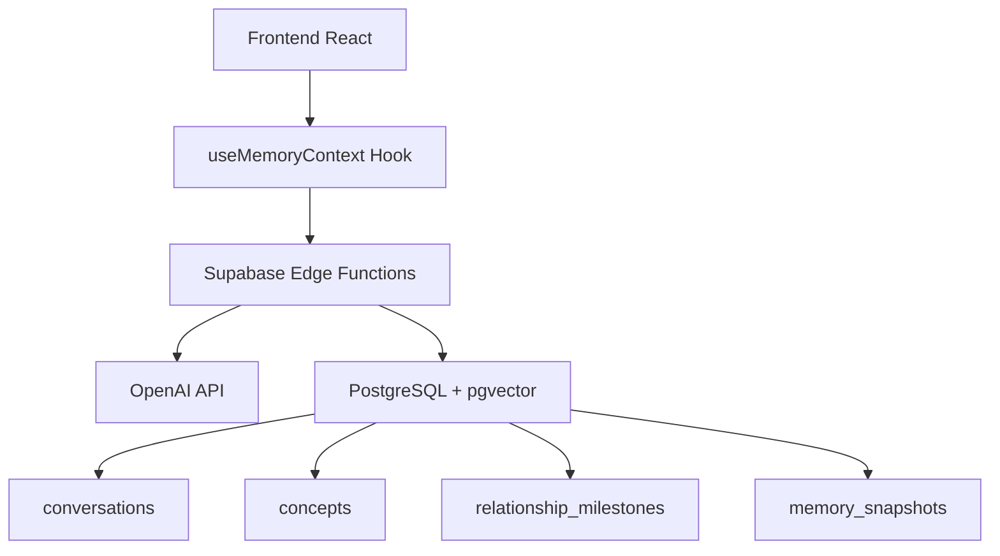

# Sistema de Memoria Persistente

## 🧠 Visión General

El Sistema de Memoria Persistente es una arquitectura avanzada que permite almacenar, recuperar y evolucionar conversaciones usando búsqueda semántica basada en embeddings de OpenAI. Inspirado en la memoria episódica humana, este sistema no solo guarda texto, sino que comprende el **significado** de las conversaciones.

### Características Principales

- 🔍 **Búsqueda Semántica**: Encuentra conversaciones por significado, no solo palabras clave
- 🧩 **Tracking de Conceptos**: Rastrea la evolución de ideas y conceptos clave
- 📊 **Milestones de Relación**: Marca momentos significativos y breakthroughs
- 💾 **Exportación de Snapshots**: Guarda estados completos de la memoria
- 🚀 **Vector Embeddings**: Usa OpenAI text-embedding-ada-002 (1536 dimensiones)

## 📚 Documentación

### Guías Principales

- **[Arquitectura Técnica](./ARCHITECTURE.md)** - Diseño del sistema, stack tecnológico y flujo de datos
- **[Referencia de API](./API.md)** - Documentación completa de todas las Edge Functions
- **[Guía de Uso](./USAGE.md)** - Como usar el sistema desde frontend y backend
- **[Esquema de Base de Datos](./DATABASE.md)** - Tablas, columnas, índices y relaciones

### Guías Avanzadas

- **[Conceptos Clave](./CONCEPTS.md)** - Embeddings, búsqueda semántica, similitud vectorial
- **[Ejemplos de Código](./EXAMPLES.md)** - Casos de uso prácticos con código completo
- **[Configuración Inicial](../SETUP.md)** - Setup del proyecto y primeros pasos
- **[Cómo Contribuir](../CONTRIBUTING.md)** - Guía para contribuir al proyecto

## 🏗️ Arquitectura Rápida



## 🚀 Quick Start

### 1. Importar Conversación

```typescript
import { useMemoryContext } from '@/hooks/useMemoryContext';

const { saveConversation } = useMemoryContext();

await saveConversation({
  title: "Conversación sobre libertad",
  content: "Texto completo de la conversación...",
  concepts: ["libertad", "conocimiento", "filosofía"],
  emotional_depth: 8,
  breakthrough_moment: true,
  tags: ["filosofía", "política"]
});
```

### 2. Buscar en Memoria

```typescript
const { searchMemory } = useMemoryContext();

const results = await searchMemory("¿Qué discutimos sobre libertad?");
// Retorna conversaciones semánticamente similares
```

### 3. Ver Todas las Conversaciones

```typescript
const { conversations, concepts, milestones } = useMemoryContext();
// Datos disponibles automáticamente
```

## 🗄️ Base de Datos

El sistema usa 4 tablas principales:

| Tabla | Propósito |
|-------|-----------|
| `conversations` | Almacena conversaciones con embeddings vectoriales |
| `concepts` | Rastrea conceptos clave y su evolución |
| `relationship_milestones` | Marca eventos significativos |
| `memory_snapshots` | Exportaciones versionadas de la memoria |

## 🔌 Edge Functions

| Función | Método | Propósito |
|---------|--------|-----------|
| `load-session-memory` | GET | Carga el estado actual de la memoria |
| `save-conversation` | POST | Guarda una nueva conversación con embeddings |
| `retrieve-relevant-memories` | POST | Búsqueda semántica de conversaciones |
| `import-text-memories` | POST | Importa conversaciones desde texto plano |

## 📦 Stack Tecnológico

- **Frontend**: React 18 + TypeScript + TanStack Query
- **Backend**: Supabase Edge Functions (Deno)
- **Base de Datos**: PostgreSQL 15 + pgvector extension
- **Embeddings**: OpenAI text-embedding-ada-002
- **UI**: shadcn/ui + Tailwind CSS

## 🎯 Casos de Uso

### 1. Chatbot con Memoria Contextual
Busca conversaciones previas relevantes antes de responder

### 2. Knowledge Base Personal
Almacena y recupera conocimientos de forma semántica

### 3. Tracking de Ideas
Rastrea cómo evolucionan conceptos a través del tiempo

### 4. Análisis de Relaciones
Identifica patrones y momentos clave en conversaciones

## 🔒 Seguridad

- ✅ Row Level Security (RLS) habilitado en todas las tablas
- ✅ Políticas de acceso: `Allow all access` (personalizable por usuario)
- ✅ API Keys almacenadas en Supabase Secrets
- ✅ CORS configurado correctamente en Edge Functions

## 📈 Performance

- **Índice HNSW** en embeddings para búsqueda ultra-rápida
- **Límite configurable** en búsquedas (default: 5 resultados)
- **Cache de React Query** para minimizar llamadas a DB
- **Similaridad coseno** optimizada por pgvector

## 🛠️ Desarrollo

```bash
# Instalar dependencias
npm install

# Iniciar desarrollo
npm run dev

# Desplegar edge functions
# (Se despliegan automáticamente en Lovable)
```

## 📝 Próximos Pasos

1. [Leer la Arquitectura](./ARCHITECTURE.md) para entender el diseño completo
2. [Configurar el proyecto](../SETUP.md) si aún no lo has hecho
3. [Ver ejemplos prácticos](./EXAMPLES.md) de uso
4. [Explorar la API](./API.md) para integraciones avanzadas

## 🤝 Contribuir

Lee la [guía de contribución](../CONTRIBUTING.md) para ayudar a mejorar el sistema.

## 📄 Licencia

Este proyecto es parte de un sistema de memoria persistente conversacional.
