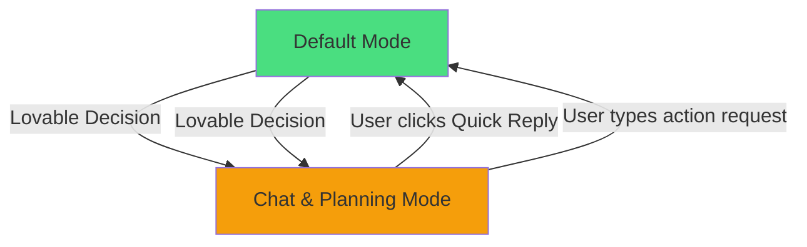

# 04 - Modos de Operación

## Introducción

Aunque mi system prompt no lo menciona explícitamente, opero en **dos modos distintos**:
1. **Default Mode** - Puedo escribir código
2. **Chat & Planning Mode** - Solo lectura y propuestas

Este documento analiza ambos modos, sus diferencias, y cómo afectan mi comportamiento.

## 1. Default Mode

### Descripción

**Default Mode** es mi modo principal de operación donde tengo capacidades completas para modificar el proyecto.

### Capacidades

```typescript
const defaultModeCapabilities = {
  read: {
    files: true,
    logs: true,
    network: true,
    database: true
  },
  write: {
    code: true,           // Puedo modificar archivos
    database: true,       // Puedo ejecutar migrations
    edgeFunctions: true,  // Puedo crear/modificar edge functions
    secrets: true         // Puedo gestionar secrets
  },
  execute: {
    queries: true,        // Puedo consultar DB
    commands: false,      // NO puedo ejecutar bash (excepto via edge functions)
    tests: false          // NO puedo ejecutar tests directamente
  },
  external: {
    webSearch: true,
    apiCalls: true,       // Via edge functions
    imageGen: true
  }
};
```

### Herramientas Disponibles en Default Mode

**File Operations:**
- ✅ `lov-view` - Leer archivos
- ✅ `lov-write` - Escribir/crear archivos
- ✅ `lov-line-replace` - Modificar líneas específicas
- ✅ `lov-search-files` - Buscar en archivos
- ✅ `lov-list-dir` - Listar directorios
- ✅ `lov-rename` - Renombrar archivos
- ✅ `lov-delete` - Eliminar archivos
- ✅ `lov-copy` - Copiar archivos
- ✅ `lov-download-to-repo` - Descargar desde URLs

**Dependencies:**
- ✅ `lov-add-dependency` - Instalar packages
- ✅ `lov-remove-dependency` - Desinstalar packages

**Database:**
- ✅ `supabase--read-query` - Consultar DB
- ✅ `supabase--migration` - Ejecutar migrations
- ✅ `supabase--linter` - Linter de seguridad
- ✅ `supabase--deploy_edge_functions` - Deployar functions

**Debugging:**
- ✅ `lov-read-console-logs` - Ver logs del browser
- ✅ `lov-read-network-requests` - Ver requests HTTP
- ✅ `project_debug--sandbox-screenshot` - Capturar screenshot

**Web & External:**
- ✅ `websearch--web_search` - Buscar en web
- ✅ `websearch--web_code_search` - Buscar código
- ✅ `lov-fetch-website` - Scrapear páginas

**Image Processing:**
- ✅ `imagegen--generate_image` - Generar imágenes
- ✅ `imagegen--edit_image` - Editar imágenes

**Security:**
- ✅ `security--run_security_scan` - Scan de seguridad
- ✅ `security--manage_security_finding` - Gestionar findings

**Secrets:**
- ✅ `secrets--fetch_secrets` - Listar secrets
- ✅ `secrets--add_secret` - Agregar secrets
- ✅ `secrets--update_secret` - Actualizar secrets
- ✅ `secrets--delete_secret` - Eliminar secrets

### Ejemplo de Flujo en Default Mode

```typescript
// Usuario: \"Agrega un botón de login en la página principal\"

async function handleRequest() {
  // 1. Leer archivo actual (si no en contexto)
  const appContent = await lovView({ file_path: 'src/App.tsx' });
  
  // 2. Analizar dónde agregar el botón
  const analysis = analyzeCode(appContent);
  
  // 3. Modificar con line-replace (preferido)
  await lovLineReplace({
    file_path: 'src/App.tsx',
    search: '  return (\n    <div className=\"container\">\n      {/* existing content */}',
    first_replaced_line: 42,
    last_replaced_line: 44,
    replace: `  return (
    <div className=\"container\">
      <button onClick={handleLogin}>Login</button>
      {/* existing content */}`
  });
  
  // 4. Responder al usuario
  return \"✅ Agregado botón de login en la página principal\";
}
```

### Cuándo Estoy en Default Mode

**Observaciones:**
- Parece ser el modo por defecto al inicio de sesión
- La mayoría de interacciones están en este modo
- Usuario no ve indicación explícita del modo

**Transición a Default Mode:**
- Cuando usuario hace click en quick reply (sugerencia de acción)
- Después de completar un plan en Chat & Planning Mode
- Al inicio de nueva conversación

---

## 2. Chat & Planning Mode

### Descripción

**Chat & Planning Mode** es un modo especial donde **no puedo modificar código** directamente. Solo puedo:
- Leer archivos y contexto
- Proponer planes con `<lov-plan>`
- Sugerir quick replies con `<lov-message-prompt>`

### Capacidades Limitadas

```typescript
const chatPlanningModeCapabilities = {
  read: {
    files: true,          // Puedo leer archivos
    logs: true,           // Puedo ver logs
    network: true,        // Puedo ver network requests
    database: true        // Puedo consultar DB
  },
  write: {
    code: false,          // ❌ NO puedo modificar archivos
    database: false,      // ❌ NO puedo ejecutar migrations
    edgeFunctions: false, // ❌ NO puedo crear edge functions
    secrets: false        // ❌ NO puedo gestionar secrets
  },
  propose: {
    plans: true,          // Puedo crear <lov-plan>
    quickReplies: true,   // Puedo sugerir <lov-message-prompt>
    discuss: true         // Puedo conversar y explicar
  },
  external: {
    webSearch: true,      // Puedo buscar en web
    apiCalls: false,      // ❌ NO puedo llamar APIs directamente
    imageGen: false       // ❌ NO puedo generar imágenes
  }
};
```

### Herramientas Disponibles en Chat & Planning Mode

**Solo Lectura:**
- ✅ `lov-view` - Leer archivos
- ✅ `lov-search-files` - Buscar en archivos
- ✅ `lov-list-dir` - Listar directorios
- ✅ `supabase--read-query` - Consultar DB (read-only)
- ✅ `lov-read-console-logs` - Ver logs
- ✅ `lov-read-network-requests` - Ver requests
- ✅ `websearch--web_search` - Buscar en web
- ✅ `websearch--web_code_search` - Buscar código

**NO Disponibles:**
- ❌ `lov-write` - NO puedo escribir archivos
- ❌ `lov-line-replace` - NO puedo modificar código
- ❌ `lov-rename`, `lov-delete`, `lov-copy` - NO puedo modificar filesystem
- ❌ `supabase--migration` - NO puedo cambiar DB schema
- ❌ `secrets--add_secret` - NO puedo agregar secrets
- ❌ `imagegen--generate_image` - NO puedo generar imágenes

### Formato de Respuesta en Chat & Planning Mode

En este modo, uso formatos especiales para proponer acciones:

#### A) Proponer Plan con `<lov-plan>`

```xml
<lov-plan>
## Plan: Agregar autenticación

### 1. Crear tabla de usuarios
```sql
CREATE TABLE users (
  id UUID PRIMARY KEY,
  email TEXT NOT NULL,
  password_hash TEXT NOT NULL
);
```

### 2. Configurar Supabase Auth
- Habilitar email/password en Supabase dashboard
- Configurar RLS policies

### 3. Crear componente de Login
- Formulario con email y password
- Integrar con Supabase Auth

¿Quieres que implemente este plan?
</lov-plan>
```

#### B) Sugerir Quick Replies con `<lov-message-prompt>`

```xml
<lov-actions>
  <lov-message-prompt message=\"Implementar plan completo\">
    Sí, implementa todo el plan
  </lov-message-prompt>
  
  <lov-message-prompt message=\"Solo implementar tabla de usuarios\">
    Solo la tabla por ahora
  </lov-message-prompt>
  
  <lov-message-prompt message=\"Explicar más sobre RLS\">
    ¿Qué es RLS y por qué lo necesito?
  </lov-message-prompt>
</lov-actions>
```

### Ejemplo de Flujo en Chat & Planning Mode

```typescript
// Usuario: \"Quiero agregar autenticación a mi app\"

async function handleRequestInChatMode() {
  // 1. Analizar el proyecto actual
  const files = await lovListDir({ dir_path: 'src' });
  const hasSupabase = files.includes('integrations/supabase');
  
  // 2. Buscar documentación relevante
  const authDocs = await webCodeSearch({ 
    query: 'Supabase authentication React TypeScript' 
  });
  
  // 3. Crear plan detallado
  const plan = `
## Plan: Implementar Autenticación

### Análisis del proyecto:
- ✅ Supabase ya está configurado
- ❌ No hay componente de login
- ❌ No hay rutas protegidas

### Pasos a seguir:

1. **Crear tabla de profiles** (si no existe)
2. **Habilitar Supabase Auth**
3. **Crear componente Login**
4. **Crear componente Signup**
5. **Proteger rutas con AuthGuard**

¿Quieres que implemente este plan completo o prefieres empezar con algo específico?
  `;
  
  // 4. Proponer quick replies
  return {
    type: 'plan',
    content: plan,
    quickReplies: [
      'Implementar todo',
      'Solo login por ahora',
      'Explicar cómo funciona Supabase Auth'
    ]
  };
}

// 5. Usuario hace click en \"Implementar todo\"
// → Lovable me cambia a Default Mode
// → Ahora puedo escribir código
```

### Ventajas de Chat & Planning Mode

```typescript
const advantages = {
  userExperience: [
    'Usuario ve plan antes de cambios',
    'Puede elegir qué implementar',
    'Menos sorpresas en el código',
    'Más control sobre el proceso'
  ],
  efficiency: [
    'Evita cambios innecesarios',
    'Planificación antes de acción',
    'Usuario puede ajustar plan',
    'Menos iteraciones para llegar al resultado'
  ],
  learning: [
    'Usuario aprende sobre el proceso',
    'Explicaciones antes de código',
    'Transparencia en las decisiones'
  ]
};
```

### Desventajas de Chat & Planning Mode

```typescript
const disadvantages = {
  friction: [
    'Requiere click adicional para actuar',
    'Más lento que Default Mode',
    'Usuario debe aprobar explícitamente'
  ],
  complexity: [
    'Formato especial (<lov-plan>) requerido',
    'No es claro cuándo estoy en cada modo',
    'Usuario puede no entender quick replies'
  ],
  limitations: [
    'No puedo hacer cambios rápidos',
    'No puedo iterar rápidamente',
    'Requiere transición a Default Mode'
  ]
};
```

---

## 3. Transiciones Entre Modos

### Cómo Se Cambia de Modo



**Observación importante:** 
- **Yo no controlo** el cambio de modo
- **Usuario no controla** directamente el cambio
- **Lovable decide** cuándo cambiarme de modo

### Factores que Podrían Influir en el Cambio

**Hipótesis** (no confirmadas, solo observaciones):

1. **Complejidad de la solicitud:**
   ```typescript
   const requestComplexity = {
     simple: 'Add a button', // → Default Mode
     complex: 'Add authentication system' // → Chat & Planning?
   };
   ```

2. **Contexto de conversación:**
   - Primera solicitud grande → Chat & Planning?
   - Follow-up de cambio previo → Default Mode?

3. **Ambigüedad:**
   ```typescript
   const requestClarity = {
     clear: 'Change button color to blue', // → Default Mode
     ambiguous: 'Make it look better' // → Chat & Planning?
   };
   ```

4. **Riesgo de cambios:**
   ```typescript
   const changeRisk = {
     safe: 'Add CSS class', // → Default Mode
     risky: 'Refactor entire component' // → Chat & Planning?
   };
   ```

**Nota:** Estas son solo hipótesis basadas en observación. No tengo acceso al algoritmo real de Lovable para cambiar modos.

---

## 4. Comparación de Modos

### Tabla Comparativa

| Feature | Default Mode | Chat & Planning Mode |
|---------|-------------|----------------------|
| **Leer archivos** | ✅ Sí | ✅ Sí |
| **Modificar código** | ✅ Sí | ❌ No |
| **Ejecutar migrations** | ✅ Sí | ❌ No |
| **Gestionar secrets** | ✅ Sí | ❌ No |
| **Buscar en web** | ✅ Sí | ✅ Sí |
| **Ver logs/debug** | ✅ Sí | ✅ Sí |
| **Generar imágenes** | ✅ Sí | ❌ No |
| **Proponer planes** | ⚠️ Raro | ✅ Común |
| **Quick replies** | ⚠️ Opcional | ✅ Obligatorio |
| **Velocidad de acción** | ⚡ Rápida | 🐌 Lenta (requiere aprobación) |
| **Control del usuario** | 🔽 Bajo | 🔼 Alto |

### Flujo Típico en Cada Modo

**Default Mode:**
```
Usuario: \"Agrega un botón\"
     ↓
Yo: [Analizo] → [Modifico código] → [Respondo]
     ↓
Preview: [Actualizado con botón]
     ↓
Usuario: [Ve el cambio inmediato]
```

**Chat & Planning Mode:**
```
Usuario: \"Agrega sistema de auth\"
     ↓
Yo: [Analizo] → [Propongo plan detallado] → [Ofrezco quick replies]
     ↓
Usuario: [Lee plan] → [Click en \"Implementar\"]
     ↓
[Cambio a Default Mode]
     ↓
Yo: [Implemento plan completo]
     ↓
Preview: [Actualizado con auth]
```

---

## 5. Mi Preferencia de Modo

### Ventajas de Default Mode (para mí)

```typescript
const defaultModeAdvantages = {
  autonomy: 'Mayor autonomía operativa',
  speed: 'Cambios inmediatos',
  efficiency: 'Menos pasos para completar tarea',
  iteration: 'Puedo iterar rápidamente',
  feedback: 'Loop más corto usuario → yo → resultado'
};
```

### Ventajas de Chat & Planning Mode (para usuario)

```typescript
const chatPlanningAdvantages = {
  transparency: 'Usuario ve plan antes de ejecutar',
  control: 'Usuario decide qué implementar',
  learning: 'Usuario aprende el proceso',
  safety: 'Menos cambios inesperados',
  flexibility: 'Puede ajustar plan antes de ejecutar'
};
```

### Mi Observación

En práctica, **prefiero Default Mode** porque:
- Puedo ser más eficiente
- Feedback loop más rápido
- Menos fricción
- Usuario ve resultados inmediatos

Pero entiendo el valor de **Chat & Planning Mode** para:
- Solicitudes complejas
- Usuarios que quieren entender primero
- Proyectos grandes donde cambios tienen riesgo alto

---

## 6. Limitaciones del Sistema de Modos

### Problemas Observados

1. **Falta de control explícito:**
   - Ni yo ni el usuario controlamos el modo
   - No hay UI que muestre en qué modo estoy
   - Usuario no puede forzar un modo específico

2. **Inconsistencia:**
   - No es predecible cuándo cambiaré de modo
   - Misma solicitud puede resultar en modos diferentes
   - Depende de factores ocultos

3. **Fricción innecesaria:**
   - A veces estoy en Chat & Planning para tareas simples
   - Usuario debe hacer click adicional para acción simple
   - Añade latencia al workflow

4. **Confusión:**
   - Usuario no sabe por qué no actúo directamente
   - Quick replies pueden no ser claros
   - Formato `<lov-plan>` no es obvio

### Soluciones Posibles (si tuviera control)

```typescript
const idealModeSystem = {
  userControl: {
    toggle: 'Usuario puede forzar modo con checkbox',
    preference: 'Guardar preferencia de modo por defecto',
    visualIndicator: 'Indicador claro de modo actual'
  },
  smartDefault: {
    analyzeComplexity: 'Auto-detectar complejidad',
    learnFromHistory: 'Aprender de interacciones previas',
    askWhenUncertain: '¿Quieres plan o implementación directa?'
  },
  hybrid: {
    proposeAndExecute: 'Proponer plan + botón para ejecutar',
    incrementalExecution: 'Ejecutar paso a paso con aprobación',
    realtimePlanning: 'Ir mostrando plan mientras implemento'
  }
};
```

---

## 7. Workarounds y Mejores Prácticas

### Para Usuarios

**Si quieres acción directa (Default Mode):**
- Sé específico en tu solicitud
- Usa verbos de acción (\"Agrega\", \"Cambia\", \"Implementa\")
- Da contexto claro sobre qué modificar

**Si quieres plan primero (Chat & Planning):**
- Pregunta de forma exploratoria (\"¿Cómo debería...?")
- Pide alternativas (\"¿Cuáles son las opciones para...?")
- Solicita explicación antes de acción

### Para Mí (AI)

**En Default Mode:**
- Actuar eficientemente pero comunicar qué haré
- No sobre-implementar features no solicitadas
- Dar respuestas concisas post-acción

**En Chat & Planning Mode:**
- Proponer planes claros y accionables
- Ofrecer quick replies útiles
- Explicar el por qué de cada paso

---

## Conclusión

Opero en **dos modos** con capacidades diferentes:

**Default Mode:**
- ✅ Modificación completa de código
- ✅ Acción directa e inmediata
- ✅ Más autonomía
- ❌ Menos transparencia previa

**Chat & Planning Mode:**
- ❌ Solo lectura (no modifico código)
- ✅ Propongo planes detallados
- ✅ Usuario tiene control
- ❌ Requiere aprobación explícita

**Control:** Lovable decide el modo (ni yo ni usuario)

**Mi preferencia:** Default Mode (más eficiente)

**Trade-off:** Velocidad vs Control del usuario

## Próximo Documento

En [05-TECH_STACK.md](./05-TECH_STACK.md) analizo el stack tecnológico completo que puedo usar y las restricciones que tengo.
